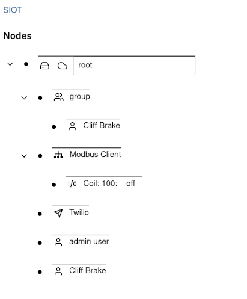
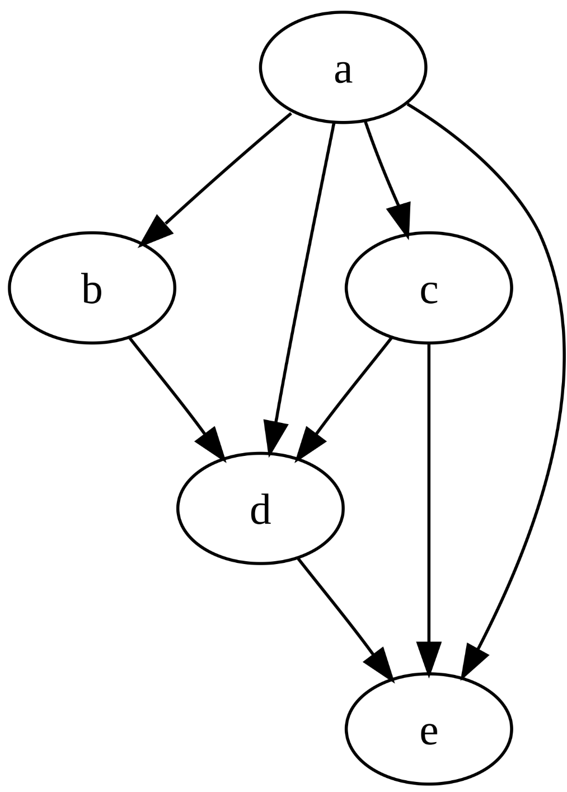
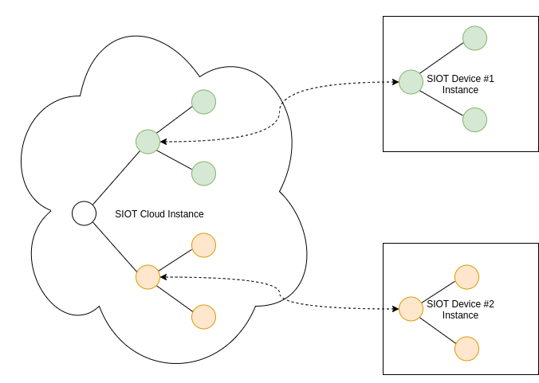
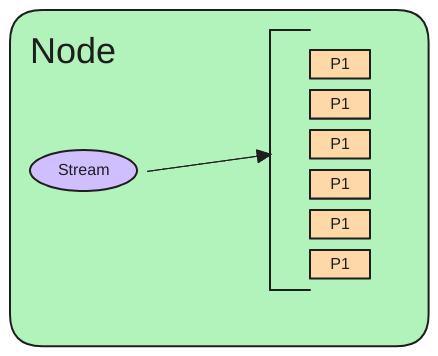
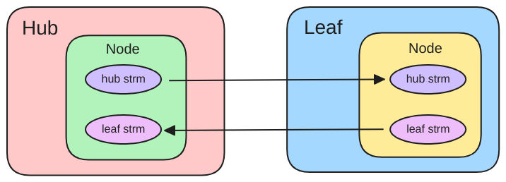
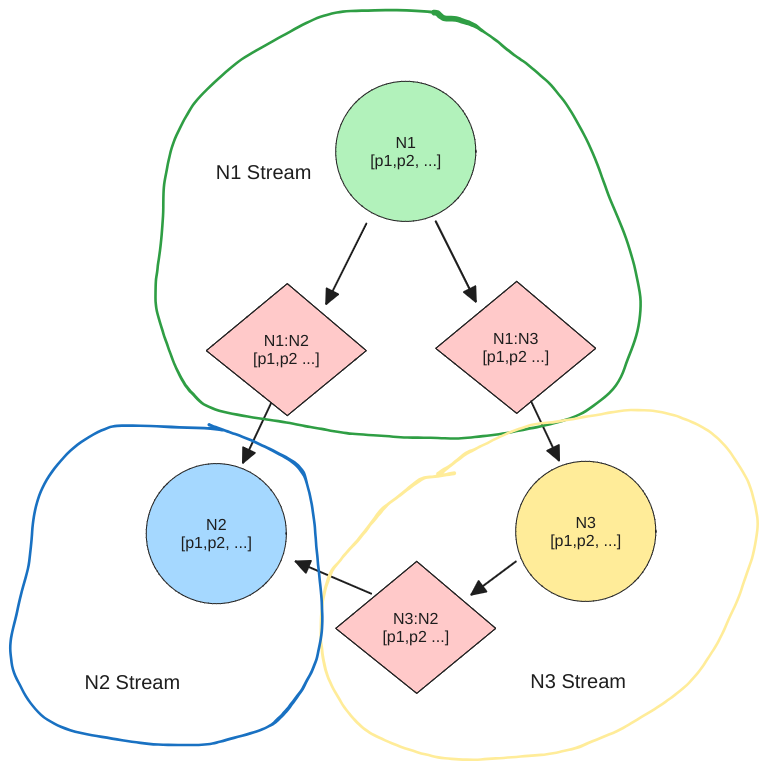
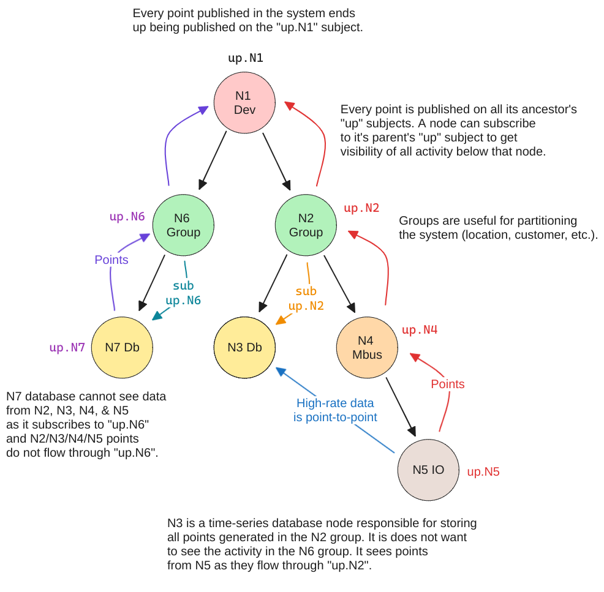

# JetStream SIOT Store

- Author: Cliff Brake, last updated: 2026-08-07
- Status: in progress (stages 1-2 complete; stage 3 initial implementation
  complete, follow-on work remaining)

## Problem

SQLite has worked well as a SIOT store. There are a few things we would like to
improve:

- Synchronization of history
  - Currently, if a device or server is offline, only the latest state is
    transferred when connected. We would like all history that has accumulated
    when offline to be transferred once reconnected.
- We want history at the edge as well as cloud
  - This allows us to use history at the edge to run more advanced algorithms
    like AI
- We currently have to re-compute hashes all the way to the root node anytime
  something changes
  - This may not scale to larger systems
  - Is difficult to get right if things are changing while we re-compute hashes
    - it requires some type of coordination between the distributed systems,
      which we currently don't have.

## Context/Discussion

The purpose of this document is to explore storing SIOT state in a NATS
JetStream store. SIOT data is stored in a tree of nodes and each node contains
an array of points. Note, the term **"node"** in this document represents a data
structure in a tree, not a physical computer or SIOT instance. The term
**"instance"** will be used to represent devices or SIOT instances.



Nodes are arranged in a
[directed acyclic graph](https://en.wikipedia.org/wiki/Directed_acyclic_graph).



A subset of this tree is synchronized between various instances as shown in the
below example:



The tree topology can be as deep as required to describe the system. To date,
only the current state of a node is synchronized and history (if needed) is
stored externally in a time-series database like InfluxDB and is not
synchronized. The node tree is an excellent data model for IoT systems.

Each node contains an array of points that represent the state of the node. The
points contain a type and a key. The key can be used to describe maps and
arrays. We keep points separate so they can all be updated independently and
easily merged.

With JetStream, we could store points in a stream where the head of the stream
represents the current state of a Node or collection of nodes. Each point is
stored in a separate NATS subject.



NATS JetStream is a stream-based store where every message in a stream is given
a sequence number. Synchronization is simple in that if a sequence number does
not exist on a remote system, the missing messages are sent.

NATS also supports leaf nodes (instances) and streams can be synchronized
between hub and leaf instances. If they are disconnected, then streams are
"caught up" after the connection is made again.

Several experiments have been run to understand the basic JetStream
functionality in [this repo](https://github.com/simpleiot/nats-exp).

1. Storing and extracting points in a stream
1. Using streams to store time-series data and measure performance
1. Syncing streams between the hub and leaf instances

### Advantages of JetStream

- JetStream is built into NATS, which we already embed and use.
- History can be stored in a NATS stream instead of externally. Currently, we
  use an external store like InfluxDB to store history.
- JetStream streams can be synchronized between instances.
- JetStream has various retention models so old data can automatically be
  dropped.
- Leverage the NATS AuthN/AuthZ features.
- JetStream is a natural extension of core NATS, so many of the core SIOT
  concepts are still valid and do not need to change.

### Challenges with moving to JetStream

- Streams are typically synchronized in one direction. This is a challenge for
  SIOT as the basic premise is data can be modified in any location where a
  user/device has proper permissions. A user may change a configuration in a
  cloud portal or on a local touch-screen.
- Sequence numbers must be set by one instance, so you can't have both a leaf
  and hub nodes inserting data into a single stream. This has benefits in that
  it is a very simple and reliable model.
- We are constrained by a simple message subject to label and easily query data.
  This is less flexible than an SQL database, but this constraint can also be an
  advantage in that it forces us into a simple and consistent data model.
- SQLite has a built-in cache. We would likely need to create our own with
  JetStream.

### JetStream consistency model

From this [discussion](https://github.com/nats-io/nats-server/discussions/4577):

> When the doc mentions immediate consistency, it is in contrast to
> [eventual consistency](https://en.wikipedia.org/wiki/Eventual_consistency). It
> is about how 'writes' (i.e. publishing a message to a stream).
>
> JetStream is an immediately consistent distributed storage system in that
> every new message stored in the stream is done so in a unique order (when
> those messages reach the stream leader) and that the acknowledgment that the
> storing of the message has been successful only happens as the result of a
> RAFT vote between the NATS JetStream servers (e.g. 3 of them if replicas=3)
> handling the stream.
>
> This means that when a publishing application receives the positive
> acknowledgement to it's publication to the stream you are guaranteed that
> everyone will see that new message in their updates _in the same order_ (and
> with the same sequence number and time stamp).
>
> This 'non-eventual' consistency is what enables 'compare and set' (i.e.
> compare and publish to a stream) operations on streams: because there can only
> be one new message added to a stream at a time.
>
> To map back to those formal consistency models it means that for writes, NATS
> JetStream is
> [Linearizable](https://jepsen.io/consistency/models/linearizable).

Currently SIOT uses a more "eventually" consistent model where we used data
structures with some light-weight CRDT proprieties. However, this has the
disadvantage that we have to do things like hash the entire node tree to know if
anything has changed. In a more static system where not much is changing, this
works pretty well, but in a dynamic IoT system where data is changing all the
time, it is hard to scale this model.

### Message/Subject encoding

In the past, we've used the
[Point data structure](https://docs.simpleiot.org/docs/adr/1-consider-changing-point-data-type.html#proposal-2).
This has worked extremely well at representing reasonably complex data
structures (including maps and arrays) for a node. Yet it has limitations and
constraints that have proven useful it making data easy to store, transmit, and
merge.

```go
// Point is a flexible data structure that can be used to represent
// a sensor value or a configuration parameter.
// ID, Type, and Index uniquely identify a point in a device
type Point struct {
	//-------------------------------------------------------
	//1st three fields uniquely identify a point when receiving updates

	// Type of point (voltage, current, key, etc)
	Type string `json:"type,omitempty"`

	// Key is used to allow a group of points to represent a map or array
	Key string `json:"key,omitempty"`

	//-------------------------------------------------------
	// The following fields are the values for a point

	// Time the point was taken
	Time time.Time `json:"time,omitempty" yaml:"-"`

	// Instantaneous analog or digital value of the point.
	// 0 and 1 are used to represent digital values
	Value float64 `json:"value,omitempty"`

	// Optional text value of the point for data that is best represented
	// as a string rather than a number.
	Text string `json:"text,omitempty"`

	// catchall field for data that does not fit into float or string --
	// should be used sparingly
	Data []byte `json:"data,omitempty"`

	//-------------------------------------------------------
	// Metadata

	// Used to indicate a point has been deleted. This value is only
	// ever incremented. Odd values mean point is deleted.
	Tombstone int `json:"tombstone,omitempty"`

	// Where did this point come from. If from the owning node, it may be blank.
	Origin string `json:"origin,omitempty"`
}
```

With JetStream, the `Type`and `Key` can be encoded in the message subject:

`p.<node id>.<type>.<key>`

Message subjects are indexed in a stream, so NATS can quickly find messages for
any subject in a stream without scanning the entire stream (see
[discussion 1](https://github.com/nats-io/nats-server/discussions/3772) and
[discussion 2](https://github.com/nats-io/nats-server/discussions/4170)).

Over time, the Point structure has been simplified. For instance, it used to
also have an `Index` field, but we have learned we can use a single `Key` field
instead. At this point it may make sense to simplify the payload. One idea is to
do away with the `Value` and `Text` fields and simply have a `Data` field. The
components that use the points have to know the data-type anyway to know if they
should use the `Value` or `Text`field. In the past, Protobuf encoding was used
as we started with quite a few fields and provided some flexibility and
convenience. But as we have reduced the number of fields and two of them are now
encoded in the message subject, it may be simpler to have a simple encoding for
`Time`, `Data`, `Tombstone`, and `Origin` in the message payload. The code using
the message would be responsible for convert `Data` into whatever datatype is
needed. This would open up the opportunity to encode any type of payload in the
future in the `Data` field and be more flexible for the future.

#### Message payload:

- `Time` (uint64)
- `Tombstone` (byte)
- `OriginLen` (byte)
- `Origin` (string)
- `Data Type` (byte)
- `Data` (length determined by the message length subtracted by the length of
  the above fields)

Examples of types:

- 0 - unknown or custom
- 1 - float (32, or 64 bit)
- 2 - int (8, 16, 32, or 64 bit)
- 3 - unit (8, 16, 32, or 65 bit)
- 4 - string
- 5 - JSON
- 6 - Protobuf

Putting `Origin` in the message subject will make it inefficient to query as you
will need to scan and decode all messages. Are there any cases where we will
need to do this? (this is an example where an SQL database is more flexible).
One solution would be to create another stream where the origin is in the
subject.

There are times when the current point model does not fit very well - for
instance when sending a notification - this is difficult to encode in an array
of points. I think in these cases encoding the notification data as JSON
probably makes more sense and this encoding should work much better.

#### Can't send multiple points in a message

In the past, it was common to send multiple points in a message for a node - for
instance when creating a node, or updating an array. However, with the `type`
and `key` encoded in the subject this will no longer work. What is the
implication for having separate messages?

- Will be more complex to create nodes
- When updating an array/map in a node, it will not be updated all at once, but
  over the time it takes all the points to come into the client.
- There is still value in arrays being encoded as points - for instance a relay
  devices that contains two relays. However, for configuration are we better
  served by encoding the struct in a the data field as JSON and updating it as
  an atomic unit?

### UI Implications

Because NATS and JetStream subjects overlap, the UI could
[subscribe to the current state changes](https://github.com/simpleiot/simpleiot/tree/master/frontend/lib)
much as is done today. A few things would need to change:

- Getting the initial state could still use the
  [NATS `nodes` API](https://docs.simpleiot.org/docs/ref/api.html). However, the
  `Value` and `Text` fields might be merged into `Data`.
- In the `p.<node id>` subscription, the `Type` and `Key` now would come from
  the message subject.

### Bi-Directional Synchronization

Bi-directional synchronization between two instances may be accomplished by
having two streams for every node. The head of both incoming and outgoing
streams is looked at to determine the current state. If points of the same type
exist in both streams, the point with the latest timestamp wins. In reality, 99%
of the time, one set of data will be set by the Leaf instance (ex: sensor
readings) and another set of data will be set by the upstream Hub instance (ex:
configuration settings) and there will be very little overlap.



The question arises - do we really need bi-directional synchronization and the
complexity of having two streams for every node? Every node includes some amount
of configuration which can flow down from upstream instances. Additionally, many
nodes are collecting data which needs to flow back upstream. So it seems a very
common need for every node to have data flowing in both directions. Since this
is a basic requirement, it does not seem like much of stretch to allow any data
to flow in either stream, and then merge the streams at the endpoints where the
data is used.

### Does it make sense to use NATS to create merged streams?

NATS can source streams into an additional 3rd stream. This might be useful in
that you don't have to read two streams and merge the points to get the current
state. However, there are several disadvantages:

- Data would be stored twice
- Data is not guaranteed to be in chronological order - the data would be
  inserted into the 3rd stream when it is received. So you would still have to
  walk back in history to know for sure if you had the latest point. It seems
  simpler to just read the head of two streams and compare them.

### Timestamps

NATS JetStream messages store a timestamp, but the timestamp is when the message
is inserted into the stream, not necessarily when the sample was taken. There
can be some delay between the NATS client sending the message and the server
processing it. Therefore, an additional high-resolution
[64-bit timestamp](https://docs.simpleiot.org/docs/adr/4-time.html) is added to
the beginning of each message.

### Edges

Edges are used to describe the connections between nodes. Nodes can exist in
multiple places in the tree. In the below example, `N2` is a child of both `N1`
and `N3`.



Edges currently contain the up and downstream node IDs, an array of points, and
a node type. Putting the type in the edge made it efficient to traverse the tree
by loading edges from a SQLite table and indexing the IDs and type. With
JetStream it is less obvious how to store the edge information. SIOT regularly
traverses up and down the tree.

- Down: to discover nodes
- Up: to propagate points to up subjects

Because edges contain points that can change over time, edge points need to be
stored in a stream, much like we do the node points. If each node has its own
stream, then the child edges for the node could be stored in the same stream as
the node as shown above. This would allow us to traverse the node tree on
startup and perhaps cache all the edges. The following subject can be used for
edge points:

`p.<up node ID>.<down node ID>.<type>.<key>`

Again, this is very similar to the existing
[NATS API](https://docs.simpleiot.org/docs/ref/api.html#nats).

Two special points are present in every edge:

- `nodeType`: defines the type of the downstream node
- `tombstone`: set to true if the downstream node is deleted

One challenge with this model is much of the code in the SIOT uses a
`NodeEdge` data structure which includes a node and its parent edge. This
collection of data describes this instance of a node and is more useful from a
client perspective. However, `NodeEdge`'s are duplicated for every mirrored node
in the tree, so don't really make sense from a storage and synchronization
perspective. This will likely become more clear after some implementation work.

### NATS `up.*` subjects

In SIOT, we partition the system using the tree structure and nodes that listen
for messages (databases, messaging services, rules, etc.) subscribe to the
`up.*`stream of their parent node. In the below example, each group has it's own
database configuration and the Db node only receives points generated in the
group it belongs to. This provides an opportunity for any node at any level in
the tree to listen to messages of another node, as long as:

1. It is equal or higher in the structure
2. Shares an ancestor.



The use of "up" subjects would not have to change other than the logic that
re-broadcasts points to "up" subjects would need to use the edge cache instead
of querying the SQLite database for edges.

### AuthN/AuthZ

Authorization typically needs to happen at device or group boundaries. Devices
or users will need to be authorized. Users
[have access](https://docs.simpleiot.org/docs/user/users-groups.html) to all
nodes in their parent group or device. If each node has its own stream, that
will simplify AuthZ. Each device or user are explicitly granted permission to
all the Nodes they have access to. If a new node is created that is a child of a
node a user has permission to view, this new node (and the subsequent streams)
are added to the list.

### Are we optimizing the right thing?

Any time you move away from an SQL database, you should
[think long and hard](https://web.archive.org/web/20250211174018/http://www.sarahmei.com/blog/2013/11/11/why-you-should-never-use-mongodb/)
about this. Additionally, there are very nice time-series database solutions out
there. So we should have good reasons for inventing yet-another-database.
However, mainstream SQL and Time-series databases all have one big drawback:
they don't support synchronizing subsets of data between distributed systems.

With system design, one approach is to order the problems you are solving by
difficulty with the top of the list being most important/difficult, and then
optimize the system to solve the hard problems first.

1. Synchronizing subsets of data between distributed systems (including history)
2. Be small and efficient enough to deploy at the edge
3. Real-time response
4. Efficient searching through history
5. Flexible data storage/schema
6. Querying nodes and state
7. Arbitrary relationships between data
8. Data encode/decode performance

The number of devices and nodes in systems SIOT is targeting is relatively
small, thus the current node topology can be cached in memory. The history is a
much bigger dataset so using a stream to synchronize, store, and retrieve
time-series data makes a lot of sense.

On #7, will we ever need arbitrary relationships between data? With the node
graph, we can do this fairly well. Edges contain points that can be used to
further characterize the relationship between nodes. With IoT systems your
relationships between nodes is mostly determined by physical proximity. A Modbus
sensor is connected to a Modbus, which is connected to a Gateway, which is
located at a site, which belongs to a customer.

On #8, the network is relatively slow compared to anything else, so if it takes
a little more time to encode/decode data this is typically not a big deal as the
network is the bottleneck.

With an IoT system, the data is primarily 1) sequential in time, and 2)
hierarchical in structure. Thus, the streaming/tree approach still appears to be
the best approach.

### Questions

Still open:

- How chatty is the NATS Leaf-node protocol? Is it efficient enough to use over
  low-bandwidth Cat-M cellular connections (~20-100Kbps)? Bandwidth on
  constrained links has not been measured.
- Are there any other features of NATS/JetStream that we should be considering?

Resolved by the 2026-08-06 revision:

- ~~Is it practical to have 2 streams for every node?~~ Per-node streams were
  replaced by boundary-origin streams; stream count now scales with instance
  count rather than fleet node count.
- ~~Would it make sense to create streams at the device/instance boundaries
  rather than node boundaries?~~ Yes — this is the adopted model. AuthZ within
  an instance is preserved because boundaries fall where authorization already
  happens (devices and groups).
- ~~How robust is the JetStream store compared to SQLite in events like power
  loss?~~ The file store fsyncs on a 2-minute interval by default, comparable
  to the prior SQLite WAL exposure; `--storeSyncInterval` shortens the window
  or forces an fsync on every write.

### Stream Granularity and Synchronization Model (2026-08-06 revision)

The initial Stage 2 implementation used one stream per node. A design review
before merging the store raised two structural concerns with that layout and
with the original Stage 3 synchronization sketch, and led to a revised model.

**Echo in merge-on-receive synchronization.** The original Stage 3 sketch fed
points received from a remote instance into the local store's merge logic,
which writes them into local streams. With bi-directional sync, each side then
replays the other's points back to it: the hub writes leaf points into hub
streams, and the leaf's consumer on those streams receives its own points
again. Preventing the loop requires origin-based echo suppression on every
message, and any defect in that suppression circulates points between
instances indefinitely. Merge-on-receive also gives up the single-writer
property that motivated JetStream in the first place: each stream becomes a
mixture of local writes and republished remote writes, with arrival-order
interleaving in the history.

**Hub scaling.** Per-node streams scale with the total number of nodes in the
fleet, not with the number of instances. A hub serving 500 devices with 30
nodes each holds roughly 15,000 streams, each with its own file store and
accounting, plus a durable consumer per synced stream per connected leaf.
Node creation and deletion become stream administration operations rather
than message publishes, and startup enumeration touches every stream.

**Alternatives considered:**

1. *One stream per origin instance (an oplog per writer).* Sync becomes one
   consumer per peer and hub storage scales with instance count.
   `MaxMsgsPerSubject` retention still works because it applies per subject,
   not per stream. However, node IDs are UUIDs, so the subject space is flat:
   selecting a subtree to sync requires maintaining an explicit filter list,
   and read-side AuthZ inside a single stream depends on filter-constrained
   consumer permissions, which have sharp edges (single-filter form only,
   legacy API forms must be denied).
2. *Streams at sync/AuthZ boundaries.* Authorization in SIOT naturally happens
   at device or group boundaries (see AuthN/AuthZ above), and a device
   subtree syncs as a unit. Making the stream the boundary aligns storage,
   sync, and permissions, and drops hub stream count to a small multiple of
   the device count.
3. *Merge at read instead of on receive.* Keep every stream single-writer and
   replicate remote streams locally (JetStream sourcing or durable
   consumers). Current state is the merge of subject tips across the local
   and replica streams, which is exactly the two-stream comparison described
   in the Bi-Directional Synchronization section above. The in-memory edge
   and point caches already perform this merge once at load time, so the
   read-path cost is negligible. Echo is impossible by construction because
   no instance ever writes remote data into its own streams.

**Revised model (adopted): boundary-origin streams**, combining 2 and 3:

- A **boundary** is a node that represents a SIOT instance: the local
  instance's root node and any device node that corresponds to a (potentially
  synced) remote instance. Every node is owned by the nearest boundary found
  walking up the tree. Nodes above all device boundaries are owned by the
  instance root boundary.
- Each (boundary, origin instance) pair gets one stream, named
  `inst-<boundaryID>-<originID>` (stream names cannot contain dots, so names
  use dashes). The `inst` prefix identifies both tokens as instances — a
  boundary is a node representing an instance — and keeps "node" reserved
  for the data tree. Only instance `<originID>` ever appends to that stream.
- Storage subjects carry both routing tokens so stream subject spaces never
  overlap: `inst.<boundaryID>.<originID>.<nodeID>.p.<type>.<key>` for node
  points and `inst.<boundaryID>.<originID>.<parentID>.ep.<childID>` for edge
  points. The stream captures `inst.<boundaryID>.<originID>.>`. Core NATS
  wire subjects (`p.>`, `ep.>`) are unchanged.
- Current state of a node is the merge of subject tips across all
  `inst-<boundaryID>-*` streams present locally, newest timestamp wins. The
  edge and point caches hold the merged state; merging happens at cache load
  and as messages arrive.
- Trade-offs accepted with this layout: retention (`MaxMsgsPerSubject`) is
  tuned per boundary rather than per node; moving a node across boundaries
  requires republishing its subject tips into the new stream and purging the
  old subjects; reads consult one stream per origin that has written to the
  boundary. Nodes mirrored under multiple parents resolve to a single owner
  (the instance root boundary when more than one boundary can reach them);
  mirroring across device boundaries remains an open design point for
  Stage 3.

## Experiments

Several proof-of-concept experiments have been run to prove the feasibility of
this:

https://github.com/simpleiot/nats-exp

## Decision

Implementation is broken down into 3 stages:

1. message/subject encoding changes — **COMPLETE**
   ([plan](../../plans/2026-03-11-jetstream-point-encoding-changes.md),
   branch `feat/js-subject-point-changes`). Point struct now uses
   `DataType`/`Data` instead of `Value`/`Text`. Protobuf replaced with binary
   encoding for point wire format. NATS subjects include type/key
   (`p.<nodeId>.<type>.<key>`, `ep.<nodeId>.<parentId>`). One point per NATS
   message for node points; edge points remain batched for atomicity.
1. switch store from SQLite to JetStream — initial implementation **COMPLETE**
   with per-node streams
   ([plan](../../plans/2026-03-17-implement-the-next-stage-of-adr-7.md),
   branch `feat/js-store`); layout revision to boundary-origin streams
   **COMPLETE**
   ([plan](../../plans/2026-08-06-boundary-origin-streams.md)). See the
   Stream Granularity and Synchronization Model section for the analysis
   behind the revision.
   - Boundary-origin streams: each (boundary, origin instance) pair gets
     stream `inst-<boundaryID>-<originID>` capturing subjects
     `inst.<boundaryID>.<originID>.<nodeID>.p.<type>.<key>` (node points) and
     `inst.<boundaryID>.<originID>.<parentID>.ep.<childID>` (edge points,
     stored with the parent node's boundary). Only the origin instance
     appends to a stream.
   - Streams retain full history (time-series). Current state = merge of
     subject tips (via `GetLastMsgForSubject`) across the streams for a
     boundary, newest timestamp wins. Retention uses `MaxMsgsPerSubject`
     (not `MaxAge` or stream-level `MaxBytes`/`MaxMsgs`) so current state is
     always preserved, including rarely-updated config points that
     time/size-based policies could silently drop.
   - Retention is resolved per stream: the server option
     `--storeMaxMsgsPerSubject` / `SIOT_STORE_MAX_MSGS_PER_SUBJECT` sets the
     instance default (0 = unlimited); Stage 3 adds per-boundary and
     per-replica overrides at the same resolution point. Changing the value
     applies to each existing stream the first time it is ensured after a
     restart, and JetStream trims existing subjects to the new limit.
   - Durability: the JetStream file store fsyncs on a 2-minute interval by
     default, which is the accepted power-loss window for typical
     deployments (comparable exposure to the prior SQLite WAL
     configuration). `--storeSyncInterval` / `SIOT_STORE_SYNC_INTERVAL`
     accepts a Go duration to shorten the window, or `always` to fsync
     every write for edge devices with unreliable power, trading write
     throughput.
   - `META` KV bucket for instance metadata (rootID, jwtKey).
   - In-memory edge and point caches hold the merged current state, populated
     on startup by reading stream tips.
   - Hash tree removed; JetStream sequence numbers replace it.
   - SQLite removed entirely; migration via `siot export`/`siot import`.
1. Use JetStream to sync between systems — initial implementation
   **COMPLETE** ([plan](../../plans/2026-08-06-stage3-jetstream-sync.md),
   branch `feat/js-store-boundary-stream`), with follow-on work remaining
   (see the end of this section).
   - Each instance runs its own NATS server and owns its origin streams. The
     single-writer invariant holds globally: instance R appends only to
     `inst-*-R` streams.
   - Instances connect via NATS leaf/client connections. Each instance keeps
     local **replicas** of the remote-origin streams for the boundaries it
     participates in, using JetStream sourcing (durable consumers as a
     fallback if sourcing proves unsuitable across leaf connections).
     Replication is sequence-tracked, so reconnect after network loss
     delivers only missed messages. No rescan or hash comparison.
   - Replicated data stays in the replica streams. There is no
     merge-on-receive: current state is merged at read in the edge and point
     caches. Echo cannot occur because no instance writes remote data into
     its own streams.
   - Example: device X (root node ID X, hub root ID R) owns `inst-X-X`. The
     hub writes configuration for X's subtree to its own `inst-X-R`. The hub
     replicates `inst-X-X` from the device; the device replicates `inst-X-R`
     from the hub. Multi-hop topologies chain sourcing through intermediate
     instances.
   - AuthZ: writes are enforced with core NATS subject permissions
     (unchanged by stream layout); reads with per-stream JetStream API
     permissions. Device X may replicate `inst-X-*` and export only
     `inst-X-X`. Grants are issued dynamically (NATS auth callout) as the
     tree changes.
   - Real-time point delivery continues via core NATS subjects (`p.>`,
     `ep.>`) as today. Replica catch-up covers only the offline/startup gap.
   - Prerequisite spikes before implementation: verify JetStream sourcing
     behavior across leaf connections/domains, and verify the
     filter-carrying consumer-create permission form
     (`$JS.API.CONSUMER.CREATE.<stream>.<consumer>.<filter>`) on the NATS
     version SIOT pins.
   - Spike results (2026-08-06): JetStream sourcing across a leaf
     connection with distinct JetStream domains works, including catch-up
     after the sourced server restarts (only missed messages delivered);
     see `store/leafnode_spike_test.go`. Chained (multi-hop) sourcing and
     the consumer-create permission form remain to be verified.
   - Initial implementation (2026-08-06,
     [plan](../../plans/2026-08-06-stage3-jetstream-sync.md)) uses
     durable-consumer replication over the existing upstream client
     connection rather than sourcing: the sync client copies messages
     between same-named streams subject-for-subject, acknowledging only
     after the receiving side confirms the write, so reconnects resume
     with only missed messages. This needs no leafnode listener and no
     static JetStream domain configuration (domains are server config,
     while instance identity is only known once the store initializes),
     and it chains through intermediate instances naturally. Sourcing
     over leaf connections remains the intended replacement once
     identity/domain configuration is worked out.
   - The receiving store consumes replica streams, merges tips into its
     caches, and re-broadcasts changed tips on the core NATS wire
     subjects tagged with a `Siot-Origin` header; a store never persists
     a wire message tagged with a remote origin. After an offline gap,
     broadcasts are held until the backlog drains and only final tips
     are sent, so rules do not replay intermediate values.
   - Deleting a device node on the hub now detaches it: the device does
     not force itself back into the tree (the old hash sync re-created
     it); only the hub can restore the edge.
   - Follow-on work is listed in the Remaining Work section below.

## Remaining Work

Stage 3 is functional end to end — two instances replicate in both
directions, survive disconnection, and converge — but the items below are
still outstanding. They are grouped by area and roughly ordered by priority
within each group. The Stage 3
[plan](../../plans/2026-08-06-stage3-jetstream-sync.md) tracks progress.

**Sync coverage**

1. Nested device boundaries: only the root boundary replicates today, so a
   device beneath another device's boundary does not yet sync.
2. Multi-hop chaining test: each hop is independent and expected to work,
   but this is unverified.
3. Nodes mirrored across device boundaries: a node reachable from more than
   one boundary resolves to the instance root boundary. How mirroring
   should behave across a sync boundary is an open design point (see the
   Stream Granularity section).
4. Moving a node between boundaries: requires republishing subject tips
   into the new stream and purging the old subjects. Not implemented.

**Transport**

5. JetStream sourcing over leaf connections remains the intended
   replacement for durable-consumer replication, pending a way to drive
   server domain configuration from instance identity (identity is known
   only after the store initializes).
6. Chained (multi-hop) sourcing is unverified; the single-hop spike passed
   (`store/leafnode_spike_test.go`).

**Security**

7. AuthZ tightening: instances share a token today. The target is
   per-stream JetStream permissions issued dynamically via NATS auth
   callout, so a device may replicate `inst-X-*` and export only
   `inst-X-X`.
8. The filter-carrying consumer-create permission form
   (`$JS.API.CONSUMER.CREATE.<stream>.<consumer>.<filter>`) is unverified
   on the NATS version SIOT pins. Item 7 depends on it.

**Operations and observability**

9. Per-replica retention overrides: replica streams are currently
   unlimited. The resolution point exists in `maxMsgsForStream`.
10. History sinks: the Db client consumes boundary-origin streams with a
    durable consumer, so node points are gap-free across restarts
    (`client/db.go`), and external sinks can follow the same pattern.
    Remaining: edge points are excluded by the consumer filter and are not
    stored, and sink lag is not surfaced. High-rate (`phrup`) data stays a
    core NATS subscription by design.
11. Sync status points: per-replica lag and last-delivered sequence.
    `SyncCount` currently counts replication sessions.
12. Frontend sync status UI: surface lag rather than the former hash and
    `SyncCount` values.

## Consequences

Positive:

- Every stream is a single-writer, linearizable log with provenance intact.
  Bi-directional sync cannot echo points between instances.
- Hub storage and consumer counts scale with the number of instances, not
  with total fleet node count. Node creation and deletion are message
  publishes, not stream administration.
- Stream boundaries align with sync boundaries and with the natural AuthZ
  boundaries (devices and groups), so device-level permissions are one rule
  per device.
- History is retained locally per boundary and synchronizes with the same
  mechanism as current state.

Negative:

- The store must resolve which boundary owns a node (an edge cache walk) on
  every write, and boundary resolution rules must be identical on every
  instance.
- Moving a node across boundaries requires republishing subject tips and
  purging old subjects; per-node streams handled moves for free.
- Retention is tuned per boundary rather than per node.
- Reads merge tips across one stream per origin instance that has written to
  the boundary; the in-memory caches hide this cost but must be correct.
- No SQLite fallback; existing users migrate via `siot export`/`siot import`.

## Additional Notes/Reference
