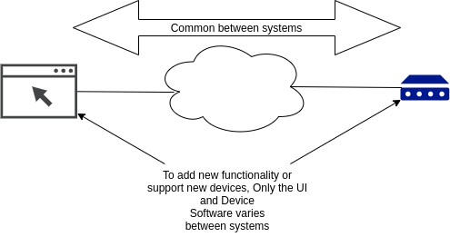
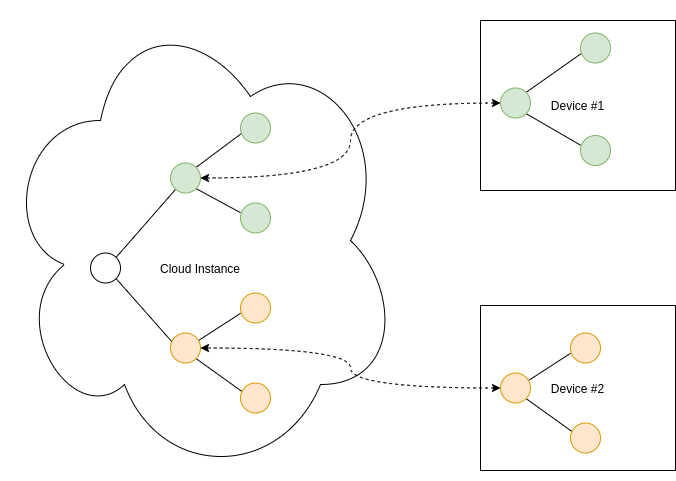

+++
title = "Architecture"
weight = 4
+++

This document describes how the Simple IoT project fulfills the basic
requirements as described in the top level [README](../README.md).

## IoT Systems are distributed systems

IoT systems are inherently distributed where data needs to be synchronized
between a number of different systems including:

1. Cloud (one to several instances depending on the level of reliability
   desired)
2. Edge nodes (many instances)
3. User Interface (phone, browser)

Typically, the cloud instance stores all the system data, and the edge, browser,
and mobile devices access a subset of the system data.

## Extensible architecture

Any `siot` app can function as a standalone, client, server or both. As an
example, `siot` can function both as an edge (client) and cloud apps (server).

- full client: full siot node that initiates and maintains connection with
  another siot instance on a server. Can be behind a firewall, NAT, etc.
- server: needs to be on a network that is accessible by clients

We also need the concept of a lean client where an effort is made to minimize
the application size to facilitate updates over IoT cellular networks where data
is expensive.

## Device communication and messaging

In an IoT system, data from sensors is continually streaming, so we need some
type of messaging system to transfer the data between various instances in the
system. This project uses NATS.io for messaging. Some reasons:

- allows us to [push realtime data](https://youtu.be/REZ6DKvRVv0) to an edge
  device behind a NAT, on cellular network, etc -- no public IP address, VPN,
  etc required.
- is more efficient than HTTP as it shares one persistent TCP connection for all
  messages. The overhead and architecture is similar to MQTT, which is proven to
  be a good IoT solution. It may also use less resources than something like
  observing resources in CoAP systems, where each observation requires a
  separate persistent connection.
- can scale out with multiple servers to provide redundancy or more capacity.
- is written in Go, so possible to embed the server to make deployments simpler
  for small systems. Also, Go services are easy to manage as there are no
  dependencies.
- focus on simplicity -- values fit this project.
- good security model.

For systems that only need to send one value several times a day, CoAP is
probably a better solution than NATS. Initially we are focusing on systems that
send more data -- perhaps 5-30MB/month. There is no reason we can't support CoAP
as well in the future.

## Data modification

Where possible, modifying data (especially nodes) should be initiated over nats
vs direct db calls. This ensures anything in the system can have visibility into
data changes. Eventually we may want to hide db operations that do writes to
force them to be initiated through a NATS message.

## Simple, Flexible data structures

As we work on IoT systems, data structures (types) tend to emerge. Common data
structures allow us to develop common algorithms and mechanism to process data.
Instead of defining a new data type for each type of sensor, define one type
that will work with all sensors. Then the storage (both static and time-series),
synchronization, charting, and rule logic can stay the same and adding
functionality to the system typically only involves changing the edge
application and the frontend UI. Everything between these two end points can
stay the same. This is a very powerful and flexible model as it is trivial to
support new sensors and applications.

The core data structures are currently defined in the [`data`](../data)
directory for Go code, and [`frontend/src/Data`](../frontend/src/Api) directory
for Elm code. The fundamental data structures for the system are
[`Nodes`](../data/node.go), [`Points`](../data/point.go), and
[`Edges`](../data/edge.go). A `Node` can have one or more `Points`. A `Point`
can represent a sensor value, or a configuration parameter for the node. With
sensor values and configuration represented as `Points`, it becomes easy to use
both sensor data and configuration in rule or equations because the mechanism to
use both is the same. Additionally, if all `Point` changes are recorded in a
time series database (for instance Influxdb), you automatically have a record of
all configuration and sensor changes for a `node`.

Treating most data as `Points` also has another benefit in that we can easily
simulate a device -- simply provide a UI or write a program to modify any point
and we can shift from working on real data to simulating scenarios we want to
test.

`Edges` are used to describe the relationships between nodes as a graph. `Nodes`
can have parents or children and thus be represented in a hierarchy. To add
structure to the system, you simply add nested `Nodes`. The `Node` hierarchy can
represent the physical structure of the system, or it could also contain virtual
`Nodes`. These virtual nodes could contain logic to process data from sensors.
Several examples of virtual nodes:

- a pump `Node` that converts motor current readings into pump events.
- implement moving averages, scaling, etc on sensor data.
- combine data from multiple sensors
- implement custom logic for a particular application
- a component in an edge device such as a cellular modem

Edges can also contain metadata (`Value`, `Text` fields) that further describe
the relationship between nodes. Some examples:

- role the user plays in the node (viewer, admin, etc)
- order of notifications when sequencing notifications through a node's users

Being able to arranged nodes in an arbitrary hierarchy also opens up some
interesting possibilities such as creating virtual nodes that have a number of
children that are collecting data. The parent virtual nodes could have rules or
logic that operate off data from child nodes. In this case, the virtual parent
nodes might be a town or city, service provider, etc., and the child nodes are
physical edge nodes collecting data, users, etc.

## Node Tree

The same Simple IoT application can run in both the cloud and device instances.
The node tree in a device would then become a subset of the nodes in the cloud
instance. Changes can be made to nodes in either the cloud or device and data is
sycnronized in both directions.

The following diagram illustrates how nodes might be arranged in a typical
system.

A few notes this structure of data:

- A user has access to its child nodes, parent nodes, and parent node
  descendants (parents, children, siblings, nieces/nephews).
- Likewise, a rule node processes points from nodes using the same relationships
  described above.
- A user can be added to any node. This allows permissions to be granted at any
  level in the system.
- A user can be added to multiple nodes.
- A node admin user can configure nodes under it. This allows a service provider
  to configure the system for their own customers.
- If a point changes, it triggers rules of upstream nodes to run (perhaps paced
  to some reasonable interval)
- The _Edge Dev Offline_ rule will fire if any of the Edge devices go offline.
  This allows us to only write this rule once to cover many devices.
- When a rule triggers a notification, the rule node and any upstream nodes can
  optionally notify its users.

The distributed parts of the system include the following instances:

- **Cloud** (could be multiple for redundancy). The cloud instances would
  typically store and synchronize the root node and everything under it.
- **Edge Devices** (typically many instances (1000's) connected via low
  bandwidth cellular data). Edge instances would would store and synchronize the
  edge node instance and descendants (ex Edge Device 1)
- **Web UI** (potentially dozens of instances connected via higher bandwidth
  browser connection).

As this is a distributed system where nodes may be created on any number of
connected systems, node IDs need to be unique. A unique serial number or UUID is
recommended.

## Data Synchronization

**NOTE, other than synchronization of node points, which is a fairly easy
problem, this section in a WIP**

See [research](research.md) for information on techniques that may be applicable
to this problem.

Typically, configuration is modified through a user interface either in the
cloud, or with a local UI (ex touchscreen LCD) at an edge device. Rules may also
eventually change values that need to be synchronized. As mentioned above, the
configuration of a `Node` will be stored as `Points`. Typically the UI for a
node will present fields for the needed configuration based on the `Node`
`Type`, whether it be a user, rule, group, edge device, etc.

In the system, the Node configuration will be relatively static, but the points
in a node may be changing often as sensor values changes, thus we need to
optimize for efficient synchronization of points. We can't afford the bandwidth
to send the entire node data structure any time something changes.

As IoT systems are fundamentally distributed systems, the question of
synchronization needs to be considered. Both client (edge), server (cloud), and
UI (frontend) can be considered independent systems and can make changes to the
same node.

- An edge device with a LCD/Keypad may make configuration changes.
- Configuration changes may be made in the Web UI.
- Sensor values will be sent by an edge device.
- Rules running in the cloud may update nodes with calculated values.

Although multiple systems may be updating a node at the same time, it is very
rare that multiple systems will update the same node point at the same time. The
reason for this is that a point typically only has one source. A sensor point
will only be updated by an edge device that has the sensor. A configuration
parameter will only be updated by a user, and there are relatively few admin
users, and so on. Because of this, we can assume there will rarely be collisions
in individual point changes, and thus this issue can be ignored. The point with
the latest timestamp is the version to use.

### Real-time Point synchronization

Point changes are handled by sending points to a NATS topic for a node any time
it changes. There are three primary instance types:

1. Cloud: will subscribe to point changes on all nodes (wildcard)
1. Edge: will subscribe to point changes only for the nodes that exist on the
   instance -- typically a handful of nodes.
1. WebUI: will subscribe to point changes for nodes currently being viewed --
   again, typically a small number.

With Point Synchronization, each instance is responsible for updating the node
data in its local store.

### Catch-up/non real-time synchronization

Sending points over NATS will handle 99% of data synchronization needs, but
there are a few cases this does not cover:

1. One system is offline for some period of time
1. Data is lost during transmission
1. Other errors or unforeseen situations

There are two types of data:

1. periodic sensor readings (we'll call sample data) that is being continuously
   updated
1. configuration data that is infrequently updated

Any node that produces sample data should send values every 10m, even if the
value is not changing. There are several reasons for this:

- indicates the data source is still alive
- makes graphing easier if there is always data to plot
- covers the synchronization problem for sample data. A new value will be coming
  soon, so don't really need catch-up synchronization for sample data.

Config data is not sent periodically. To manage synchronization of config data,
each node will have a `Hash` field.

The node `Hash` field is a hash of:

- node point timestamps except for sample points. Sample points are excluded
  from the node hash as discussed above.
- and child node `Hash` fields

The points are sorted by timestamp and child nodes are sorted by hash so that
the order is consistent when the hash is computed.

This is essentially a Merkle Tree -- see [research](research.md).

Comparing the node `Hash` field allows us to detect node differences. We then
compare the node points and child nodes to determine the actual differences.

Any time a node point (except for sample date) is modified, the node's `Hash`
field is updated, and the `Hash` field in parents, grand-parents, etc are also
computed and updated. This may seem like a lot of overhead, but if the database
is local, and the graph is reasonably constructed, then each update might
require reading a dozen or so nodes and perhaps writing 3-5 nodes. Additionally,
non sample-data changes are relatively infrequent.

Initially synchronization between edge and cloud nodes is supported. The edge
device will contain an "upstream" node that defines a connection to another
instance's NATS server -- typically in the cloud. The edge node is responsible
for synchronizing of all state using the following algorithm:

1. occasionally the edge device fetches the edge device root node hash from the
   cloud.
1. if the hash does not match, the edge device fetches the entire node and
   compares/updates points. If local points need updated, this process can
   happen all on the edge device. If upstream points need updated, these are
   simply transmitted over NATS.
1. if node hash still does not match, a recursive operation is started to fetch
   child node hashes and the same process is repeated.

### Node additions

If a node is added, the hash mechanism will detect a node has been added. If the
node is missing on the edge device, that node is requested. If the node is
missing in the cloud, the node is transmitted by the edge device to the cloud.

### Node deletions

If a node is deleted, this information needs to be recorded, otherwise the
synchronization process will simply re-create the deleted node if it exists on
another instance. To signify a node has been deleted, the hash will be set to a
blank string.

## Frontend architecture

Much of the frontend architecture is already defined by the Elm architecture.
The current frontend is based on the [elm-spa.dev](https://www.elm-spa.dev/)
project, which defines the data/page model. Data is fetched using REST APIs, but
eventually we would like to use the same synchronization method that is used in
edge devices to make the web UI more real-time.

We'd like to keep the UI
[optimistic](https://blog.meteor.com/optimistic-ui-with-meteor-67b5a78c3fcf) if
possible.
