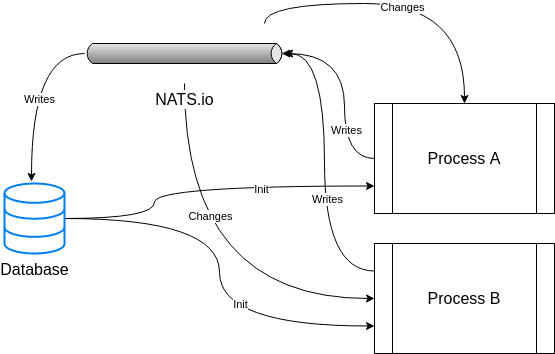
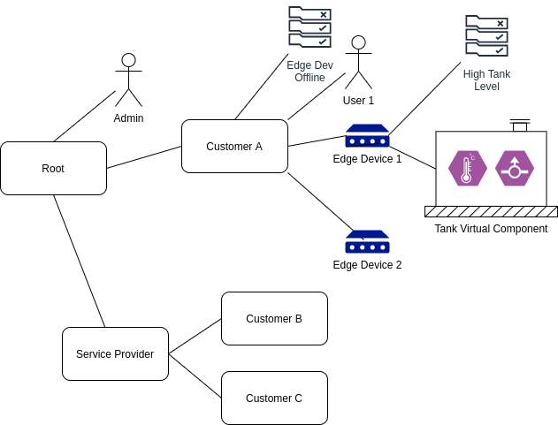

# System Architecture

**Contents**

<!-- toc -->

## IoT Systems are distributed systems

IoT systems are inherently distributed where data needs to be synchronized
between a number of different systems including:

1. Cloud (one to several instances depending on the level of reliability
   desired)
2. Edge devices (many instances)
3. User Interface (phone, browser)

Typically, the cloud instance stores all the system data, and the edge, browser,
and mobile devices access a subset of the system data.

## Extensible architecture

Any `siot` app can function as a standalone, client, server or both. As an
example, `siot` can function both as an edge (client) and cloud apps (server).

- Full client: full SIOT node that initiates and maintains connection with
  another SIOT instance on a server. Can be behind a firewall, NAT, etc.
- Server: needs to be on a network that is accessible by clients

We also need the concept of a lean client where an effort is made to minimize
the application size to facilitate updates over IoT cellular networks where data
is expensive.

## Device communication and messaging

In an IoT system, data from sensors is continually streaming, so we need some
type of messaging system to transfer the data between various instances in the
system. This project uses NATS.io for messaging. Some reasons:

- Allows us to [push real-time data](https://youtu.be/REZ6DKvRVv0) to an edge
  device behind a NAT, on cellular network, etc. - no public IP address, VPN,
  etc. required.
- Is more efficient than HTTP as it shares one persistent TCP connection for all
  messages. The overhead and architecture is similar to MQTT, which is proven to
  be a good IoT solution. It may also use less resources than something like
  observing resources in CoAP systems, where each observation requires a
  separate persistent connection.
- Can scale out with multiple servers to provide redundancy or more capacity.
- Is written in Go, so possible to embed the server to make deployments simpler
  for small systems. Also, Go services are easy to manage as there are no
  dependencies.
- Focus on simplicity - values fit this project.
- Good security model.

For systems that only need to send one value several times a day, CoAP is
probably a better solution than NATS. Initially we are focusing on systems that
send more data - perhaps 5-30MB/month. There is no reason we can't support CoAP
as well in the future.

## Data modification

Where possible, modifying data (especially nodes) should be initiated over NATS
vs direct db calls. This ensures anything in the system can have visibility into
data changes. Eventually we may want to hide db operations that do writes to
force them to be initiated through a NATS message.

## Simple, Flexible data structures

As we work on IoT systems, data structures (types) tend to emerge. Common data
structures allow us to develop common algorithms and mechanism to process data.
Instead of defining a new datatype for each type of sensor, define one type that
will work with all sensors. Then the storage (both static and time-series),
synchronization, charting, and rule logic can stay the same and adding
functionality to the system typically only involves changing the edge
application and the frontend UI. Everything between these two end points can
stay the same. This is a very powerful and flexible model as it is trivial to
support new sensors and applications.

See [Data](data.md) for more information.

## Node Tree

The same Simple IoT application can run in both the cloud and device instances.
The node tree in a device would then become a subset of the nodes in the cloud
instance. Changes can be made to nodes in either the cloud or device and data is
synchronized in both directions.

The following diagram illustrates how nodes might be arranged in a typical
system.

A few notes this structure of data:

- A user has access to its child nodes, parent nodes, and parent node
  descendants (parents, children, siblings, nieces/nephews).
- Likewise, a rule node processes points from nodes using the same relationships
  described above.
- A user can be added to any node. This allows permissions to be granted at any
  level in the system.
- A user can be added to multiple nodes.
- A node admin user can configure nodes under it. This allows a service provider
  to configure the system for their own customers.
- If a point changes, it triggers rules of upstream nodes to run (perhaps paced
  to some reasonable interval)
- The _Edge Dev Offline_ rule will fire if any of the Edge devices go offline.
  This allows us to only write this rule once to cover many devices.
- When a rule triggers a notification, the rule node and any upstream nodes can
  optionally notify its users.

The distributed parts of the system include the following instances:

- **Cloud** (could be multiple for redundancy). The cloud instances would
  typically store and synchronize the root node and everything under it.
- **Edge Devices** (typically many instances (1000's) connected via low
  bandwidth cellular data). Edge instances would store and synchronize the edge
  node instance and descendants (ex Edge Device 1)
- **Web UI** (potentially dozens of instances connected via higher bandwidth
  browser connection).

As this is a distributed system where nodes may be created on any number of
connected systems, node IDs need to be unique. A unique serial number or UUID is
recommended.
