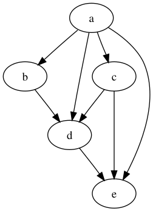
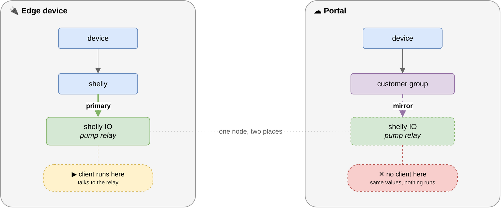

# Data

**Contents**

<!-- toc -->

See also:

- [Data store](store.md)
- [Data synchronization](./sync.md)

## Data Structures

As a client developer, there are two main primary structures:
[`NodeEdge`](https://pkg.go.dev/github.com/simpleiot/simpleiot/data#NodeEdge)
and [`Point`](https://pkg.go.dev/github.com/simpleiot/simpleiot/data#Point). A
`Node` can be considered a collection of `Points`.

These data structures describe most data that is stored and transferred in a
Simple IoT system.

The core data structures are currently defined in the
[`data`](https://github.com/simpleiot/simpleiot/tree/master/data) directory for
Go code, and
[`frontend/src/Api`](https://github.com/simpleiot/simpleiot/tree/master/frontend/src/Api)
directory for Elm code.

A `Point` can represent a sensor value, or a configuration parameter for the
node. With sensor values and configuration represented as `Points`, it becomes
easy to use both sensor data and configuration in rule or equations because the
mechanism to use both is the same. Additionally, if all `Point` changes are
recorded in a time series database (for instance InfluxDB), you automatically
have a record of all configuration and sensor changes for a `node`.

Treating most data as `Points` also has another benefit in that we can easily
simulate a device. Provide an UI or write a program to modify any point and we
can shift from working on real data to simulating scenarios we want to test.

Edges are used to describe the relationships between nodes as a
[directed acyclic graph](https://en.wikipedia.org/wiki/Directed_acyclic_graph).



`Nodes` can have parents or children and thus be represented in a hierarchy. To
add structure to the system, you simply add nested `Nodes`. The `Node` hierarchy
can represent the physical structure of the system, or it could also contain
virtual `Nodes`. These virtual nodes could contain logic to process data from
sensors. Several examples of virtual nodes:

- A pump `Node` that converts motor current readings into pump events.
- Implement moving averages, scaling, etc. on sensor data.
- Combine data from multiple sensors
- Implement custom logic for a particular application
- A component in an edge device such as a cellular modem

Like Nodes, Edges also contain a Point array that further describes the
relationship between Nodes. Some examples:

- Role the user plays in the node (viewer, admin, etc.)
- Order of notifications when sequencing notifications through a node's users
- Node is enabled/disabled for instance we may want to disable a Modbus IO node
  that is not currently functioning.

Being able to arranged nodes in an arbitrary hierarchy also opens up some
interesting possibilities such as creating virtual nodes that have a number of
children that are collecting data. The parent virtual nodes could have rules or
logic that operate off data from child nodes. In this case, the virtual parent
nodes might be a town or city, service provider, etc., and the child nodes are
physical edge nodes collecting data, users, etc.

### The Point `Key` field constraint

The Point data structure has a `Key` field that can be used to construct Array
and Map data structures in a node. This is a flexible idea in that it is easy to
transition from a scaler value to an array or map. However, it can also cause
problems if one client is writing key values of `""` and another client (say a
rule action) is writing value of `"0"`. One solution is to have fancy logic that
equates `""` to `"0"` on point updates, compares, etc. Another approach is to
consider `""` and invalid key value and set key to `"0"` for scaler values. This
incurs a slight amount of overhead, but leads to more predictable operation and
eliminates the possibility of having two points in a node that mean the same
things.

**The Simple IoT Store always sets the Key field to `"0"` on incoming points if
the Key field is blank.**

Clients should be written with this in mind.

### The Point `Type` and `Key` character constraint

A point travels on a NATS subject that ends in its type and key, so both are
subject tokens and may not contain a period, whitespace, or the NATS wildcards
`*` and `>`. Listeners read the node ID and parent ID from fixed positions in a
subject, so a period would add a token, shift everything after it, and deliver
the point to the wrong handler.

The store rejects points it cannot publish rather than rewriting them, since a
key is data the sender chose and often the name it writes back to. A rejected
point is logged with its type and key, and an `error` point is set on the node
so the sender is visible in the UI.

A client that builds keys from names it does not control -- kernel device names,
mount points, network interface names -- should pass them through
[`data.SubjectSafeToken`](https://pkg.go.dev/github.com/simpleiot/simpleiot/data#SubjectSafeToken),
which replaces the offending characters with underscores. The metrics client
does this for sensor and interface names, which is why a cooling device the
kernel calls `devfreq-17000000.gpu` appears as `devfreq-17000000_gpu`.

### The number of points on a node

A node and all of its points are encoded into a single NATS message when the
node is requested, so a node cannot hold an unbounded number of points. A
typical point encodes to about 34 bytes and one with a long type and a
multi-label key to about 100, against a 1 MB message limit, so a node reaches it
somewhere around 10,000 points.

A client that can generate points in bulk — one reading per device, per process,
or per scraped metric — should bound how many it publishes to a single node, and
should split a large source across several nodes rather than growing one. The
failure is worse than it sounds: a reply carries a subtree, so a node too large
to encode fails every tree fetch that covers it, not only itself. See
[Message and payload limits](store.md#message-and-payload-limits) for the
symptoms and for how to recover a node that has already grown too large.

### Converting Nodes to other data structures

Nodes and Points are convenient for storage and synchronization, but cumbersome
to work with in application code that uses the data, so we typically convert
them to another data structure.
[`data.Decode`](https://pkg.go.dev/github.com/simpleiot/simpleiot/data#Decode),
[`data.Encode`](https://pkg.go.dev/github.com/simpleiot/simpleiot/data#Encode),
and
[`data.MergePoints`](https://pkg.go.dev/github.com/simpleiot/simpleiot/data#MergePoints)
can be used to convert Node data structures to your own custom `struct`, much
like the Go `json` package.

### Arrays and Maps

Points can be used to represent arrays and maps. For an array, the `key` field
contains the index `"0"`, `"1"`, `"2"`, etc. For maps, the `key` field contains
the key of the map. An example:

| Type            | Key   | Data (string)    | Data (number) |
| --------------- | ----- | ---------------- | ------------- |
| description     | 0     | Node Description |               |
| ipAddress       | 0     | 192.168.1.10     |               |
| ipAddress       | 1     | 10.0.0.3         |               |
| diskPercentUsed | /     |                  | 43            |
| diskPercentUsed | /home |                  | 75            |
| switch          | 0     |                  | 1             |
| switch          | 1     |                  | 0             |

The above would map to the following Go type:

```go
type myNode struct {
    ID              string      `node:"id"`
    Parent          string      `node:"parent"`
    Description     string      `node:"description"`
    IpAddresses     []string    `point:"ipAddress"`
    Switches        []bool      `point:"switch"`
    DiscPercentUsed []float64   `point:"diskPercentUsed"`
}
```

The
[`data.Decode()`](https://pkg.go.dev/github.com/simpleiot/simpleiot/data#Decode)
function can be used to decode an array of points into the above type. The
[`data.Merge()`](https://pkg.go.dev/github.com/simpleiot/simpleiot/data#MergePoints)
function can be used to update an existing struct from a new point.

#### Best practices for working with arrays

To make changes to an array in UI/Client code when storing the array in a native
structure, store a length field as well so you know how long the original array
was. After modifying the array, check if the new length is less than the
original - if it is, then add a tombstone points to the end so that the deleted
points get removed.

Generally it is simplest to send the entire array as a single message any time
any value in it has changed - especially if values are going to be added or
removed. The `data.Decode` will then correctly handle the array resizing.

#### Technical details of how `data.Decode` works with slices

Some consideration is needed when using `Decode` and `MergePoints` to decode
points into Go slices. Slices are never allocated / copied unless they are being
expanded. Instead, deleted points are written to the slice as the zero value.
However, for a given `Decode` call, if points are deleted from the _end_ of the
slice, `Decode` will re-slice it to remove those values from the slice. Thus,
there is an important consideration for clients: if they wish to rely on slices
being truncated when points are deleted, points must be batched in order such
that `Decode` sees the trailing deleted points first. Put another way, `Decode`
does not care about points deleted from prior calls to `Decode`, so "holes" of
zero values may still appear at the end of a slice under certain circumstances.
Consider points with integer values `[0, 1, 2, 3, 4]`. If tombstone is set on
point with `Key` 3 followed by a point tombstone set on point with `Key` `4`,
the resulting slice will be `[0, 1, 2]` if these points are batched together.
But, if they are sent separately (thus resulting in multiple `Decode` calls),
the resulting slice will be `[0, 1, 2, 0]`.

## Node Topology changes

Nodes can exist in multiple locations in the tree. This allows us to do things
like include a user in multiple groups.

### Add

Node additions are detected in real-time by sending the points for the new node
as well as points for the edge node that adds the node to the tree.

### Copy

Node copies are similar to add, but only the edge points are sent. A copy of a
node that has a primary location is marked a mirror; see
[Primary and mirror edges](#primary-and-mirror-edges) below.

### Delete

Node deletions are recorded by setting a tombstone point in the edge above the
node to true. If a node is deleted, this information needs to be recorded,
otherwise the synchronization process will simply re-create the deleted node if
it exists on another instance.

Deleting the primary edge of a node also deletes its mirrors, because a mirror
of a deleted node has nothing behind it.

### Move

Move is just a combination of Copy and Delete. The role of the edge is carried
across, so a moved node keeps the place it had. Some node types are found by
walking down from their parent rather than from the tree root, and those cannot
be moved out from under it (see below).

If the any real-time data is lost in any of the above operations, the catch up
synchronization will propagate any node changes.

## Primary and mirror edges

A node reached through two parents is one node with one set of points, and for
most node types that is the point of mirroring: a user belongs to two groups, a
rule is visible from two places. For a node that owns something outside the tree
(a Modbus bus, a GPIO line, an MQTT broker connection), it is not. Two clients
acting on one piece of hardware, possibly from two instances, have no way to
coordinate.



The edge says which is which, through two edge points:

| Edge points   | Role    | Meaning                                                                     |
| ------------- | ------- | --------------------------------------------------------------------------- |
| `primary` = 1 | primary | the node in the place it lives; its client runs here                        |
| `mirror` = 1  | mirror  | a view of the node for organization and access control; no client runs here |
| neither       | no role | a node with no primary location; every edge runs a client                   |

Read the role through
[`NodeEdge.EdgeRole`](https://pkg.go.dev/github.com/simpleiot/simpleiot/data#NodeEdge.EdgeRole)
rather than the points directly. An edge carrying both points reads as a mirror,
because declining to run a client is the safe direction to fail.

### Which node types have a primary location

A node type is primary when its client's behavior comes from a resource it holds
rather than from where the node sits: `modbus`, `modbusIo`, `oneWire`,
`oneWireIO`, `shelly`, `shellyIo`, `gpio`, `gps`, `serialDev`, `canBus`,
`particle`, `networkManager` and its children, `ntp`, `browser`, `update`,
`provisioning`, `provisioningFile`, `sync`, `metrics`, `signalGenerator`,
`mqtt`, `mqttSub`, and the `mqttDevice` and Sparkplug nodes an MQTT connection
builds from the topics it sees.

The rest take their meaning from where they sit, so several instances are
meaningful and each one runs a client: `device`, `user`, `group`, `rule`,
`condition`, `action`, `actionInactive`, `variable`, `db`, `msgService`, and
`file`. A `db` client records the subtree under its parent and a `msgService`
client sees notifications raised under its parent, so mirroring one into a
second group gives a second client doing a different and correct job.

A custom node type the system does not know carries no role and behaves as node
types always have.

The two groups are `primaryTypes` and `treeScopedTypes` in
[`data/edge_role.go`](https://github.com/simpleiot/simpleiot/blob/master/data/edge_role.go).
Both are listed explicitly, and a test fails when a node type is in neither, so
adding a client means deciding which side its node type belongs on.

### Nodes that belong under a particular parent

Separately from the primary role, some node types are found by walking down from
their parent: a `modbusIo` through its `modbus` bus, a `condition` through its
`rule`. Moving one of these elsewhere leaves it where nothing looks for it, so
the move is refused and mirroring is offered instead. `data.NodeTypeOwner` holds
the table.

### Across sync boundaries

Mirroring a node from a device subtree into a group on an upstream instance is
the case this mechanism was built for, and the roles are set correctly when it
happens: the device keeps the primary edge, the upstream group gets a mirror,
and only the device runs a client. Access works the same way, since a mirror
edge grants a user reach to the node exactly as any other edge does.

Control works through the mirror as well. A `valueSet` written on the mirror --
by a rule on the upstream, or someone pressing a button in the portal UI --
reaches the device, and the client there acts on it and reports the result back
as `value`. Nothing about the write is special: the mirror and the primary are
the same node, so a point written on either lands on the node itself.

What makes this work is that ownership follows the primary edge.
`EdgeCache.OwningBoundary` walks up from a node to find the boundary that owns
it, and it skips mirror edges. A device replicates only the streams for its own
boundary, so if a mirror on the upstream moved the node's ownership to the
upstream root, points the upstream wrote would be stored where the device never
reads them and a command would never arrive. Skipping mirror edges keeps the
node with the device that holds the hardware, which is where the client that
acts on it runs.

A node with no role works the same way without any marking. Every node hangs off
the instance root, so reaching the root alongside a device boundary says only
that the node is somewhere in this instance's tree, and the device boundary is
the one that says where the node lives. A variable on a device that is also
mirrored onto the upstream therefore stays owned by the device, and a value
written on the upstream reaches it. A node reachable from two device boundaries
has nothing to choose between them and resolves to the instance root.

### Upgrading

Edges created before this mechanism existed carry no role, so they keep running
clients as they always have, including mirrors of hardware nodes. Which of
several existing edges was meant to be the primary cannot be told after the
fact, so nothing is guessed at for edges that are already there.

Mirroring one of these nodes does mark it, because the mirror is a new edge and
the edge it is made from is where the node already lived: for a node type with a
primary location, the source edge becomes the primary and the new edge a mirror.
A mirror made before the upgrade carries no role, so remove it and mirror again
to have both edges marked.

## Tracking who made changes

The `Point` type has an `Origin` field that is used to track who generated this
point. If the node that owned the point generated the point, then Origin can be
left blank - this saves data bandwidth - especially for sensor data which is
generated by the client managing the node. There are several reasons for the
`Origin` field:

- Track who made changes for auditing and debugging purposes. If a rule or some
  process other than the owning node modifies a point, the Origin should always
  be populated. Tests that generate points should generally set the origin to
  "test".
- Eliminate echos where a client may be subscribed to a subject as well as
  publish to the same subject. With the Origin field, the client can determine
  if it was the author of a point it receives, and if so simply drop it. See
  [client documentation](client.md#message-echo) for more discussion of the echo
  topic.

## Evolvability

One important consideration in data design is the can the system be easily
changed. With a distributed system, you may have different versions of the
software running at the same time using the same data. One version may use/store
additional information that the other does not. In this case, it is very
important that the other version does not delete this data, as could easily
happen if you decode data into a type, and then re-encode and store it.

With the Node/Point system, we don't have to worry about this issue because
Nodes are only updated by sending Points. It is not possible to delete a Node
Point. So it one version writes a Point the other is not using, it will be
transferred, stored, synchronized, etc. and simply ignored by version that don't
use this point. This is another case where SIOT solves a hard problem that
typically requires quite a bit of care and effort.
