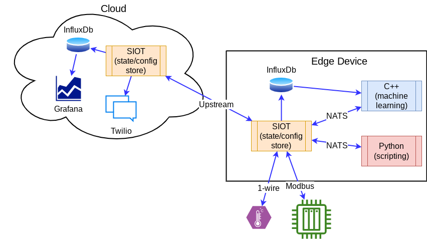

# Integration

This page discusses ways you can integration Simple IoT into your system. At
[its core](architecture.md), SIOT is a distributed graph database optimized for
storing, viewing, and synchronizing state/config in IoT systems. This makes it
very useful for any system where you need distributed state/config.

With SIOT, you run the same application in both the cloud and edge devices, so
you can use any of the available integration points at either place.

## The SIOT API

This primary way to interact with Simple IoT is through a
[NATS API](api.html#nats). You can add additional processes written in any
language that has a [NATS client](https://nats.io/download/). Additionally, the
[NATS wire protocol](https://docs.nats.io/reference/reference-protocols/nats-protocol)
is fairly simple so could be implemented from scratch if needed. If your most of
your system is written in C++, but you needed a distributed config/state store,
then run SIOT along side your existing processes and add a NATs connection to
SIOT. If you want easy scripting in your system, consider writing a Python
application that can read/modify the SIOT store over NATS.

## SIOT Data Structures

The SIOT data structures are very general (nodes and points) arranged in a
graph, so you can easily add your own data to the SIOT store by defining new
node and point types as needed. This makes SIOT very flexible and adaptable to
about any purpose. You can use points in a node to represent maps and arrays. If
you data needs more structure, then nested nodes can accomplish that. It is
important with SIOT data to retain CRDT properties. These concepts are discussed
more in [ADR-1](../adr/1-consider-changing-point-data-type.md).

The requirement to only use nodes and points may seem restrictive at first, but
can be viewed as a serialization format with CRDT properties that are convenient
for synchronization. Any distributed database requires meta data around your
data to assist with synchronization. With SIOT, we have chosen to make this
metadata simple and accessible to the user. It is typical to convert this data
to more convenient data structures in your application -- much the same way you
would deserialize JSON.

The [architecture page](architecture.md#simple-flexible-data-structures)
discusses data structures in more detail.

## Time series data and Graphing

If you need history and graphs, you can add
[InfluxDB and Grafana](../user/graphing.md). This instantly gives you history
and graphs of all state and configuration changes that happened in the system.

## Embedded Linux Systems

Simple IoT was designed with Embedded Linux systems in mind, so it is very
efficient -- a single, statically linked Go binary with all assets embedded that
is ~20MB in size and uses ~20MB of memory. There are no other dependencies
required such as a runtime, other libraries, etc. This makes SIOT extremely easy
to deploy and update. An Embedded Linux system deployed at the edge can be
synchronized with a cloud instance using an [upstream](../user/upstream.md)
connection.

## Integration with MCU (Microcontroller) systems

MCUs are processors designed for embedded control and are typically 32-bit CPUs
that run bare-metal code or a small OS like FreeRTOS or Zephyr and don't have as
[much memory as MPUs](http://bec-systems.com/site/1540/microcontroller-mcu-or-microprocessor-mpu).
MCUs cannot run the full SIOT application or easily implement a full
data-centric data store. However, you can still leverage the SIOT system by
using the node/point data structures to describe configuration and state and
interacting with a Simple IoT like any other NATS client.
[nanopb](https://github.com/nanopb/nanopb) can be used on MCUs to encode and
decode protobuf messages, which is the default encoding for SIOT messages.

If your MCU supports MQTT, then it may make sense to use that to interact with
Simple IoT as MQTT is very similar to NATS, and NATS includes a built-in MQTT
server. The
[NATS wire protocol](https://docs.nats.io/reference/reference-protocols/nats-protocol)
is also fairly simple and can also be implemented on top of any TCP/IP stack.

If your MCU interfaces with a local SIOT system using USB, serial, or CAN, then
you can use the SIOT [serial adapter](serial.md).
