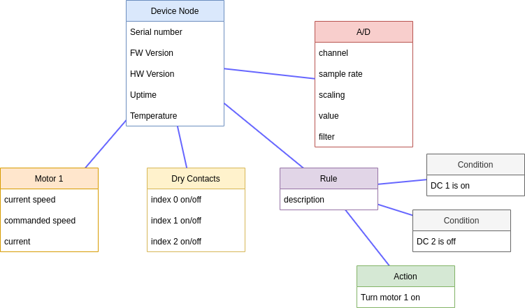

# Serial Devices

**Contents**

<!-- toc -->

(see also [user documentation](../user/mcu.md) and
[SIOT Firmware](https://github.com/simpleiot/firmware/tree/master/Arduino))

It is common in embedded systems architectures for a MPU (Linux-based running
SIOT) to be connected via a serial link (RS232, RS485, CAN, USB serial) to an
MCU.


See
[this article](http://bec-systems.com/site/1540/microcontroller-mcu-or-microprocessor-mpu)
for a discussion on the differences between a MPU and MCU. These devices are not
connected via a network interface, so can't use the [SIOT NATS API](api.md#nats)
directly, thus we need to define a proxy between the serial interface and NATS
for the MCU to interact with the SIOT system.

State/config data in both the MCU and MPU systems are represented as nodes and
points. An example of nodes and points is shown below. These can be arranged in
any structure that makes sense and is convenient. Simple devices may only have a
single node with a handful of points.



SIOT does not differentiate between state (ex: sensor values) and config (ex:
pump turn-on delay) -- it is all points. This simplifies the transport and
allows changes to be made in multiple places. It also allows for the granular
transmission and synchronization of data -- we don't need to send the entire
state/config anytime something changes.

SIOT has the ability to log points to InfluxDB, so this mechanism can also be
used to log messages, events, state changes, whatever -- simply use an existing
point type or define a new one, and send it upstream.

## Protocol

The SIOT serial protocol mirrors the NATS
[PUB message](https://docs.nats.io/reference/reference-protocols/nats-protocol#pub)
with a few assumptions:

- we don't have mirrored nodes inside the MCU device
- the number of nodes and points in a MCU is relatively small
- the payload is always an array of points
- only the following [SIOT NATS API](api.md#nats) subjects are supported:
  - blank (assumes ID of Serial MCU client node
  - `p.<id>` (used to send node points)
  - `p.<id>.<parent>` (used to send edge points)
  - `phr` (specifies high-rate payload)
- we don't support NATS subscriptions or requests -- on startup, we send the
  entire dataset for the MCU device in both directions (see On connection
  section), merge the contents, and then assume any changes will get sent and
  received after that.

`subject` can be left blank when sending/receiving points for the MCU root node.
This saves some data in the serial messages.

The point type `nodeType` is used to create new nodes and to send the node type
on connection.

All packets are ack'd by an empty packet with the same sequenced number. If an
ack is not received in X amount of time, the packet is retried up to 3 times,
and then the other device is considered "offline".

### Encoding

#### Packet Frame

All packets between the SIOT and serial MCU systems are framed as follows:

```
sequence (1 byte, rolls over)
subject (16 bytes)
payload (Protobuf Point array or HR repeated point payload)
crc (2 bytes) (Currently using CRC-16/KERMIT)
```

Protocols like RS232 and USB serial do not have any inherent framing; therefore,
this needs to be done at the application level. SIOT encodes each packet using
[COBS (Consistent Overhead Byte Stuffing)](https://en.wikipedia.org/wiki/Consistent_Overhead_Byte_Stuffing).

#### Protobuf payload

The `serial` protobuf type is used to transfer these messages:

```
message SerialPoint {
  string type = 2;
  float value = 4;
  int64 time = 16;
  float index = 13;
  string text = 8;
  string key = 11;
  int32 tombstone = 12;
}
```

Protobuf can be used for low-rate samples, config, state, etc.

Protobuf is used to encode the data on the wire. Find protobuf files
[here](https://github.com/simpleiot/simpleiot/tree/master/internal/pb).
[nanopb](https://github.com/nanopb/nanopb) can be used to generate C-based
protobuf bindings that are suitable for use in most MCU environments.

#### High-rate payload

A simple payload encoding for high-rate data can be used to avoid the overhead
of protobuf encoding and is specified with `phr` in the packet frame subject.

```
type (16 bytes) point type
key (16 bytes) point key
starttime (uint64) starting time of samples in ns since Unix Epoch
sampleperiod (uint32) time between samples in ns
count (uint16) number of samples
data, packed 32-bit floating point samples
```

This data bypasses most of the processing in SIOT and is sent to a special
[`phr` NATS subject](api.md). Clients that are interested in high-rate data
(like the InfluxDB client) can listen to these subjects.

### On connection

On initial connection between a serial device and SIOT, the following steps are
done:

- the MCU sends the SIOT system an empty packet with its root node ID
- the SIOT systems sends the current time to the MCU (point type `currentTime`)
- the MCU updates any "offline" points with the current time (see offline
  section).
- the SIOT acks the current time packet.
- all of the node and edge points are sent from the SIOT system to the MCU, and
  from the MCU to the SIOT system. Each system compares point time stamps and
  updates any points that are newer. Relationships between nodes are defined by
  edge points (point type `tombstone`).

### Timestamps

Simple IoT currently uses the default
[protobuf timestamp format](https://developers.google.com/protocol-buffers/docs/reference/google.protobuf#google.protobuf.Timestamp),
which includes the following fields:

| Field name | Type    | Description                                                                                                                                                                                                       |
| ---------- | ------- | ----------------------------------------------------------------------------------------------------------------------------------------------------------------------------------------------------------------- |
| `seconds`  | `int64` | Represents seconds of UTC time since Unix epoch 1970-01-01T00:00:00Z. Must be from 0001-01-01T00:00:00Z to 9999-12-31T23:59:59Z inclusive.                                                                        |
| `nanos`    | `int32` | Non-negative fractions of a second at nanosecond resolution. Negative second values with fractions must still have non-negative nanos values that count forward in time. Must be from 0 to 999,999,999 inclusive. |

### Fault handling

Any communication medium has the potential to be disrupted (unplugged/damaged
wires, one side off, etc). Devices should continue to operate and when
re-connected, do the right thing.

If a MCU has a valid time (RTC, sync from SIOT, etc), it will continue
operating, and when reconnected, it will send all its points to re-sync.

If a MCU powers up and has no time, it will set the time to 1970 and start
operating. When it receives a valid time from the SIOT system, it will compute
the time offset from the SIOT time and its own 1970 based time, index through
all points, add the offset to any points with time less than 2020, and then send
all points to SIOT.

When the MCU syncs time with SIOT, if the MCU time is ahead of the SIOT system,
then it set its time, and look for any points with a time after present, and
reset these timestamps to the present.

## RS485

Status: Idea

RS485 is a half duplex, prompt response transport. SIOT periodically prompts MCU
devices for new data at some configurable rate. Data is still COBS encoded so
that is simple to tell where packets start/stop without needing to rely on dead
space on the line.

Simple IoT also supports modbus, but the native SIOT protocol is more capable --
especially for structured data.

Addressing: TODO

## CAN

Status: Idea

CAN messages are limited to 8 bytes. The J1939 Transport Protocol can be used to
assemble multiple messages into a larger packet for transferring up to 1785
bytes.

## Implementation notes

Both the SIOT and MCU side need to store the common set of nodes and points
between the systems. This is critical as the point merge algorithm only uses an
incoming point if the incoming point is newer than the one currently stored on
the device. For SIOT NATS clients, we use the NodeEdge data structure:

```go
type NodeEdge struct {
        ID         string
        Type       string
        Parent     string
        Points     Points
        EdgePoints Points
	Origin     string
}
```

Something similar could be done on the MCU.

If new nodes are created on the MCU, the ID must be a UUID, so that it does not
conflict with any of the node IDs in the upstream SIOT system(s).

On the SIOT side, we keep a list of Nodes on the MCU and periodically check if
any new Nodes have been created. If so, we send the new Nodes to the MCU.
Subscriptions are set up for points and edges of all nodes, and any new points
are sent to the MCU. Any points received from the MCU simply forwarded to the
SIOT NATS bus.

## DFU

Status: Idea

For devices that support USB Device Firmware Upgrade (DFU), SIOT provides a
mechanism to do these updates. A node that specifies USB ID and file configures
the process.

- [DFU Specification](https://www.usb.org/sites/default/files/DFU_1.1.pdf)
- [Windows Implementation](https://docs.microsoft.com/en-us/windows-hardware/drivers/stream/device-firmware-update-for-usb-devices-without-using-a-co-installer)
