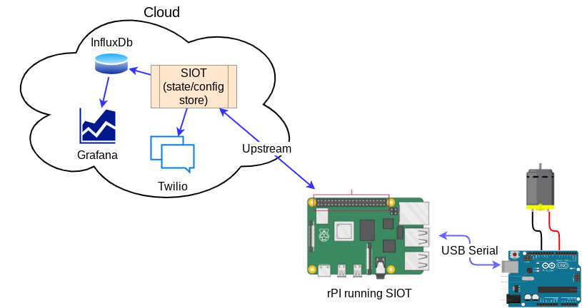
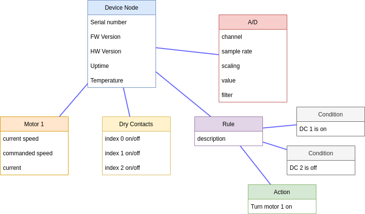
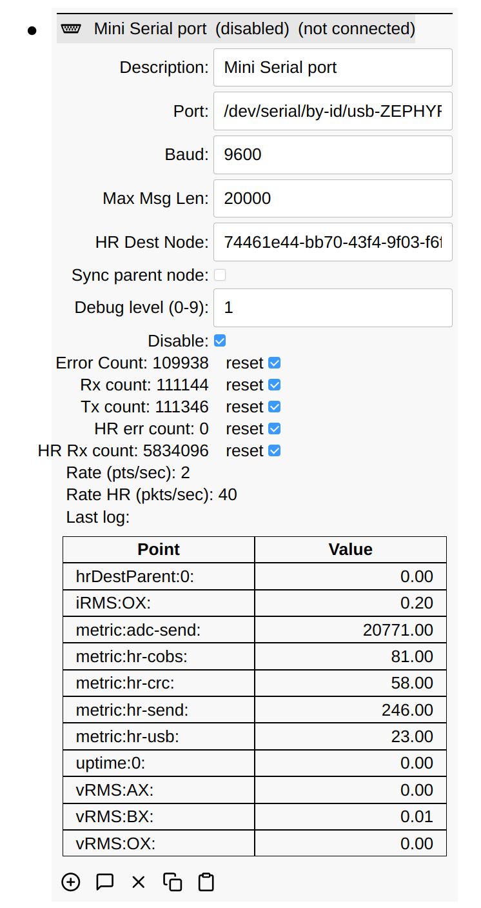

# Serial Devices

**Contents**

<!-- toc -->

(see also [user documentation](../user/mcu.md) and
[SIOT Firmware](https://github.com/simpleiot/firmware/tree/master/Arduino))

It is common in embedded systems architectures for an MPU (Linux-based running
SIOT) to be connected via a serial link (RS232, RS485, CAN, USB serial) to an
MCU.



See
[this article](http://bec-systems.com/site/1540/microcontroller-mcu-or-microprocessor-mpu)
for a discussion on the differences between an MPU and MCU. These devices are
not connected via a network interface, so can't use the
[SIOT NATS API](api.md#nats) directly, thus we need to define a proxy between
the serial interface and NATS for the MCU to interact with the SIOT system.

State/config data in both the MCU and MPU systems are represented as nodes and
points. An example of nodes and points is shown below. These can be arranged in
any structure that makes sense and is convenient. Simple devices may only have a
single node with a handful of points.



SIOT does not differentiate between state (ex: sensor values) and config (ex:
pump turn-on delay) - it is all points. This simplifies the transport and allows
changes to be made in multiple places. It also allows for the granular
transmission and synchronization of data - we don't need to send the entire
state/config anytime something changes.

SIOT has the ability to log points to InfluxDB, so this mechanism can also be
used to log messages, events, state changes, whatever - simply use an existing
point type or define a new one, and send it upstream.

## Data Synchronization

By default, the serial client synchronizes any extra points written to the
serial node. The serial UI displays the extra points as shown below:



Alternatively, there is an option for the serial client to sync its parent's
points to the serial device. When this is selected, any points received from the
serial device are posted to the parent node, and any points posted to the parent
node that were not sent by the serial device are forwarded to the serial client.

## Protocols

Two wire protocols are available, selected with the `protocol` point on the
serial node:

- **`binary`** (or empty) — COBS-framed packets, described below. Compact, and
  the only protocol supporting high-rate data and file transfer.
- **`shell`** — lines of ASCII exchanged with a Zephyr console shell, described
  in [Shell Protocol](#shell-protocol).

## Binary Protocol

The SIOT serial protocol mirrors the NATS
[PUB message](https://docs.nats.io/reference/reference-protocols/nats-protocol#pub)
with a few assumptions:

- we don't have mirrored nodes inside the MCU device
- the number of nodes and points in a MCU is relatively small
- the payload is always an array of points
- only the following [SIOT NATS API](api.md#nats) subjects are supported:
  - blank (assumes ID of Serial MCU client node
  - `p.<id>.<type>.<key>` (used to send node points)
  - `ep.<id>.<parent>` (used to send edge points)
  - `phr` (specifies high-rate payload)
- We don't support NATS subscriptions or requests - on startup, we send the
  entire dataset for the MCU device in both directions (see On connection
  section), merge the contents, and then assume any changes will get sent and
  received after that.

`subject` can be left blank when sending/receiving points for the MCU root node.
This saves some data in the serial messages.

The point type `nodeType` is used to create new nodes and to send the node type
on connection.

All packets are ack'd (in both directions) by an empty packet with the same
sequence number and subject set to 'ack'. If an ack is not received in X amount
of time, the packet is retried up to 3 times, and then the other device is
considered "offline".

### Encoding

#### Packet Frame

All packets between the SIOT and serial MCU systems are framed as follows:

```
sequence (1 byte, rolls over)
subject (16 bytes)
payload (binary encoded point array or HR repeated point payload)
crc (2 bytes) (Currently using CRC-16/KERMIT) (not included on log messages)
```

Protocols like RS232 and USB serial do not have any inherent framing; therefore,
this needs to be done at the application level. SIOT encodes each packet using
[COBS (Consistent Overhead Byte Stuffing)](https://en.wikipedia.org/wiki/Consistent_Overhead_Byte_Stuffing).

#### Log payload

The log message is specified with `log` in the packet frame subject. The payload
is ASCII characters and CRC not included.

#### Point payload

Points are encoded using a compact binary format (see `data/point.go`
`Encode`/`DecodePoints`). The format is:

```
count (4 bytes, little-endian uint32)
repeated:
  type (2 byte length prefix + string)
  key (2 byte length prefix + string)
  time (8 bytes, little-endian int64, nanoseconds since epoch)
  dataType (1 byte: 0=unknown, 1=float, 2=int, 3=string, 4=JSON)
  data (2 byte length prefix + bytes)
  tombstone (4 bytes, little-endian int32)
  origin (2 byte length prefix + string)
```

This encoding is used for low-rate samples, config, state, etc.

#### High-rate payload

A simple payload encoding for high-rate data can be used to avoid the overhead
of Protobuf encoding and is specified with `phr` in the packet frame subject.

```
type (16 bytes) point type
key (16 bytes) point key
starttime (uint64) starting time of samples in ns since Unix Epoch
sampleperiod (uint32) time between samples in ns
data (variable, remainder of packet), packed 32-bit floating point samples
```

This data bypasses most of the processing in SIOT and is sent to a special
[`phr` NATS subject](api.md). Clients that are interested in high-rate data
(like the InfluxDB client) can listen to these subjects.

#### File payload

This payload type is for transferring files in blocks. These files may be used
for firmware updates or other transfers where large amounts of data need to be
transferred. An empty block with index set to -1 is sent at the end of the
transfer.

```
name (16 bytes) filename
index (4 bytes) file block index
data (variable, remainder of packet)
```

### On connection

On initial connection between a serial device and SIOT, the following steps are
done:

- The MCU sends the SIOT system an empty packet with its root node ID
- The SIOT systems sends the current time to the MCU (point type `currentTime`)
- The MCU updates any "offline" points with the current time (see offline
  section).
- The SIOT acks the current time packet.
- All the node and edge points are sent from the SIOT system to the MCU, and
  from the MCU to the SIOT system. Each system compares point time stamps and
  updates any points that are newer. Relationships between nodes are defined by
  edge points (point type `tombstone`).

### Timestamps

The Simple IoT uses a 64-bit nanosecond since Unit epoch value for all
timestamps.

### Fault handling

Any communication medium has the potential to be disrupted (unplugged/damaged
wires, one side off, etc.). Devices should continue to operate and when
re-connected, do the right thing.

If an MCU has a valid time (RTC, sync from SIOT, etc.), it will continue
operating, and when reconnected, it will send all its points to re-sync.

If an MCU powers up and has no time, it will set the time to 1970 and start
operating. When it receives a valid time from the SIOT system, it will compute
the time offset from the SIOT time and its own 1970 based time. It then indexes
through all points and adds the offset to any points with time less than 2020,
and then send all points to SIOT.

When the MCU syncs time with SIOT, if the MCU time is ahead of the SIOT system,
then it set its time, and look for any points with a time after present, and
reset these timestamps to the present.

## Shell Protocol

Many Zephyr applications already expose a shell on their console UART and model
their data as points on it. The shell protocol talks to that shell directly,
rather than requiring the firmware to implement the binary framing above.

The [zephyr-siot](https://github.com/simpleiot/zephyr-siot) library implements
the MCU side. Enable `CONFIG_SIOT_POINT_SHELL` and the firmware gains a point
cache, a `siot` shell command, and point streaming.

### Framing

Lines terminated by `\n`, optionally preceded by `\r`. No COBS and no CRC: the
link is a console, and the shell already defines the framing.

The reader strips VT100 escape sequences and any leading shell prompt, then
classifies what remains:

- a `pt ` line that parses is a point
- a line matching the Zephyr log format
  (`[HH:MM:SS.mmm,uuu] <lvl> module: text`) becomes a `log` point
- anything else is ignored

Unrecognized lines are not errors. A console legitimately carries a boot banner,
prompts, and command output, and tolerating all of it is what lets the protocol
work on a link that was never meant to be machine-only. A line longer than
`maxMessageLength` is dropped and counted in `errorCount`.

### Point line

Both directions use the same fields and differ only in the verb:

```
pt <type> <key> <INT|FLT|STR|JSN> <data> [<time>]     MCU to SIOT
p  <type> <key> <INT|FLT|STR|JSN> <data> [<time>]     SIOT to MCU
```

`p` is the command the Zephyr firmware already registers, so anything SIOT
writes could have been typed by hand. `pt` differs so that an echoed command is
never mistaken for a point report.

| Field     | Notes                                              |
| --------- | -------------------------------------------------- |
| type      | required                                           |
| key       | required; `0` when the point has no key            |
| data type | `FLT`, `INT`, `STR`, or `JSN`                      |
| data      | the value, quoted when it needs to be              |
| time      | optional; RFC 3339 UTC with nine fractional digits |

The MCU uses `0` for a keyless point where SIOT uses an empty key; the client
translates in both directions.

### Quoting

Fields are separated by single spaces. A field is emitted bare unless it
contains a space, a double quote, a backslash, or a control character, in which
case it is wrapped in double quotes with `\"`, `\\`, `\r`, `\n`, and `\t`
escaped. This matches what the Zephyr shell tokenizer accepts, which is the
constraint that fixes the rules — SIOT must satisfy it when writing `p`
commands, so the same rules apply to `pt`.

Zephyr's `CONFIG_SHELL_CMD_BUFF_SIZE` defaults to 256 bytes. SIOT refuses to
send a longer command rather than letting the shell truncate it silently.

### Timestamps

SIOT stamps every point it writes, and the MCU stores that value and hands it
back unchanged when the point is emitted. The MCU needs no clock of its own for
this; it is a carrier, not a timekeeper.

That round trip is what makes an echo identifiable. The MCU's `p` handler
publishes to the same channel its emitter subscribes to, so every point SIOT
writes comes straight back. SIOT drops an inbound point whose value **and**
timestamp match one it just wrote. Without this the two sides would trade the
same point forever: a point with no timestamp is stamped on arrival, so each lap
looks newer than the last and the store keeps accepting it.

Points the MCU originates carry no timestamp until the firmware has a real
clock, and SIOT stamps those on arrival.

The format is RFC 3339 UTC with a fixed nine-digit fractional second
(`2026-07-31T12:00:00.000000000Z`). The width is fixed deliberately: trimming
trailing zeros, as Go's `time.RFC3339Nano` does, makes the encoding
non-canonical and the strings sort incorrectly. Parsing accepts shorter forms,
so a hand-typed command still works; only the formatter is strict.

### On connection

```
<newline>              clear any partial line in the shell input buffer
shell echo off         stop the shell echoing our writes
shell colors off       stop VT100 color sequences
siot stream on         start point streaming
siot dump              request every cached point
```

There is no time synchronization step, since the firmware has no clock to set.
`connected` becomes true when the first line arrives, not when the port opens,
and reverts after `timeout` seconds of silence.

### Not supported

High-rate data (`phr`), file transfer, and packet acknowledgement have no shell
equivalent, and encoding them would mean base64 over a console. Nodes needing
those should use the binary protocol.

## RS485

Status: Idea

RS485 is a half duplex, prompt response transport. SIOT periodically prompts MCU
devices for new data at some configurable rate. Data is still COBS encoded so
that is simple to tell where packets start/stop without needing to rely on dead
space on the line.

Simple IoT also supports Modbus, but the native SIOT protocol is more capable -
especially for structured data.

Addressing: TODO

## CAN

Status: Idea

CAN messages are limited to 8 bytes. The J1939 Transport Protocol can be used to
assemble multiple messages into a larger packet for transferring up to 1785
bytes.

## Implementation notes

Both the SIOT and MCU side need to store the common set of nodes and points
between the systems. This is critical as the point merge algorithm only uses an
incoming point if the incoming point is newer than the one currently stored on
the device. For SIOT NATS clients, we use the `NodeEdge` data structure:

```go
type NodeEdge struct {
        ID         string
        Type       string
        Parent     string
        Points     Points
        EdgePoints Points
	Origin     string
}
```

Something similar could be done on the MCU.

If new nodes are created on the MCU, the ID must be an UUID, so that it does not
conflict with any of the node IDs in the upstream SIOT system(s).

On the SIOT side, we keep a list of Nodes on the MCU and periodically check if
any new Nodes have been created. If so, we send the new Nodes to the MCU.
Subscriptions are set up for points and edges of all nodes, and any new points
are sent to the MCU. Any points received from the MCU simply forwarded to the
SIOT NATS bus.

## DFU

Status: Idea

For devices that support USB Device Firmware Upgrade (DFU), SIOT provides a
mechanism to do these updates. A node that specifies USB ID and file configures
the process.

- [DFU Specification](https://www.usb.org/sites/default/files/DFU_1.1.pdf)
- [Windows Implementation](https://docs.microsoft.com/en-us/windows-hardware/drivers/stream/device-firmware-update-for-usb-devices-without-using-a-co-installer)
