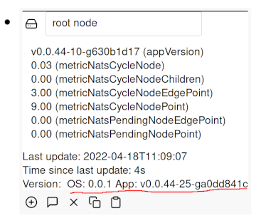

# Version

The Simple IoT app stores and uses three different version values:

- App Version
- OS Version
- HW Version

The App version is compiled into the application Go binary by the build (see the
[`envsetup.sh`](https://github.com/simpleiot/simpleiot/blob/master/envsetup.sh)
file). This version is based on the latest Git tag plus hash if there have been
any changes since the tag.

On Linux, the OS version is extracted from the `VERSION` field in
`/etc/os-release`. The field can be [changed](../user/configuration.html) using
the `OS_VERSION_FIELD` environment variable.

The versions are displayed in the root node as shown below:

