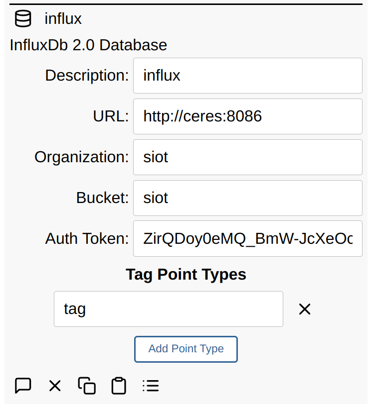

# Database Client

The main [SIOT store](../ref/store.md) is SQLite. SIOT supports additional
database clients for purposes such as storing time-series data.

## InfluxDB 2.x

Point data can be stored in an InfluxDB 2.0 Database by adding a Database node:

The following InfluxDB tags are added to every point:

- `node.id` (typically a UUID)
- `node.type` (extracted from the type field in the edge data structure)
- `node.description` (generated from the `description` point from the node)

Additional tag tag points can be specified. The DB client will query and cache
node points of these types for any point flowing through the system and then
InfluxDB tags in the format: `node.<point type>.<point key>`. In the below
example:

- `value` and `type` and fields from the point
- `node.description` and `node.type` are automatically added
- `node.tag.machine` got added because the `tag` point was added to the list of
  node points that get added as tags.

See the [Graphing documentation](graphing.md) for information on how to
automatically map tags to graph labels.

## Victoria Metrics

Victoria Metrics
[supports the InfluxDB v2](https://docs.victoriametrics.com/#how-to-send-data-in-influxdb-v2-format)
line protocol; therefore, it can be used for numerical data. Victoria Metrics
[does not support storing strings](https://stackoverflow.com/questions/66406899/does-victoriametrics-have-some-way-to-store-string-value-instead-float64).
