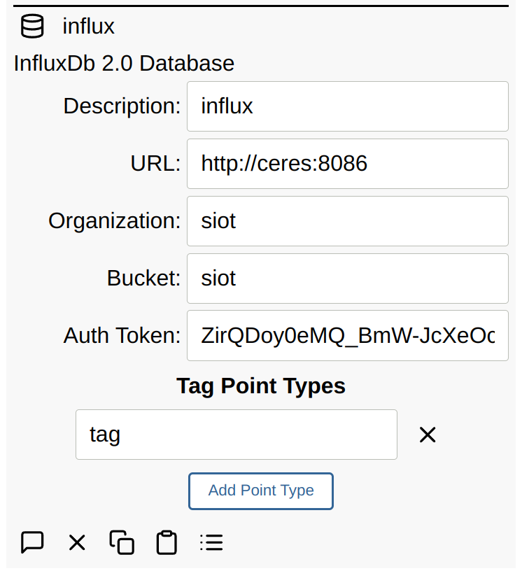
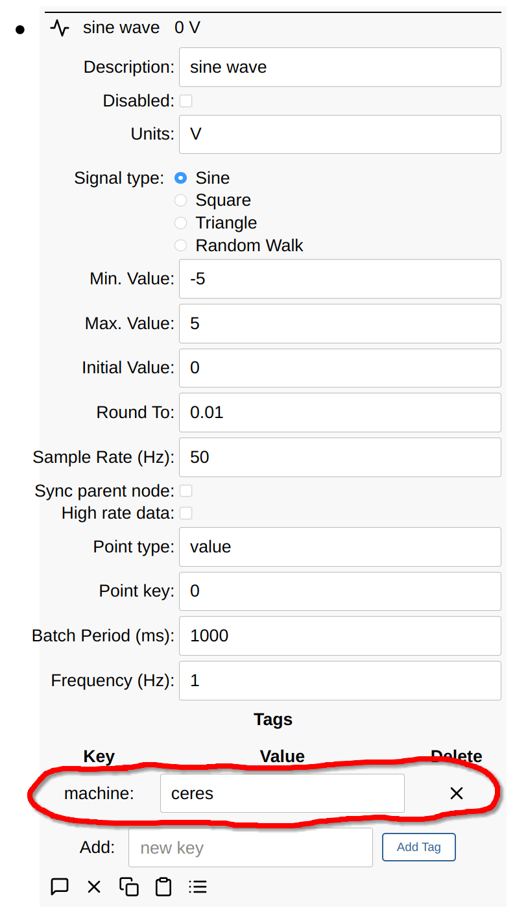
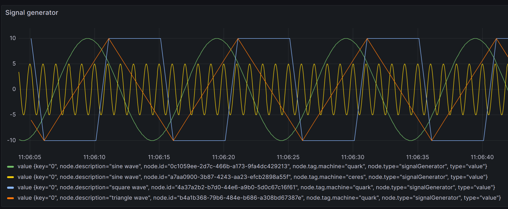

# Database Client

The main [SIOT store](../ref/store.md) is NATS JetStream, which retains a
bounded history of points for each node. For long-term storage, dashboards, and
ad-hoc queries, a Database client can forward points to an external time-series
database.

[VictoriaMetrics](https://victoriametrics.com/) is the primary time-series store
for SIOT. The Database client speaks the InfluxDB v2 write API, which
VictoriaMetrics
[supports](https://docs.victoriametrics.com/#how-to-send-data-in-influxdb-v2-format),
so InfluxDB 2.x can also be used.

## Reliable delivery with durable consumers

The Database client reads points from the store's JetStream streams using
durable consumers rather than subscribing to live message traffic. A durable
consumer is a named position in a stream that the NATS server persists to disk
alongside the stream data. The client acknowledges each message only after the
database has accepted the points it carried, and the server advances the saved
position only on acknowledgment.

This makes delivery resumable. If the Database client, the SIOT instance, or the
connection to the database is down for a period of time, points continue to
accumulate in the streams. When the client comes back, delivery resumes from the
saved position and the missed points are written to the database. Each Database
node keeps its own position, so multiple Database clients can consume the same
streams independently.

Two limits apply:

- Stream retention bounds how far behind a client can fall. By default the store
  keeps the last 20,000 points per subject (one subject is one point type and
  key on one node). If a client is down long enough that a signal exceeds this
  limit, the oldest points for that signal are dropped from the stream and will
  be missing from the database.
- High-rate points are not stored in streams. They are delivered live and are
  not recovered after downtime, including downtime of the database itself.

A newly added Database node starts recording from the present; it does not
backfill history already in the streams. Streams that appear after the client
starts, such as the replica stream for a newly adopted device, are consumed from
their beginning so the device's initial catch-up is captured.

### When the database is unavailable

The same mechanism covers an outage in the time-series database itself. If
VictoriaMetrics is stopped, restarted, upgraded, or simply unreachable across
the network, points sent during that window are written once it comes back and
the recorded history has no gap.

The stream that already holds the points serves as the buffer, and the client's
saved consumer position records how far it has gotten. There is no separate
spool file or in-memory queue in the client to size or manage. The sequence is:

1. The client collects points into batches of up to 500 and writes at least once
   a second, so each batch travels as a single write request.
2. It acknowledges the stream messages behind a batch only after the database
   accepts the write. Until then the points remain in the stream.
3. A failed batch returns to the stream with a retry delay that starts at about
   a second and doubles up to a maximum of one minute. The client makes no
   further connection attempts until the delay expires, so an outage lasting
   hours costs about one attempt per minute.
4. Meanwhile points keep arriving and accumulate. Up to 5000 may be outstanding
   at once; beyond that, JetStream stops delivering to this client and the rest
   wait in the stream.
5. When the database answers again, the held points are redelivered and written.
   Each point carries its original timestamp, so the history fills in at the
   times the readings happened.

Restarting SIOT during an outage is safe: none of the affected points were
acknowledged, so they are still in the stream and arrive again on the next run.
Stopping the client returns anything it had taken from the stream but had not
yet written.

Rejections work differently. Bad credentials or a line the database cannot parse
would fail identically on every attempt, so the client logs those points and
drops them instead of blocking everything behind them.

Three log messages describe this behavior, each prefixed with the Database
node's description:

```
Db client site db: database write failed, holding points in the stream until it recovers: ...
Db client site db: database write succeeded after 4 failed attempts
Db client site db: dropping 37 points the database rejected: ...
```

The first appears once when an outage starts, not on every attempt. The second
confirms recovery and how many attempts it took, and the third reports points
that were discarded.

The limits above still apply: an outage that outlasts stream retention for a
fast-changing signal loses that signal's oldest points, and high-rate points are
not buffered at all.

## Choosing a database type

Add a Database node and choose the database type: **InfluxDB 2.x** or **Victoria
Metrics**. Both are written using the InfluxDB version 2 line protocol, so the
connection settings are similar, but the two differ in what they store and in
how you graph the result. Existing Database nodes have no database type set and
continue to behave as InfluxDB.

A third option, [TimescaleDB](#timescaledb-planned), is described below as a
planned addition. It is not implemented.

## Victoria Metrics

Set the database type to Victoria Metrics and set the URI to the write endpoint,
typically `http://myserver:8428` for a single-node instance. VictoriaMetrics has
no concept of an organization or a bucket, so those fields are hidden when this
type is selected.

A single-node VictoriaMetrics has no authentication on the write path, so the
Auth Token field can be left blank. VictoriaMetrics expects authentication to be
handled by [vmauth](https://docs.victoriametrics.com/vmauth/) or vmgateway in
front of it. The client sends the token as an `Authorization: Token <token>`
header, which is one of the formats vmauth accepts, so setting the Auth Token
here works when you point the URI at vmauth.

VictoriaMetrics
[does not support storing strings](https://stackoverflow.com/questions/66406899/does-victoriametrics-have-some-way-to-store-string-value-instead-float64);
it
[converts any non-numeric field value to 0](https://docs.victoriametrics.com/victoriametrics/integrations/influxdb/).
The client therefore writes only the numeric `value` field and skips string
points, which keeps a `points_text` series of zeros out of the database. If you
want to filter or graph on a value, publish it as a number. The
[GPS client](gps.md) does this for its fix status points for exactly this
reason.

Each point arrives in VictoriaMetrics as the metric `points_value`, with the
point `type` and `key` and all of the node tags described below available as
labels.

### Query latency offset

New points typically reach VictoriaMetrics within a second, because the write
client sends a batch every second (or sooner once 500 points accumulate).
Queries, however, do not see them for another 30 seconds by default:
VictoriaMetrics shifts the end of every query range back by
[`-search.latencyOffset`](https://docs.victoriametrics.com/victoriametrics/single-server-victoriametrics/#list-of-command-line-flags),
which defaults to `30s` so that slow Prometheus scrapes are still counted.

To see data as soon as it is written, start VictoriaMetrics (or `vmselect` in a
cluster) with:

```sh
victoria-metrics -search.latencyOffset=0s
```

Use a small value such as `1s` if the clocks on the writing devices and the
database server may differ slightly. The offset can also be set per request with
a `latency_offset=0s` URL parameter, which in Grafana can be added to the data
source's custom query parameters when changing the server flag is not an option.

#### Setting the flag under systemd

Most Linux packages run VictoriaMetrics from a systemd unit that reads extra
flags from an environment file, so the flag belongs there rather than in the
unit itself. Check which file your unit uses:

```sh
systemctl cat victoriametrics.service
```

A packaged unit typically contains lines such as:

```
EnvironmentFile=/etc/default/victoriametrics
ExecStart=/usr/bin/victoria-metrics -storageDataPath /var/lib/victoriametrics $ARGS
```

Add the flag to the variable that `ExecStart` expands, `ARGS` in this example,
by editing `/etc/default/victoriametrics`:

```
ARGS="-search.latencyOffset=0s"
```

Separate additional flags with spaces inside the quotes. Then restart the
service and confirm the setting, which appears in the list of flags that differ
from their defaults:

```sh
sudo systemctl restart victoriametrics
curl -s localhost:8428/flags
```

Keeping the flag in the environment file means a package upgrade can replace the
unit without discarding the setting. Distributions vary: some use
`/etc/sysconfig/victoriametrics` or a different variable name, and a unit with
no `EnvironmentFile` needs a drop-in override created with
`sudo systemctl edit victoriametrics.service` that sets `ExecStart` to the full
command line.

### Graphing Victoria Metrics data

Use Grafana with a Victoria Metrics (Prometheus-compatible) data source and
query `points_value` with MetricsQL. See the
[Graphing documentation](graphing.md) for how the node tags map to graph labels.

## InfluxDB 2.x

Point data can also be stored in an InfluxDB 2.x database by adding a Database
node:



## TimescaleDB (planned)

Support for [TimescaleDB](https://www.timescale.com/) is not implemented. This
section describes what it would look like so the design can be discussed on the
[community forum](https://community.tmpdir.org/c/simple-iot/5) before the work
starts.

TimescaleDB is PostgreSQL with time-series extensions, which makes it different
from the two options above in ways that matter:

- **It stores text.** Points carrying strings are skipped today, because
  VictoriaMetrics converts non-numeric values to zero. A batch or lot number, a
  barcode read, an operator ID, or a machine state written as text would be
  stored and queryable. See [text data](plc.md#text-data) for where this comes
  up with industrial equipment.
- **It is relational.** Point history can be joined against tables you already
  keep, such as work orders, product definitions, or maintenance records,
  without moving either side.
- **It downsamples and ages data on its own** through continuous aggregates,
  compression, and retention policies, all configured in the database rather
  than in Simple IoT.

### How points would map

One point becomes one row in a hypertable, which is close to the point model
already, so little has to be invented:

```sql
-- planned, subject to change
CREATE TABLE points (
    time    TIMESTAMPTZ      NOT NULL,
    node_id UUID             NOT NULL,
    type    TEXT             NOT NULL,
    key     TEXT             NOT NULL DEFAULT '',
    value   DOUBLE PRECISION,
    text    TEXT,
    tags    JSONB
);
SELECT create_hypertable('points', 'time');
```

The `tags` column holds the same tags described above, including the ones
inherited from ancestor nodes, so a query selects on `tags->>'node.tag.machine'`
where a MetricsQL query would select on a label. The client would create the
table on first use if the database role allows it, and otherwise log the
statements for you to run.

### Configuration

The connection settings differ from the InfluxDB ones, since PostgreSQL uses a
connection URI and a database role rather than an organization, bucket, and
token:

```yaml
# planned, subject to change
nodes:
  - db:
      dbType: timescale
      description: TimescaleDB
      uri: postgres://siot@db.example.com:5432/siot
      authToken: password
      tagPointType: tag
```

### Graphing

Grafana reads TimescaleDB through its PostgreSQL data source, and queries are
SQL rather than MetricsQL:

```sql
SELECT time_bucket('1 minute', time) AS bucket,
       avg(value)
FROM points
WHERE type = 'value'
  AND tags->>'node.tag.machine' = 'press-3'
  AND $__timeFilter(time)
GROUP BY bucket
ORDER BY bucket;
```

### Things to weigh

- **PostgreSQL is heavier than VictoriaMetrics at the edge.** VictoriaMetrics
  runs as a single binary on a small device with little tuning. TimescaleDB is a
  better fit for a server or cloud instance, so this is an addition to the
  options rather than a replacement for them.
- **Check the licensing for the features you want.** Hypertables are available
  under the Apache 2.0 edition, while compression, continuous aggregates, and
  retention policies are part of the Community edition under the Timescale
  License.
- **Retention and rollups move into the database.** That is an advantage once
  configured, and something to configure that the other two options do not ask
  for.

## Tags

Tags are the labels you filter and group by when querying or graphing. Every
point written to the database carries the point's own `type` and `key`, plus
three tags describing the node that emitted it:

- `node.id`, the node's ID (typically a UUID)
- `node.type`, the node type, such as `signalGenerator` or `modbusIo`
- `node.description`, the node's Description field

These are always present and need no configuration. Anything beyond them (which
machine a reading came from, which site a machine sits at) is added by turning
node points into tags, described next.

### Adding custom tags

Custom tags come from points on the node, so adding one takes two steps: put the
point on the node that should carry the label, then tell the Database node which
point types become tags.

**Step 1: add a tag point to the node.** Most node types have a **Tags** field
with an **Add Tag** button. Enter a name, which becomes the tag's key, then fill
in its value. Naming a tag `machine` and setting it to `press-3` adds a `tag`
point with key `machine` and text `press-3` to that node. The example below adds
a machine tag to the signal generator producing the data.



**Step 2: list the point type on the Database node.** The client turns a point
into a tag only when its type appears in this list. Open the Database node, find
**Tag Point Types**, press **Add Point Type**, and enter `tag`. This is the
point type, not the tag name, so the single entry `tag` covers every tag added
through the Tags field, however many there are.

**Result.** Points flowing through the client now carry the tag, named
`node.<point type>.<point key>`. A tag named `machine` added through the Tags
field is written as `node.tag.machine`, since the point type is `tag` and the
point key is `machine`:



The naming rule also covers point types other than `tag`. If a node has a
`machine` point and you add `machine` to Tag Point Types, its points are written
as `node.machine.<key>`. Listing a type that a node does not have is harmless:
it contributes no tag.

Two things to know when planning tags:

- Tags apply going forward. Adding or editing a tag starts a new series in the
  database from that moment, and a query spanning the change sees both the old
  and the new series. The same is true of `node.description`. Settle on tag
  names before collecting history you intend to keep.
- Adding tags is inexpensive. The database indexes tag values and stores each
  distinct string once, so a descriptive tag repeated across millions of samples
  costs far less than its length suggests.

See the [Graphing documentation](graphing.md) for how to map these tags to graph
labels.

### Tag inheritance

One tag point can cover a whole subtree, so step 1 rarely needs repeating on
every node. Tag points are inherited from ancestor nodes, so a label can be set
once on the node that represents the thing being described (a machine group, a
device, a site), and every point emitted beneath it carries that tag. Set `site`
on the device node instead of on each of its sensors. For example, with `tag`
listed in Tag Point Types:

```
device        tag: site=plant-a, customer=acme
└── press-3   tag: machine=press-3, site=plant-b
    └── temp-1    tag: sensor=inlet
```

a point emitted by `temp-1` is written with `node.tag.sensor=inlet`,
`node.tag.machine=press-3`, `node.tag.site=plant-b`, and
`node.tag.customer=acme`.

The resolution rules are:

- All tags resolve into the same flat `node.<point type>.<point key>` namespace,
  so queries do not depend on the depth at which a tag was set.
- When the same tag is defined at more than one level, the value closest to the
  emitting node wins, so a local tag overrides an inherited one (`site` above).
- Inheritance stops at the Database client's parent node, whose own tags are
  included. Nodes above the Database client's scope do not contribute tags.
- A node can have more than one parent. When two ancestors at the same depth
  define the same tag, the node with the lowest ID wins, and the client logs the
  ambiguity the first time it is seen.
- `node.id`, `node.type`, and `node.description` always describe the emitting
  node and are never inherited.

### Expanding key labels

Some clients write a point key that is itself a set of labels, `name=value`
pairs joined by commas. The [Prometheus scrape](metrics.md) in the metrics
client does this, because a Prometheus sample carries a label set and a SIOT
point carries a single key.

With **Expand Key Labels** on, which is the default, the Database client reads
such a key and writes each label as its own database label. A point of type
`myapp_requests_total` with key `code=200,method=post` arrives with `code` and
`method` labels alongside the tags it would otherwise carry, so it can be
grouped and filtered the way the Prometheus series it came from was:

```promql
sum by (method) (points_value{type="myapp_requests_total"})
```

The whole key is still written as the `key` tag, so a query that selects on the
complete set keeps working either way.

Three things are worth knowing:

- **Only a key that is a label set is expanded.** The parse is strict and all or
  nothing: every comma-separated piece must be `name=value` with a valid label
  name, or the key is left alone entirely. Keys such as `eth0`, `/dev/sda`, and
  `cpu0` are unaffected, which is why the setting is safe to leave on for a
  database receiving points from every kind of node. A key whose label value
  contained a comma cannot be split reliably and is declined for the same
  reason.
- **Bucket boundaries are restored to numbers.** A point key cannot hold a
  period, so the metrics client writes `le="0.005"` as `le=0_005`. The Database
  client puts the period back on `le` and `quantile`, the two labels a query
  reads as numbers, so `histogram_quantile` works. No other label is rewritten,
  since an underscore elsewhere may well have been an underscore to begin with.
- **Expansion changes series identity.** Adding labels to a series makes it a
  new series as far as the database is concerned, the same way adding a tag
  does. A dashboard built against scraped points before expansion was enabled
  sees the old series stop and a new one start.

A label named `type` or `key` is skipped, since those are the tags the client
writes itself, and the collision is logged once.

## Schema

Below is an export of a Victoria Metrics node and an InfluxDB node:

```yaml
nodes:
  - db:
      dbType: victoriaMetrics
      description: Victoria Metrics
      expandKeyLabels: true
      tagPointType: tag
      uri: http://localhost:8428
  - db:
      authToken: T0k3n
      bucket: siot
      dbType: influxdb
      description: InfluxDB
      org: bec
      tagPointType:
        - machine
        - tag
      uri: http://localhost:8086
```

`dbType` is `victoriaMetrics` or `influxdb`; a node with no `dbType` behaves as
InfluxDB. `org` and `bucket` apply to InfluxDB alone, and Victoria Metrics nodes
leave them out.

`tagPointType` is the **Tag Point Types** field described above. It is a list,
so a single point type is written as one value and several are written as a
sequence. Each entry is a point type, and the client adds it to every sample as
`node.<point type>.<point key>`.

`expandKeyLabels` is the **Expand Key Labels** field described above. A node
created before this setting existed has it turned on the first time the client
runs, and the value is written to the node so it can be turned off.

An export carries `authToken` as it was entered, so treat a file that contains
database nodes the way you would treat the token itself.
