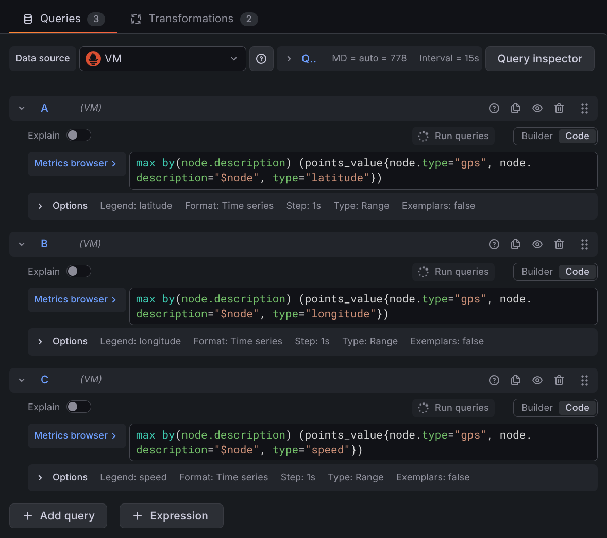
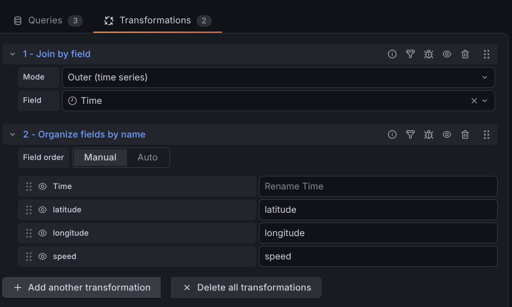

# GPS Client

The GPS client reads position data and publishes it as points on a `gps` node.
It supports three sources:

- **Serial** reads NMEA sentences directly from a receiver on a serial port.
- **gpsd** subscribes to the [gpsd](https://gpsd.io/) daemon over TCP. This is a
  good choice on a Linux system where gpsd already manages the receiver, where
  several processes need the same position, or where gpsd's device detection and
  driver support are useful.
- **Simulated** generates a plausible track without any hardware, which makes it
  easy to develop rules, dashboards, and graphs.

All three sources publish the same points, so anything consuming the data works
the same way no matter which source is configured.

## Configuration

Select the source first. The remaining fields change to match it.

### Serial

| Field  | Description                                        |
| ------ | -------------------------------------------------- |
| `Port` | Path to the serial device, such as `/dev/ttyUSB0`. |
| `Baud` | Port speed. Most receivers default to `9600`.      |

The client reopens the port automatically when a receiver is unplugged and
plugged back in, so a USB receiver can be moved without restarting SimpleIoT.

The client reads the GGA, GSA, RMC, and VTG sentences and ignores the rest. A
receiver reports one position across several of these, so the client collects a
full cycle of sentences and publishes them together. Every point from one
position therefore carries the same timestamp, which is what makes the data
plottable on a map.

### gpsd

| Field          | Description                                                           |
| -------------- | --------------------------------------------------------------------- |
| `gpsd address` | Host and port of the daemon. Defaults to `localhost:2947`.            |
| `Device`       | Which device to watch. Leave blank to watch whatever gpsd is serving. |

The client reconnects with a growing delay whenever the daemon becomes
unreachable. It also reports itself disconnected if no position arrives for ten
seconds, because gpsd keeps the connection open when a receiver goes quiet or is
unplugged.

### Simulated

| Field                   | Description                                                 |
| ----------------------- | ----------------------------------------------------------- |
| `Start latitude`        | Where the track begins, in degrees.                         |
| `Start longitude`       | Where the track begins, in degrees.                         |
| `Speed (m/s)`           | How fast the simulated receiver moves. Defaults to `10`.    |
| `Start heading (deg)`   | Initial direction of travel, degrees true.                  |
| `Heading drift (deg/s)` | How far the heading may wander per second. Defaults to `5`. |
| `Update period (s)`     | How often a position is published. Defaults to `1`.         |

The heading drifts randomly within the configured rate, so the track wanders
naturally instead of running straight or jumping between positions. Set the
heading drift to `0` for a straight track.

Positions follow a great circle, so tracks behave correctly at high latitudes
and when crossing the antimeridian.

The simulator reports a normal GPS fix rather than marking its data as
simulated, so rules and dashboards behave exactly as they would with real
hardware. The node's source setting is what identifies the data as synthetic.

## Published Points

| Point        | Units                   | Description                         |
| ------------ | ----------------------- | ----------------------------------- |
| `latitude`   | degrees, positive north | Position                            |
| `longitude`  | degrees, positive east  | Position                            |
| `altitude`   | meters above sea level  | See the note on altitude below      |
| `speed`      | meters per second       | Speed over ground                   |
| `heading`    | degrees true, 0 to 360  | Direction of travel over ground     |
| `fixType`    | numeric code            | Whether the fix is 2D or 3D         |
| `fixQuality` | numeric code            | Which augmentation produced the fix |
| `numSat`     | count                   | Satellites used in the fix          |
| `hdop`       | ratio                   | Horizontal dilution of precision    |
| `gpsTime`    | Unix epoch seconds      | Time reported by the receiver       |
| `connected`  | boolean                 | Whether data is currently arriving  |
| `rx`         | count                   | Messages received                   |
| `errorCount` | count                   | Messages that could not be read     |

A source publishes only what it actually reports. A receiver that sends no GSA
sentences, for example, leaves `fixType` unset; no value is guessed for it.

### Fix Type and Fix Quality

The three sources describe a fix in three different vocabularies, so the client
normalizes them into two points. `fixType` covers whether the fix is 2D or 3D,
which determines whether the altitude can be trusted. `fixQuality` covers which
augmentation produced the fix, which determines how accurate the position is.

Both are stored as numbers rather than as text, which lets them be graphed and
keeps them intact in databases that store only numeric values. The web UI
displays them as labels.

`fixType` follows the gpsd encoding:

| Value | Meaning            |
| ----- | ------------------ |
| `0`   | No fix, or unknown |
| `2`   | 2D fix             |
| `3`   | 3D fix             |

`fixQuality` follows the NMEA GGA encoding:

| Value | Meaning                      |
| ----- | ---------------------------- |
| `0`   | No fix                       |
| `1`   | GPS                          |
| `2`   | Differential GPS             |
| `3`   | Precise Positioning Service  |
| `4`   | RTK fixed                    |
| `5`   | RTK float                    |
| `6`   | Estimated, or dead reckoning |
| `7`   | Manual input                 |
| `8`   | Simulated                    |

Values `7` and `8` are available through gpsd. The NMEA library SimpleIoT uses
validates fix quality against the range `0` to `6`, so a serial receiver
reporting `7` or `8` is treated as reporting no fix. Both values are rare enough
from real receivers that this is unlikely to come up in practice.

### A Note on Altitude

The serial source reports altitude above mean sea level, taken from the GGA
sentence. The gpsd source prefers gpsd's `altMSL` field, which is the same
measurement, and falls back to `altHAE` when that is all the daemon provides.
`altHAE` is measured from the WGS84 ellipsoid instead, and the two differ by the
local geoid separation, which reaches tens of meters in some parts of the world.
If altitude accuracy matters for your application, check which field your gpsd
version reports.

## Storing and Graphing

Add a [database node](database.md) to store GPS points in InfluxDB or Victoria
Metrics. All the numeric points listed above are stored normally.

### Plotting a Track on a Map

Grafana's Geomap panel needs latitude and longitude as two numeric fields on the
same row. The GPS client stamps every point from one position with the same
timestamp, which is what allows the two to be brought back together.

With **InfluxDB**, a Flux `pivot()` puts them into one row directly:

```flux
from(bucket: "siot")
  |> range(start: v.timeRangeStart, stop: v.timeRangeStop)
  |> filter(fn: (r) =>
    r._measurement == "points" and
    r._field == "value" and
    (r.type == "latitude" or r.type == "longitude"))
  |> filter(fn: (r) => r["node.description"] == "My GPS")
  |> pivot(rowKey: ["_time"], columnKey: ["type"], valueColumn: "_value")
```

Set the panel's Map Layer to Coordinates, and the latitude and longitude fields
to the pivoted columns.

With **Victoria Metrics**, add one query per field. Set each query's **Legend**
to the field name, which is how the Geomap panel finds the coordinates later.



Each query selects one point type from the GPS nodes:

```
max by(node.description) (points_value{node.type="gps", node.description="$node", type="latitude"})
max by(node.description) (points_value{node.type="gps", node.description="$node", type="longitude"})
max by(node.description) (points_value{node.type="gps", node.description="$node", type="speed"})
```

`$node` is a dashboard variable holding the GPS node description, so one
dashboard can serve several receivers. `max by(node.description)` collapses the
result to one series per node.

The tag names the database client writes contain dots, as in `node.type` and
`node.description`. Victoria Metrics accepts these as label names and they can
be used directly in a query, as above.

Set **Step** to the GPS update rate, `1s` in the example. A larger step samples
the track instead of drawing every position.

Then add two transformations:



1. **Join by field** in `Outer (time series)` mode on `Time`. This is where the
   shared timestamp matters: the separate series line up onto single rows only
   because every point in one fix carries the same time.
2. **Organize fields by name**, which sets the field order and confirms the
   names carried over from the query legends.

Finally, set the panel's Map Layer to Coordinates. Grafana locates the
`latitude` and `longitude` fields by name.

To display the fix codes as labels on a Grafana panel, add value mappings using
the tables above.

## Schema

Below is an export of a simulated GPS node:

```yaml
children:
  - id: 8f2a1c4e-3b7d-4a91-b6e2-5c8d9f0a1b23
    type: gps
    points:
      - type: description
        text: Test track
      - type: disabled
      - type: gpsSource
        text: sim
      - type: simLatitude
        value: 40.0354
      - type: simLongitude
        value: -75.5198
      - type: simSpeed
        value: 12.0
      - type: simHeading
        value: 90.0
      - type: simHeadingRate
        value: 5.0
      - type: period
        value: 1.0
      - type: latitude
        value: 40.03567
      - type: longitude
        value: -75.52006
      - type: altitude
        value: 85.3
      - type: speed
        value: 12.0
      - type: heading
        value: 92.4
      - type: fixType
        value: 3.0
      - type: fixQuality
        value: 1.0
      - type: numSat
        value: 11.0
      - type: hdop
        value: 0.92
      - type: connected
        value: 1.0
```
