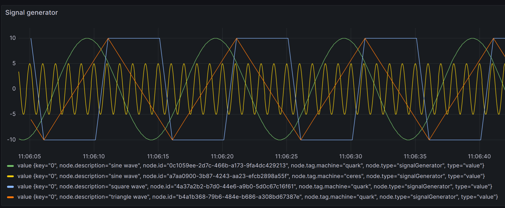
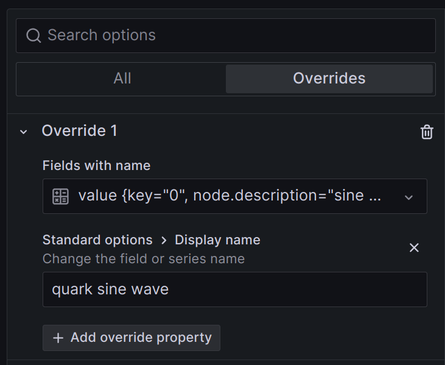
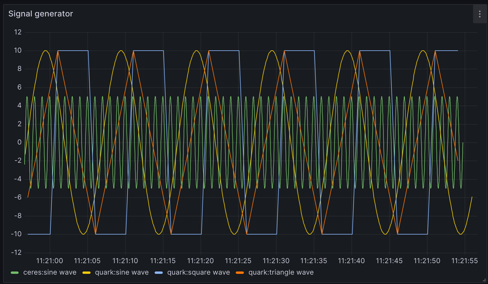

# Graphing Data

Simple IoT is designed to work with several other applications for storing time
series data and viewing this data in graphs.

## InfluxDB

[InfluxDB](https://www.influxdata.com/products/influxdb-overview/) is currently
the recommended way to store historical data. This database is efficient and can
run on embedded platforms like the Raspberry PI as well as desktop and server
machines. To connect SIOT to InfluxDB, add a [database node](database.md) node
and fill in the parameters.

## Grafana

[Grafana](https://grafana.com/) is a very powerful graphing solution that works
well with InfluxDB. Although InfluxDB has its own web interface and graphing
capability, generally we find Grafana to be more full featured and easier to
use.

### Changing the Display name (labels) in Grafana

Often with an Influx query, we'll get trace display names that look like the
below:



Often, much of this data is irrelevant or redundant with the query. One way to
change the label is with a Override:



This can be tedious to set up and maintain.

Often a better way is to add tags to the nodes generating the data and then
display the node tags in the display name by using the Influx `map` function.

```flux
from(bucket: "siot")
  |> range(start: v.timeRangeStart, stop:v.timeRangeStop)
  |> filter(fn: (r) =>
    r._measurement == "points" and
    r._field == "value" and
    r.type == "value")
  |> filter(fn: (r) => r["node.type"] == "signalGenerator")
  |> map(fn: (r) => ({_value:r._value, _time:r._time, _field:r["node.tag.machine"] + ":" + r["node.description"]}))
```

In this case we are displaying a node tag and description. The result is very
nice:


