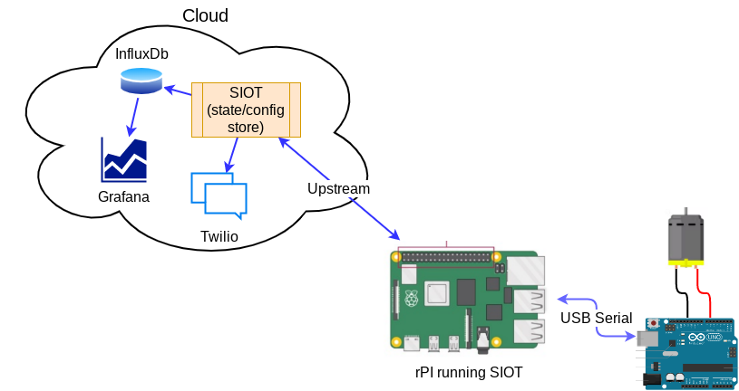
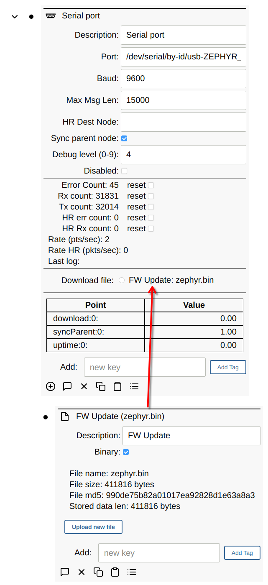

# MCU Devices

Microcontroller (MCU) devices can be connected to Simple IoT systems via various
serial transports (RS232, RS485, CAN, and USB Serial). The
[Arduino](https://www.arduino.cc/) platform is one example of a MCU platform
that is easy to use and program. Simple IoT provides a serial interface module
that can be used to interface with these systems. The combination of a laptop or
a Raspberry PI makes a useful lab device for monitoring analog and digital
signals. Data can be logged to InfluxDB and viewed in the InfluxDB Web UI or
Grafana. This concept can be scaled into products where you might have a Linux
MPU handling data/connectivity and a MCU doing real-time control.

See the [Serial reference documentation](../ref/serial.md) for more technical
details on this client.

## File Download

Files (or larger chunks of data) can be downloaded to the MCU by adding a [File](file.md) node to the serial node. Any child File node will then show up as a download option.

​		

## Debug Levels

You can set the following debug levels to log information.

- 0: no debug information
- 1: log ASCII strings (must be COBS wrapped) (typically used for debugging code
  on the MCU)
- 4: log points received or sent to the MCU
- 8: log cobs decoded data (must be COBS wrapped)
- 9: log raw serial data received (pre-COBS)

## Zephyr Examples

The [zephyr-siot](https://github.com/simpleiot/zephyr-siot) repository contains examples of MCU firmware that can interface with Simple IoT over serial, USB, and Network connections. This is a work in progress and is not complete.

## Arduino Examples (no longer maintained)

Several
[Arduino examples](https://github.com/simpleiot/firmware/tree/master/Arduino)
are available that can be used to demonstrate this functionality.
