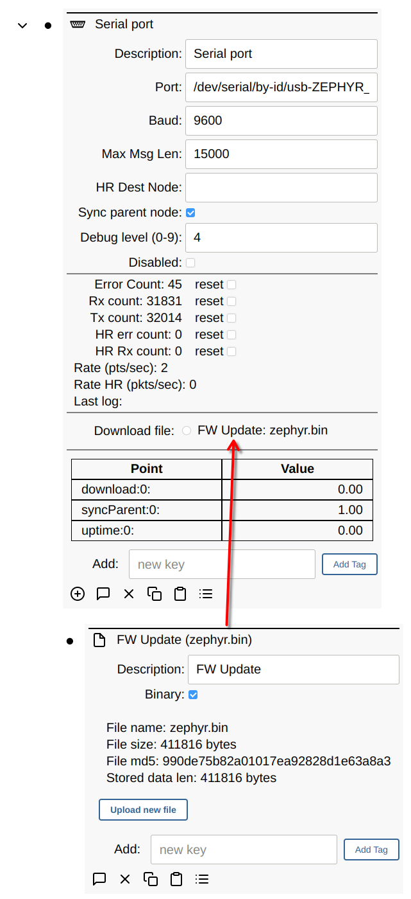

# MCU Devices

Microcontroller (MCU) devices can be connected to Simple IoT systems via various
serial transports (RS232, RS485, CAN, and USB Serial). The
[Arduino](https://www.arduino.cc/) platform is one example of an MCU platform
that is easy to use and program. Simple IoT provides a serial interface module
that can be used to interface with these systems. The combination of a laptop or
a Raspberry PI makes a useful lab device for monitoring analog and digital
signals. Data can be logged to InfluxDB and viewed in the InfluxDB Web UI or
Grafana. This concept can be scaled into products where you might have a Linux
MPU handling data/connectivity and a MCU doing real-time control.

See the [Serial reference documentation](../ref/serial.md) for more technical
details on this client.


## File Download

Files (or larger chunks of data) can be downloaded to the MCU by adding a
[File](file.md) node to the serial node. Any child File node will then show up
as a download option.

​


## Protocols

The serial client speaks two wire protocols, selected with the **Protocol**
setting on the node.

**Binary** is the default and is what existing nodes use. Points are exchanged
as COBS-framed packets with a sequence number and a CRC. It is compact, and it
supports high-rate data and file transfer. See the
[Serial reference documentation](../ref/serial.md) for the packet format.

**Zephyr shell** exchanges points as lines of ASCII over an MCU's console shell.
Everything on the wire is readable, so the same link you use for debugging is
the link Simple IoT uses for data. Choose this when your firmware already has a
Zephyr shell, or when bringing up a new board where being able to see and type
on the link matters more than efficiency.

An empty Protocol value means binary, so nodes created before shell mode existed
keep working unchanged.

### Shell protocol

The MCU emits each point as a line, and Simple IoT writes points back using the
`p` command the Zephyr firmware already registers:

```
pt uptime 0 INT 3600                              MCU to Simple IoT
p description 0 STR "lab bench" 2026-07-31T12:00:00.000000000Z
```

Both directions use the same fields and differ only in the verb, so an emitted
line becomes a replayable command by changing one character. The verbs differ
deliberately: Simple IoT must never mistake an echoed command for a point
report.

Anything on the console that is not a point line is tolerated. Zephyr log
messages become `log` points, and the boot banner, shell prompt, and command
output are ignored rather than counted as errors.

High-rate data, file transfer, and packet acknowledgement are not available in
shell mode, and the UI hides those controls when it is selected. Nodes that need
them should stay on the binary protocol.

**Timeout** is how many seconds the link may be silent before the node is marked
not connected, defaulting to 60. An open serial port says nothing about whether
anything is alive on the other end, particularly on a USB port that survives an
MCU reset.

## Log Console Output

**Log console output** mirrors every line the MCU prints to the Simple IoT
server log, tagged with the node description. Shell protocol only.

Once Simple IoT holds the serial port nothing else can read it, so this is what
keeps the board observable. It works headless, lands in the journal when Simple
IoT runs under systemd, and lets you watch a board boot in the terminal you
started the server in. With it on, a separate terminal program is only needed
before a node is attached to the port at all.

It is deliberately not a debug level: watching a board boot and diagnosing why a
point is not arriving are different questions, and a single verbosity dial would
force one to imply the other. Expect it to be loud on a board with network
logging enabled.

## Debug Levels

You can set the following debug levels to log information.

Binary protocol:

- 0: no debug information
- 1: log ASCII strings (must be COBS wrapped) (typically used for debugging code
  on the MCU)
- 4: log points received or sent to the MCU
- 8: log cobs decoded data (must be COBS wrapped)
- 9: log raw serial data received (pre-COBS)

Shell protocol:

- 0: no debug information
- 2: log malformed point lines, oversize lines, and warnings about points the
  MCU will truncate
- 4: log points decoded and each `p` command written to the MCU
- 9: log raw serial data received, before line assembly

Level 1 has no shell-mode meaning; console output is the separate checkbox
described above, so the two can be used independently.

## Schema

The configuration of a serial node using the shell protocol, with a file node
available for download to the MCU:

```yaml
nodes:
  - serialDev:
      baud: "115200"
      debug: 0
      description: Lab bench
      disabled: 0
      logConsole: 1
      maxMessageLength: 1024
      port: /dev/ttyACM0
      protocol: shell
      syncParent: 0
      timeout: 60
      children:
        - file:
            binary: 1
            data: SGVsbG8sIE1DVQ==
            description: Calibration table
            name: cal.bin
```

`port` and `baud` are text, so both are quoted. `protocol` is `binary` or
`shell`, and an empty value means binary, so nodes created before shell mode
existed carry no `protocol` point at all.

`timeout` is in seconds and `maxMessageLength` in bytes. `logConsole` applies
to the shell protocol alone.

The counts, the connection state, the uptime, and the log line shown in the UI
are points the client maintains, so an export of a running node carries them as
well.

A node sending high rate data also carries an `hrDest` point holding the ID of
the destination node. Unlike a point of type `nodeID`, it is written as the ID
rather than as a description, so it names a node in the instance it was
exported from.

## Zephyr Examples

The [zephyr-siot](https://github.com/simpleiot/zephyr-siot) repository contains
examples of MCU firmware that can interface with Simple IoT over serial, USB,
and Network connections. This is a work in progress and is not complete.

## Arduino Examples (no longer maintained)

Several
[Arduino examples](https://github.com/simpleiot/firmware/tree/master/Arduino)
are available that can be used to demonstrate this functionality.
