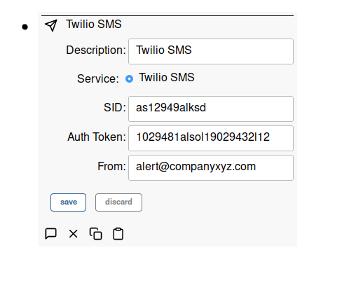

# Messaging Services

SIOT supports multiple messaging services. Add a **Messaging Service** node,
select the service, and fill in the fields for that service. Where the node sits
in the tree decides which messages it processes, as described in the
[notifications documentation](notifications.md), so a service that serves a
whole company belongs on the company group rather than on any one device.

Delivery failures are reported on the node's error point and shown in the UI.

## Twilio SMS

Simple IoT supports sending SMS messages using Twilio's
[SMS service](https://www.twilio.com/messaging/sms). `sid` and `authToken` are
the Twilio account SID and auth token, and `from` is the number messages are
sent from.



## Email (SMTP)

The `smtp` service sends each user's message as an email. `url` is the SMTP
server as `host:port` (typically port 587), `from` is the sender address, and
`username`/`authToken` are the login credentials — leave both empty for a server
that accepts unauthenticated mail. STARTTLS is used automatically when the
server offers it.

## ntfy Push Notifications

The `ntfy` service publishes notifications to an [ntfy](https://ntfy.sh) topic,
which delivers push notifications to the ntfy phone and desktop apps and
anything else subscribed to the topic. Unlike Twilio and email, ntfy needs no
user nodes: every notification raised in the service's scope is published to the
topic. `url` is the ntfy server (leave empty for the public `https://ntfy.sh`),
`topic` is the topic name, and `authToken` is an optional access token for
protected topics.

## Schema

Below is an export of one node per service:

```yaml
nodes:
  - msgService:
      description: Twilio SMS
      service: twilio
      sid: ACxxxxxxxxxxxxxxxxxxxxxxxxxxxxxxxx
      authToken: your-twilio-auth-token
      from: "+12155551212"
  - msgService:
      description: Company email
      service: smtp
      url: smtp.example.com:587
      username: alerts@example.com
      authToken: your-smtp-password
      from: alerts@example.com
  - msgService:
      description: Ops push channel
      service: ntfy
      topic: xyz-plant-alerts
```

`from` is written as text so a leading `+` is kept.

An export carries `authToken` as it was entered, so treat a file that contains
messaging service nodes the way you would treat the credentials themselves.
