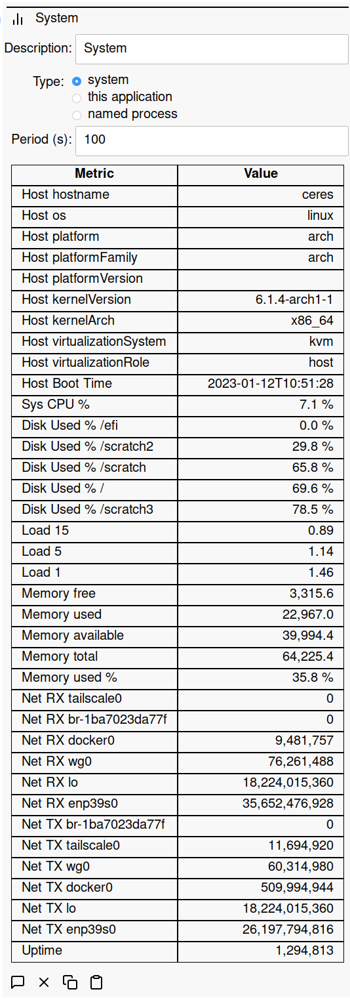
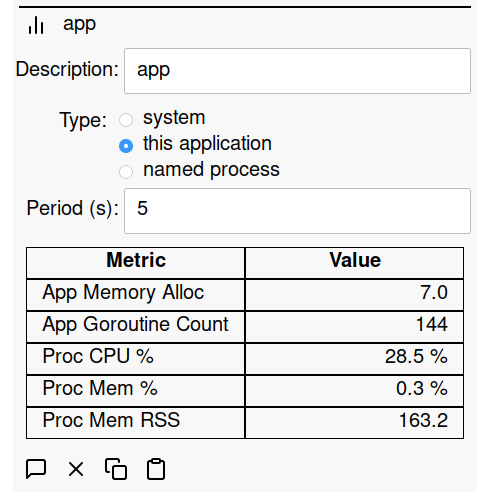
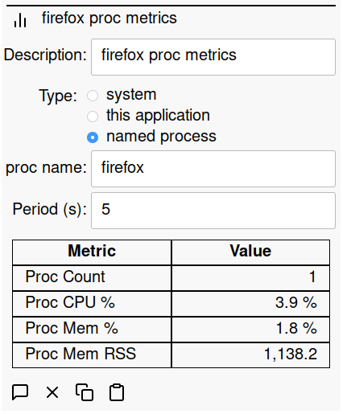

# Metrics

An important part of maintaining healthy systems is to monitor metrics for the
application and system. SIOT can collect metrics for:

- the system
- the SIOT application
- any named processes

For the named process, if there are multiple processes of the same name, then we
add values for all processes found.

## System Metrics

## SIOT Application Metrics

## Named Process Metrics

