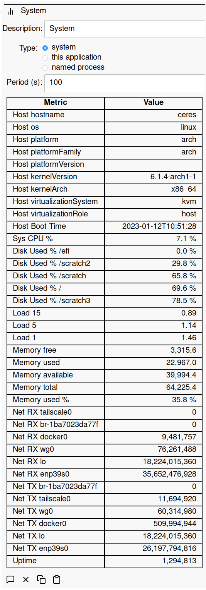
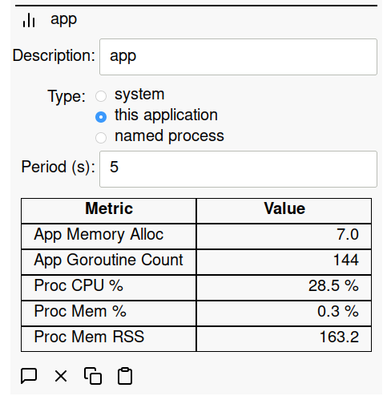
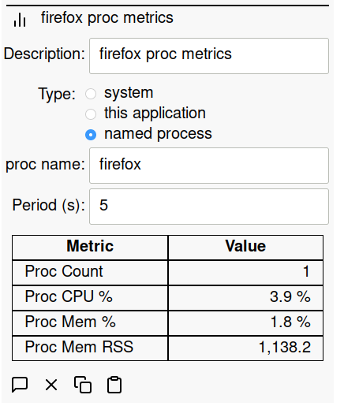

# Metrics

An important part of maintaining healthy systems is to monitor metrics for the
application and system. SIOT can collect metrics for:

- the system
- the SIOT application
- any named processes

For the named process, if there are multiple processes of the same name, then we
add values for all processes found.

## System Metrics



### Thermal Metrics

On Linux systems, the system metrics also include the thermal state of the
board:

- **Temperature** comes from the hwmon sensors and from the thermal zones in
  `/sys/class/thermal`. Both are read because many SoCs expose their board
  sensors through hwmon while reporting the CPU, SoC, and junction temperatures
  through the zones alone. On a Jetson AGX Orin, for example, `tj-thermal` is
  the junction reading that governs throttling.
- **Fan RPM and PWM** come from the hwmon fan and pwm attributes. PWM is the raw
  kernel value, which runs from 0 to 255.
- **Cooling State** is the current state of each entry in
  `/sys/class/thermal/cooling_device*`, keyed by device type. Any value above
  zero means the thermal governor is limiting the system: a `cpufreq` or
  `devfreq` device reports how far the clocks have been pulled back, and a fan
  reports how hard it has been asked to run. Temperature tells you how warm a
  board is, while the cooling state tells you whether that warmth is costing
  performance, so the two are worth reading together. Cooling State Max gives
  the scale each device is measured against and is collected once at startup.

### Power and Clocks

Two more readings round out the picture of how hard a board is working:

- **Voltage, Current, and Power** come from the hwmon power monitors, such as
  the INA3221 devices on a Jetson, and are published in volts, amps, and watts.
  A channel is published when its driver labels it, which is how a board names
  the rail that channel measures, so the points arrive keyed by rail name:
  `VDD_GPU_SOC`, `VIN_SYS_5V0`, and so on. Monitors that do not report power
  themselves still report voltage and current, and the product stands in for the
  missing reading.
- **CPU MHz** is the current clock of each core, keyed by `cpu0`, `cpu1`, and so
  on. Cores that are offline are left out. This is the reading that completes
  the thermal story: temperature says how warm the board is, cooling state says
  the governor stepped in, and the clock says what that cost.

Every reading above is taken on its own, so one that is unavailable, which
happens when a rail is powered down or a monitor channel is disabled, does not
affect the rest. Sensor names are not guaranteed to be unique; repeated names
are numbered, as in `tmp451` and `tmp451_2`.

## SIOT Application Metrics



## Named Process Metrics



## Prometheus Metrics

A metrics node can also collect from an application that exposes a `/metrics`
endpoint in the Prometheus exposition format. Any Go service built with
`client_golang` has one, as do `node_exporter`, cAdvisor, and a great deal of
other infrastructure.

The usual way to collect these is to run Prometheus or `vmagent` and have it
scrape each target, which means the scraper needs network reach to every
machine. For a small number of custom servers that is more work than it is
worth, and exposing `/metrics` to the internet describes an application's
internals to anyone who asks.

Because SIOT is already on the machine, it can scrape `127.0.0.1`. The
application binds its endpoint to loopback and never listens on a public
interface, no port is opened, and the readings travel out over the connection
SIOT already holds. From there they reach rules, sync, and the
[database client](database.md) the same way any other point does.

Set the metrics type to **prometheus** and give the node a URI. One node per
endpoint, so several applications on a machine means several nodes.

### How samples become points

A metric name becomes the point type, and its labels become the point key,
rendered as `name=value` pairs joined by commas and sorted by label name. The
sort means a series keeps the same key from one scrape to the next no matter
what order the endpoint lists its labels in.

| Sample                                           | Point type             | Point key              |
| ------------------------------------------------ | ---------------------- | ---------------------- |
| `myapp_requests_total{method="post",code="200"}` | `myapp_requests_total` | `code=200,method=post` |
| `myapp_queue_depth`                              | `myapp_queue_depth`    | _(empty)_              |
| `myapp_seconds_bucket{le="0.005"}`               | `myapp_seconds_bucket` | `le=0_005`             |

A metric name needs no adjustment, since the characters Prometheus allows in one
are all valid in a point type. Label values are ordinary text and often carry
characters a point key cannot hold, most commonly the period in a histogram
bucket boundary or a summary quantile, so those are replaced with underscores.
Two values that differ only in such a character resolve to the same key, and the
later sample wins; a label whose values differ only in punctuation is worth
avoiding for that reason.

Histograms and summaries need no special handling. The exposition format has
already flattened them into ordinary samples by the time SIOT reads them, so
`_bucket`, `_sum`, and `_count` arrive as their own point types.

### Counters

A counter only ever climbs, which makes it awkward to read in the UI and
unusable in a rule: "alert when errors increase" needs a rate, not a total. So a
counter publishes a second point under its own name with `_delta` appended,
carrying the change since the previous scrape. Nothing is published on the first
scrape of a series, since there is no earlier value to compare against. If a
counter decreases, the application restarted, and the delta is the current
value.

The raw counter is published as well, because that is what a time-series
database needs to compute `rate()` over. Turn the delta off with the **Counter
deltas** setting if the raw value is all you use.

Only a metric the endpoint declares a `counter` produces a delta. The `_bucket`,
`_sum`, and `_count` series of a histogram climb the same way but are left
alone, since a histogram with a dozen buckets would otherwise double a large
number of series.

### Filtering and limits

Two settings keep a node to a sensible size:

- **Metric Prefixes** collects only metrics whose name starts with one of the
  entries listed. Applications normally namespace their metrics, so `myapp_`
  keeps an application's own readings and leaves out the `go_` and `promhttp_`
  series that any `client_golang` registry adds. Press **Add Prefix** for each
  one you want; a metric is collected when it matches any of them, so a couple
  of subsystems from a larger exporter can be collected on one node. An empty
  list collects everything.
- **Max series** bounds a single scrape, defaulting to 200 and capped at 3000. A
  scrape that exceeds the limit is sorted, truncated, and reported through the
  node's error point, so a truncated scrape is visible rather than silent.

The limit matters because points live on the node, are stored, and replicate
upstream. An application's own metrics usually number in the dozens, while
`node_exporter` and cAdvisor run to hundreds or thousands; collect those with a
prefix or a larger limit chosen deliberately.

The 3000 ceiling is a hard one, and a larger value is reported on the node
rather than honored. A node request encodes a node and all of its points into a
single NATS message, and a scraped point takes roughly 100 bytes, so 10,000 of
them reach the 1 MB payload limit. Past that the store cannot answer the request
at all, and because a reply carries a subtree rather than one node, every tree
fetch covering the node fails and the UI stops loading. Three thousand points
come to about 350 KB, which leaves room for the rest of the reply.

An endpoint too large for one node is better split across several, each with its
own prefix. Nodes are inexpensive, and a failed scrape or a truncation then
affects only the part of the endpoint it belongs to. The limit is a property of
the store rather than of scraping; see
[Message and payload limits](../ref/store.md#message-and-payload-limits).

A scrape that fails, whether the endpoint is refusing connections, timing out,
or answering with an error, publishes no readings and sets the node's error
point. Stale values are worse than absent ones. The error clears on the next
successful scrape.

### Reserved names

A metric whose name matches one of the node's own settings cannot be published
under that name, because doing so would overwrite the setting. Such a metric
gets an underscore appended instead, so `period` is published as `period_` and
the reading is kept. The rename is logged once per name. If the endpoint already
serves the renamed name, another underscore is added, so two metrics never land
on the same point.

The names that are renamed are `description`, `type`, `name`, `period`, `uri`,
`prefix`, `counterDelta`, `maxSeries`, `tag`, `disabled`, `error`, `errorCount`,
`errorCountReset`, `connected`, `debug`, `log`, and `nodeType`.

Prometheus convention is to namespace and unit-suffix a metric name, so a
collision means the metric is worth renaming at the source. Doing that is better
than relying on the underscore, since a query then names the metric the way the
application does.

### Querying scraped metrics

Points reach VictoriaMetrics as the metric `points_value`, tagged with the point
`type` and `key` along with the node tags described in the
[database documentation](database.md). The Database client expands a key that
was written as a label set into individual labels, so a scraped series queries
the way the Prometheus series it came from did:

```promql
sum by (method) (points_value{type="myapp_requests_total_delta"})
```

and a histogram works with the bucket boundaries restored to numbers:

```promql
histogram_quantile(0.95,
  sum by (le) (points_value{type="myapp_request_duration_seconds_bucket"}))
```

This expansion is the **Expand Key Labels** setting on the Database node, which
is on by default. With it off, the labels are still reachable through the `key`
tag, though every query then carries its own extraction:

```promql
sum by (method) (
  label_replace(points_value{type="myapp_requests_total_delta"},
                "method", "$1", "key", ".*method=([^,]+).*")
)
```

## Schema

The configuration of a system metrics node and a named process node:

```yaml
nodes:
  - metrics:
      description: System
      period: 10
      tag:
        machine: press-1
      type: system
  - metrics:
      description: NATS server
      name: nats-server
      period: 10
      type: process
  - metrics:
      counterDelta: true
      description: My App
      maxSeries: 200
      period: 30
      prefix:
        - myapp_
        - worker_
      type: prometheus
      uri: http://127.0.0.1:9100/metrics
```

`type` is `system`, `app`, `process`, or `prometheus`, and `period` is how often
readings are taken, in seconds. `name` is the process name to watch and applies
to a process node; values for all processes of that name are added together.

`uri`, `prefix`, `counterDelta`, and `maxSeries` apply to a prometheus node.
`uri` is the endpoint to scrape, `counterDelta` publishes the change in each
counter alongside its raw value, and `maxSeries` bounds how many readings one
scrape publishes, defaulting to 200 and capped at 3000.

`prefix` collects only metrics whose name starts with one of its entries. It is
a list, so a single prefix is written as one value and several are written as a
sequence, as above. A metric is collected when it matches any entry, and a
`prefix` left out collects everything.

`tag` is a set of keyed points, and each one becomes a label on the samples the
[database client](database.md) writes when its point type is listed there.

The readings themselves are points on the same node, so an export of a running
instance carries them alongside the settings above.
