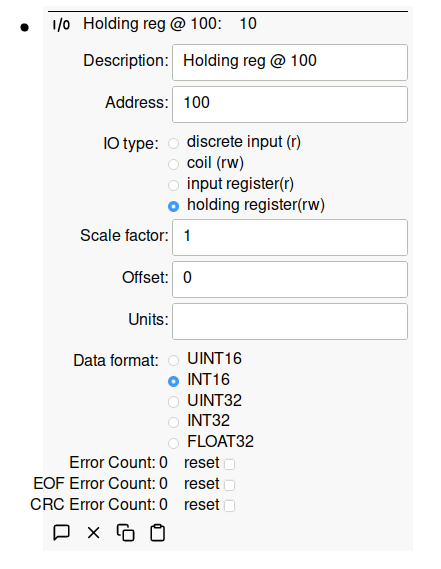

# Modbus

Modbus is popular data communications protocol used for connecting industrial
devices. The specification is open and available at the
[Modbus website](https://modbus.org/).

Simple IoT can function as both a Modbus client or server and supports both RTU
and TCP transports. Modbus client/server is used as follows:

- **client**: typically a PLC or Gateway -- the device reading sensors and
  initiating Modbus transactions. This is the mode to use if you want to read
  sensor data and then process it or send to an upstream instance.
- **server**: typically a sensor, actuator, or other device responding to Modbus
  requests. Functioning as a server allows SIOT to simulate Modbus devices or to
  provide data to another client device like a PLC.

Modbus is a prompt response protocol. With Modbus RTU (RS485), you can only have
one client (gateway) on the bus and multiple servers (sensors). With Modbus TCP,
you can have multiple clients and servers.

Modbus is configured by adding a Modbus node to the root node, and then adding
IO nodes to the Modbus node.

Modbus IOs can be configured to support most common IO types and data formats:

## Videos

### [Simple IoT Integration with PLC Using Modbus](https://youtu.be/-1PuBoTAzPE)

<iframe width="791" height="445" src="https://www.youtube.com/embed/-1PuBoTAzPE" title="Simple IoT Integration with PLC Using Modbus" frameborder="0" allow="accelerometer; autoplay; clipboard-write; encrypted-media; gyroscope; picture-in-picture; web-share" allowfullscreen></iframe>

### [Simple IoT upstream synchronization support](https://youtu.be/6xB-gXUynQc)

<iframe width="791" height="445" src="https://www.youtube.com/embed/6xB-gXUynQc" title="Simple IoT upstream synchronization support" frameborder="0" allow="accelerometer; autoplay; clipboard-write; encrypted-media; gyroscope; picture-in-picture; web-share" allowfullscreen></iframe>

### [Simple IoT Modbus Demo](https://youtu.be/iIZWxr482mI)

<iframe width="791" height="445" src="https://www.youtube.com/embed/iIZWxr482mI" title="Simple IoT Modbus Demo" frameborder="0" allow="accelerometer; autoplay; clipboard-write; encrypted-media; gyroscope; picture-in-picture; web-share" allowfullscreen></iframe>
