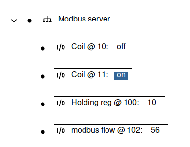
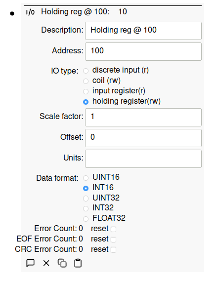

# Modbus

Modbus is popular data communications protocol used for connecting industrial
devices. The specification is open and available at the
[Modbus website](https://modbus.org/). See also this
[Modbus Overview](https://community.tmpdir.org/t/modbus-overview/1424).

Simple IoT can function as both a Modbus client or server and supports both RTU
and TCP transports. Modbus client/server is used as follows:

- **Client**: typically a PLC or Gateway - the device reading sensors and
  initiating Modbus transactions. This is the mode to use if you want to read
  sensor data and then process it or send to an upstream instance.
- **Server**: typically a sensor, actuator, or other device responding to Modbus
  requests. Functioning as a server allows SIOT to simulate Modbus devices or to
  provide data to another client device like a PLC.

Modbus is a prompt response protocol. With Modbus RTU (RS485), you can only have
one client (gateway) on the bus and multiple servers (sensors). With Modbus TCP,
you can have multiple clients and servers.

Modbus is configured by adding a Modbus node to the root node or to any group
below it, and then adding IO nodes to the Modbus node.



The `Response timeout` parameter determines how long the Modbus client will wait
for a response from a device. The default is 100ms, which is adequate for most
devices, but it can be increased if you are communicating with a slow device.

Modbus IOs can be configured to support most common IO types and data formats:



The `Scale` and `Offset` parameters convert between the raw register value and
the value stored in the node: `value = raw * scale + offset`. A scale of zero is
treated as one, so an IO with no scale entered still reads its register.

Adding or removing an IO restarts the bus, which reopens the port. A Modbus
server drops the connections it holds when this happens. This applies when a
person edits the configuration, not during normal polling.

## Schema

The configuration of an RTU client bus with one IO, and of a TCP server:

```yaml
nodes:
  - modbus:
      baud: "9600"
      clientServer: client
      debug: 0
      description: Sensor bus
      disabled: 0
      pollPeriod: 500
      port: /dev/ttyUSB0
      protocol: RTU
      timeout: 100
      children:
        - modbusIo:
            address: 3
            dataFormat: uint16
            description: Tank level
            disabled: 0
            id: 1
            modbusIoType: modbusHoldingRegister
            offset: 0
            readOnly: 1
            scale: 0.1
            units: cm
  - modbus:
      clientServer: server
      description: PLC facing
      id: 5
      port: "502"
      protocol: TCP
      timeout: 100
```

`clientServer` is `client` or `server` and `protocol` is `RTU` or `TCP`. Which
of the remaining connection settings apply follows from those two: an RTU bus
uses `port` and `baud`, a TCP server uses `port` as the port it listens on, and
a TCP client uses `uri`, written as `host:port`. `port` and `baud` are text, so
both are quoted, including a TCP port number.

`id` is the Modbus device address rather than a node ID, which is why it is
spelled like any other point. A server carries it on the bus node, and a client
carries it on each IO, so one client bus can address several devices.

`pollPeriod` applies to a client and `timeout` to both, and both are in
milliseconds. A `timeout` of zero or less is replaced with 100.

`modbusIoType` is one of `modbusDiscreteInput`, `modbusCoil`,
`modbusInputRegister`, or `modbusHoldingRegister`. `dataFormat` is `uint16`,
`int16`, `uint32`, `int32`, or `float32`, and it applies to the register types
along with `scale`, `offset`, and `units`.

The values read and written, the error counts, and the connection state are
points the client maintains, so an export of a running bus carries them as
well.

## Videos

### [Simple IoT Integration with PLC Using Modbus](https://youtu.be/-1PuBoTAzPE)

<iframe width="791" height="445" src="https://www.youtube.com/embed/-1PuBoTAzPE" title="Simple IoT Integration with PLC Using Modbus" frameborder="0" allow="accelerometer; autoplay; clipboard-write; encrypted-media; gyroscope; picture-in-picture; web-share" allowfullscreen></iframe>

### [Simple IoT upstream synchronization support](https://youtu.be/6xB-gXUynQc)

<iframe width="791" height="445" src="https://www.youtube.com/embed/6xB-gXUynQc" title="Simple IoT upstream synchronization support" frameborder="0" allow="accelerometer; autoplay; clipboard-write; encrypted-media; gyroscope; picture-in-picture; web-share" allowfullscreen></iframe>

### [Simple IoT Modbus Demo](https://youtu.be/iIZWxr482mI)

<iframe width="791" height="445" src="https://www.youtube.com/embed/iIZWxr482mI" title="Simple IoT Modbus Demo" frameborder="0" allow="accelerometer; autoplay; clipboard-write; encrypted-media; gyroscope; picture-in-picture; web-share" allowfullscreen></iframe>
