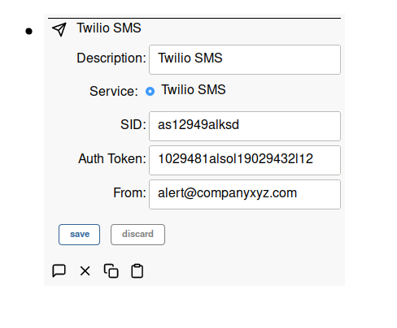

# Notifications

Notifications are sent to users when a rule goes from inactive to active and
contains a notification action. This notification travels up the node graph. At
each parent node, users potentially list for notifications. If a user is found,
then a message is generated. This message likewise travels up the node graph. At
each parent node, messaging service nodes potentially listen for messages and
then process the message. Because nodes can be aliased (mirrored) to different
places, this gives us a lot of flexibility in how points are processed. The node
tree also gives us a very visual view of how things are connected.

## Example

There is hierarchy of nodes in this example system:

- Company XYZ
  - Twilio SMS
  - Plant A
    - Joe
    - Motor overload Rule
    - Line #1
      - Motor Overload

The node hierarchy is used to manage scope and permissions. The general rule is
that a node has access to (or applies to) its parent nodes, and all of its
parents dependents. So in this example, Joe has access to everything in Plant A,
and likewise gets any Plant A notifications. The Motor overload rule also
applies to anything in Plant A. This allows us to write one rule that could
apply to multiple lines. The Twilio SMS node processes any messages generated in
Company XYZ including those generated in Plant A or Line #1 and can be
considered a company wide resource.

The process for generating a notification is as follows:

1. Line #1 contains a sensor that senses motor overload. When this value
   changes, a point (blue) gets sent to its parent Line #1 and then to Plant A.
1. Plant A contains a rule (Motor Overload) that is then run on the point, which
   generates a notification (purple) that gets sent back up to its parent (Plant
   A).
1. Plant A contains a user Joe so a notification + user generates a message
   (green), which gets sent back upstream to Plant A and then to Company XYZ.
1. Company XYZ contains a messaging service (Twilio SMS), so the message gets
   processed by this service and sent out.

Each node in Simple IoT only generates information -- it is not concerned with
who or how this information might be used. The Motor Overload sensor node only
generates what it senses. The Motor Overload rule listens for points in Plant A
(its parent) and processes those points. The Joe user node listens for points at
the Plant A node (its parent) and processes any points that are relevant. The
Twilio SMS node listens for point changes at the Company XYZ node and processes
those points. 

## Twilio SMS Messaging

Simple IoT supports sending SMS messages using Twilio's
[SMS service](https://www.twilio.com/messaging/sms). Add a Messaging node and
then configure.

