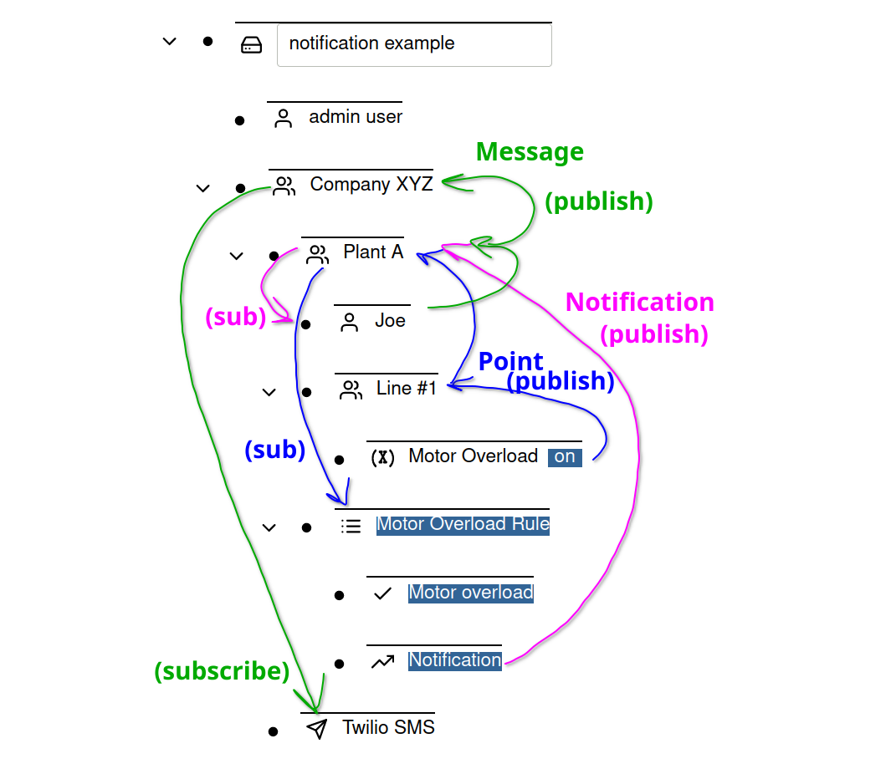

# Notifications

Notifications are sent to users when a [rule](./rules.md) goes from inactive to
active and contains a notification action. This notification travels up the node
graph. At each parent node, users potentially listen for notifications. If a
user is found, then a message is generated. This message likewise travels up the
node graph. At each parent node, messaging service nodes potentially listen for
messages and then process the message. Each node in Simple IoT that generates
information is not concerned with the recipient of the information or how the
information is used. This decoupling is the essence of messaging based systems
(we use [NATS](https://nats.io/)) and is very flexible and powerful. Because
nodes can be aliased (mirrored) to different places, this gives us a lot of
flexibility in how points are processed. The node tree also gives us a very
visual view of how things are connected as well as an easy way to expand or
narrow scope based on high in the hierarchy a node is placed.

## Example

There is hierarchy of nodes in this example system:

- Company `XYZ`
  - Twilio SMS
  - `Plant A`
    - Joe
    - Motor overload Rule
    - `Line #1`
      - Motor Overload
  - `Plant B`

The node hierarchy is used to manage scope and permissions. The general rule is
that a node has access to (or applies to) its parent nodes, and all of its
parents dependents. So in this example, Joe has access to everything in Plant
`A`, and likewise gets any Plant `A` notifications. The Motor overload rule also
applies to anything in Plant `A`. This allows us to write one rule that could
apply to multiple lines. The Twilio SMS node processes any messages generated in
Company `XYZ` including those generated in `Plant A`, `Line #1`, `Plant B`, etc.
and can be considered a company wide resource.

The process for generating an SMS notification to a user is as follows:

1. `Line #1` contains a `Motor Overload` sensor. When this value changes, a
   point (blue) gets sent to its parent `Line #1` and then to `Plant A`.
   Although it is not shown below, the point also gets sent to the `Company XYZ`
   and root nodes. Points always are rebroadcast on every parent node back to
   the root.
1. `Plant A` contains a rule (`Motor Overload`) that is then run on the point,
   which generates a notification (purple) that gets sent back up to its parent
   (**Plant A**).
1. `Plant A` contains a user `Joe` so a notification + user generates a message
   (green), which gets sent back upstream to `Plant A` and then to
   `Company XYZ`.
1. `Company XYZ` contains a messaging service (`Twilio SMS`), so the message
   gets processed by this service an SMS message gets sent to `Joe`.

The Motor Overload sensor node only generates what it senses. The Motor Overload
rule listens for points in `Plant A` (its parent) and processes those points.
The Joe user node listens for points at the `Plant A` node (its parent) and
processes any points that are relevant. The Twilio SMS node listens for point
changes at the `Company XYZ` node and processes those points. Information only
travels upstream (or up the node hierarchy).

In this example, the admin user does not receive notifications from the Twilio
SMS [messaging service](messaging.md). The reason is that the Twilio SMS node
only listens for messages on its parent node. It does not have visibility into
messages sent to the root node. With the node hierarchy, we can easily partition
who gets notified. Additional group layers can be added if needed. No explicit
binding is required between any of the nodes - the location in the graph manages
all that. The higher up you go, the more visibility and access a node has.
