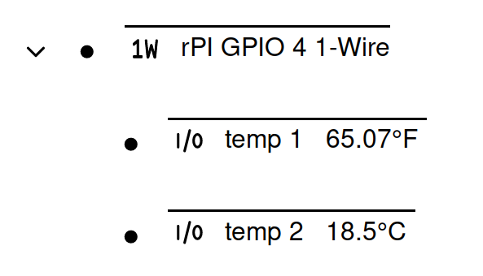
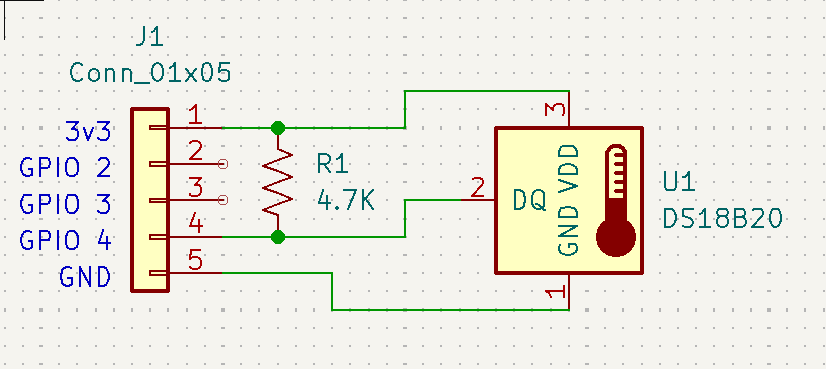
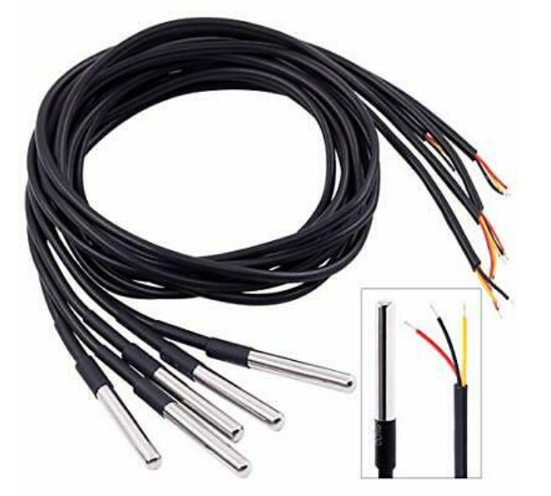

# 1-Wire

1-Wire is a device communication bus that provides low-speed data over a single
conductor. It is also possible to power some devices over the data signal as
well, but often a third wire is run for power.

Simple IoT supports 1-wire buses controlled by the
[1-wire (w1) subsystem](https://www.kernel.org/doc/html/latest/w1/index.html) in
the Linux kernel. Simple IoT will automatically create nodes for 1-wire buses
and devices it discovers.

## Bus Controllers

### Raspberry PI GPIO

There are a number of bus controllers available but one of the simplest is a
GPIO on a Raspberry PI. To enable, add the following to the `/boot/config.txt`
file:

`dtoverlay=w1-gpio`

This enables a 1-wire bus on GPIO 4.

To add a bus to a different pin:

`dtoverlay=w1-gpio,gpiopin=x`

A 4.7kΩ pull-up resistor is needed between the 1-wire signal and 3.3V. This can
be wired to a 0.1" connector as shown in the following schematic:

See [this page](https://pinout.xyz/pinout/1_wire#) for more information.

## 1-Wire devices

### DS18B20 Temperature sensors

Simple IoT currently supports 1-wire temperature sensors such as the DS18B20.
This is a very popular and practical digital temperature sensor. Each sensor has
a unique address so you can address a number of them using a single 1-wire port.
These devices are readily available at low cost from a number of places
including eBay -- search for DS18B20, and look for an image like the below:

