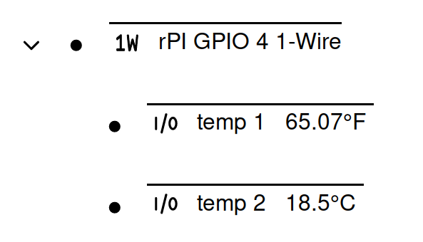
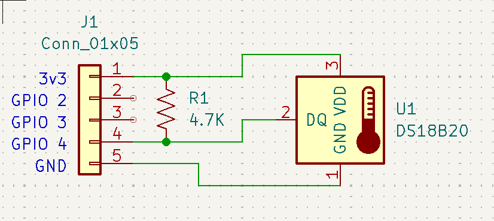
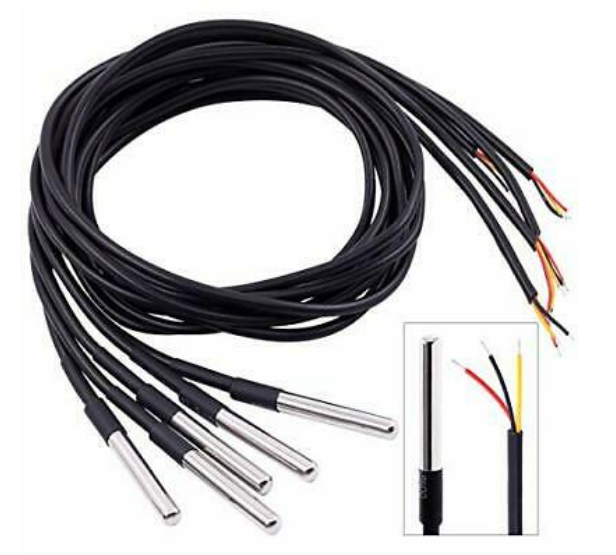

# 1-Wire

_(note, this client has been refactored, but not tested. Testing is welcome
...)_

1-Wire is a device communication bus that provides low-speed data over a single
conductor. It is also possible to power some devices over the data signal as
well, but often a third wire is run for power.

Simple IoT supports 1-wire buses controlled by the
[1-wire (`w1`) subsystem](https://www.kernel.org/doc/html/latest/w1/index.html)
in the Linux kernel.

To use a bus, add a 1-Wire node where you want it in the tree and set its
`Index` to the number of the bus controller, which matches the
`w1_bus_master<index>` directory the kernel creates in `/sys/bus/w1/devices`.
The first controller is index 0. Simple IoT then detects the sensors on that bus
and creates a node for each one.



## Bus Controllers

### Raspberry PI GPIO

There are a number of bus controllers available but one of the simplest is a
GPIO on a Raspberry PI. To enable, add the following to the `/boot/config.txt`
file:

`dtoverlay=w1-gpio`

This enables a 1-wire bus on GPIO 4.

To add a bus to a different pin:

`dtoverlay=w1-gpio,gpiopin=x`

A 4.7kΩ pull-up resistor is needed between the 1-wire signal and 3.3V. This can
be wired to a 0.1 inch connector as shown in the following schematic:



See [this page](https://pinout.xyz/pinout/1_wire#) for more information.

## 1-Wire devices

### `DS18B20` Temperature sensors

Simple IoT currently supports 1-wire temperature sensors such as the `DS18B20`.
This is a very popular and practical digital temperature sensor. Each sensor has
a unique address so you can address a number of them using a single 1-wire port.
These devices are readily available at low cost from a number of places
including eBay - search for `DS18B20`, and look for an image like the below:



Readings are in degrees Celsius by default. Set `Units` on a device node to `F`
to report degrees Fahrenheit instead.

## Schema

The configuration of a 1-wire bus and one of its devices:

```yaml
nodes:
  - oneWire:
      debug: 0
      description: Tank sensors
      disabled: 0
      index: 0
      pollPeriod: 3000
      children:
        - oneWireIO:
            description: Tank top
            disabled: 0
            id: 28-0000073b6f4d
            units: F
```

`index` is the number of the bus controller, matching the `w1_bus_master<index>`
directory in `/sys/bus/w1/devices`. `pollPeriod` is in milliseconds and defaults
to 3000 when it is zero or missing.

`id` on a device is its 1-wire address rather than a node ID, which is why it is
spelled like any other point. Simple IoT creates a device node for each sensor
it detects on the bus, so these usually arrive on their own; what a file adds is
a lasting `description` and, where wanted, `units`.

Leaving `units` out reports degrees Celsius. The readings and error counts are
points the client maintains, so an export of a running bus carries them as well.
