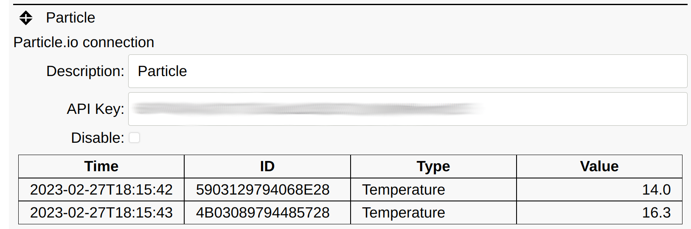
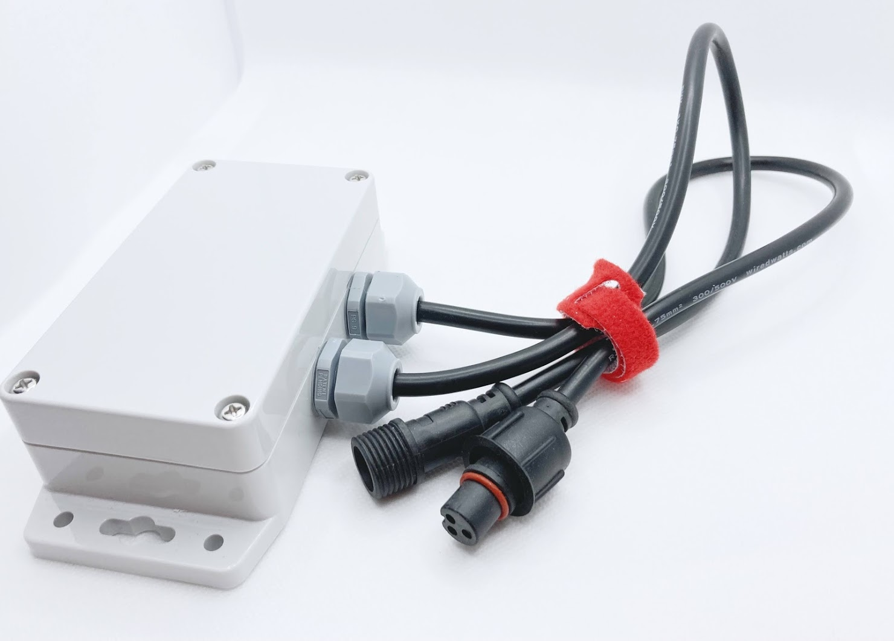
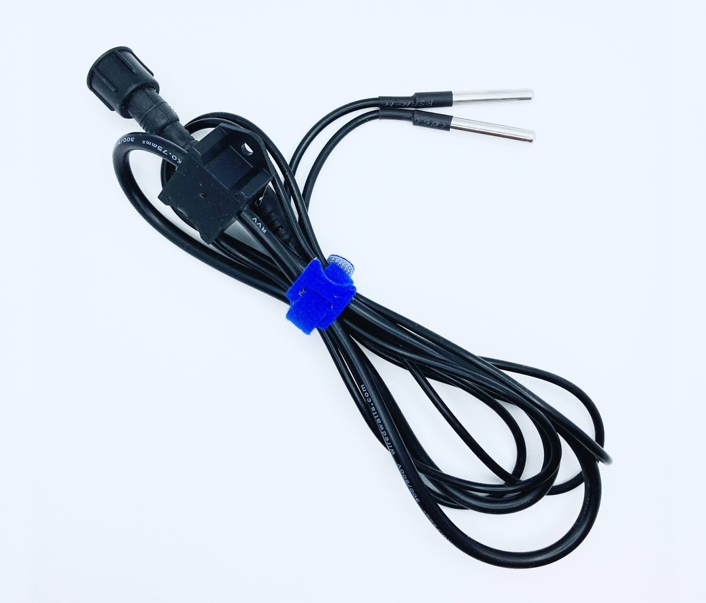

# Particle.io

SIOT provides a client for pulling data from
[Particle.io](https://www.particle.io/). Particle provide modules to quickly
implement cellular connected MCU based IoT systems. They take care of managing
the device (cellular connection, firmware deployments, etc.), and you only need
to write the application.

The Particle cloud
[event API](https://docs.particle.io/reference/cloud-apis/api/#events) is used
to obtain the data. A connection is made from the SIOT instance to the Particle
Cloud and then data is sent back to SIOT using Server Sent Events (SSE). The
advantage of this mechanism is that complex webhooks are not needed on the SIOT
side, which requires additional firewall/web server configuration.

A Particle API key is needed which can be generated using the `particle token`
[CLI command](https://docs.particle.io/getting-started/developer-tools/cli/).



The above example shows data provided by the Particle based
[Simple IoT Particle Gateway](https://github.com/simpleiot/hardware) and 1-wire
temperature sensors, and
[SIOT firmware](https://github.com/simpleiot/firmware/tree/master/siot-fw).

Data is published to Particle in the following format:

```json
[
	{
		"id": "4B03089794485728",
		"type": "temp",
		"value": 15.25
	}
]
```

The SIOT Particle client populates the point `key` field with the 1-wire device
ID.




