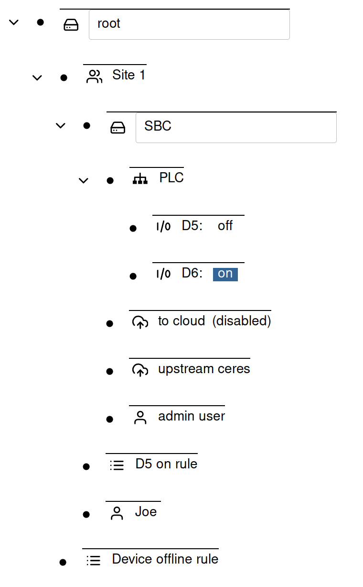
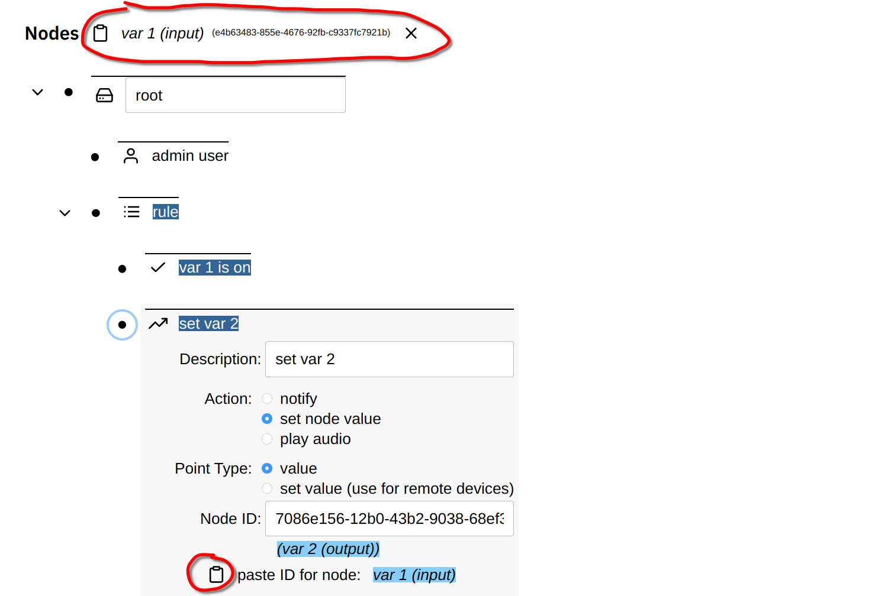
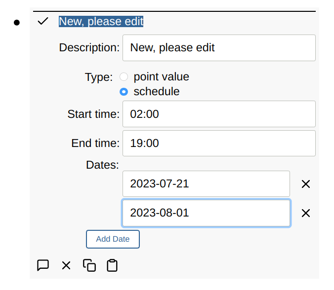
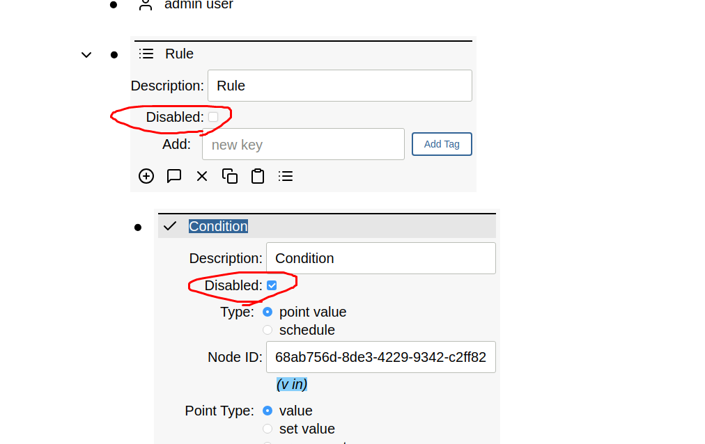

# Rules

**Contents**

<!-- toc -->

The Simple IoT application has the ability to run rules -- see the video below
for a demo:

<iframe width="640" height="360" src="https://www.youtube.com/embed/pb_a6oEdFJI" title="Simple IoT Rules Demo" frameborder="0" allow="accelerometer; autoplay; clipboard-write; encrypted-media; gyroscope; picture-in-picture; web-share" referrerpolicy="strict-origin-when-cross-origin" allowfullscreen></iframe>

Rules are composed of one or more conditions and actions. All conditions must be
true for the rule to be active.

Node point changes cause rules of any parent node in the tree to be run. This
allows general rules to be written higher in the tree that are common for all
device nodes (for instance device offline).

In the below configuration, a change in the SBC propagates up the node tree,
thus both the `D5 on rule` or the `Device offline rule` are eligible to be run.

## Node linking

Both conditions and actions can be linked to a node ID. If you copy a node, its
ID is stored in a virtual clipboard and displayed at the top of the screen. You
can then paste this node ID into the Node ID field in a condition or action.

## Conditions

Each condition may optionally specify a minimum active duration before the
condition is considered met. This allows timing to be encoded in the rules.

### Node state

A point value condition looks at the point value of a node to determine if a
condition is met. Qualifiers that filter points the condition is interested in
may be set including:

- node ID (if left blank, any node that is a descendent of the rule parent)
- point type ("value" is probably the most common type)
- point Key (used to index into point arrays and objects)

If the provided qualification is met, then the condition may check the point
value/text fields for a number of conditions including:

- number: `>`, `<`, `=`, `!=`
- text: `=`, `!=`, `contains`
- boolean: `on`, `off`

### Schedule

Rule conditions can be driven by a schedule that is composed of:

- start/stop time
- weekdays
- dates

If no weekdays are selected, then all weekdays are included.

When the dates are used, then weekdays are disabled.

Conversely, when a weekday is enabled, dates are disabled.

As a time range can span two days, the start time is used to qualify weekdays
and dates.

See also a video demo:

<iframe width="791" height="445" src="https://www.youtube.com/embed/WllM0acCOss" title="Creating an Alarm Clock with Simple IoT schedules" frameborder="0" allow="accelerometer; autoplay; clipboard-write; encrypted-media; gyroscope; picture-in-picture; web-share" allowfullscreen></iframe>

## Actions

Every action has an optional repeat interval. This allows rate limiting of
actions like notifications.

### Notifications

Notifications are the simplest rule action and are sent out when:

- all conditions are met
- time since last notification is greater than the notify action repeat
  interval.

Every time a notification is sent out by a rule, a point is created/updated in
the rule with the following fields:

- id: node of point that triggered the rule
- type: "lastNotificationSent"
- time: time the notification was sent

Before sending a notification we scan the points of the rule looking for when
the last notification was sent to decide if its time to send it.

### Set node point

Rules can also set points in other nodes. For simplicity, the node ID must be
currently specified along with point parameters and a number/bool/text value.

Typically a rule action is only used to set one value. In the case of on/off
actions, one rule is used to turn a value on, and another rule is used to turn
the same value off. This allows for hysteresis and more complex logic than in
one rule handled both the on and off states. This also allows the rules logic to
be stateful. If you don't need hystersis or complex state, the rule "inactive
action" can be used, which allows the rule to take action when it goes both
active and inactive.

## Disable Rule/Condition/Action

### Disable Rule

A rule can be disabled. If the rule is disabled while active, then the rule
inactive actions are run so that things get cleaned up if necessary and the
actions are not left active.

### Disable Condition

If there are no conditions, or all conditions are disabled, the rule is
inactive. Otherwise, disabled conditions are simply ignored. For example if
there is a disabled condition and an non-disabled active condition, the rule is
active.

### Disable Action

A disabled action is not run.
