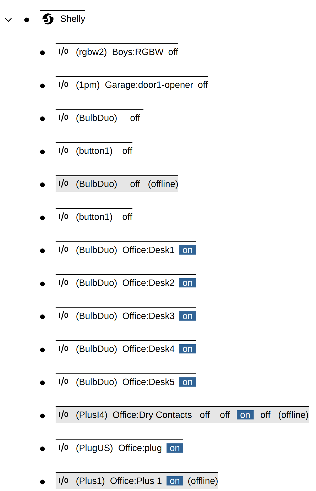
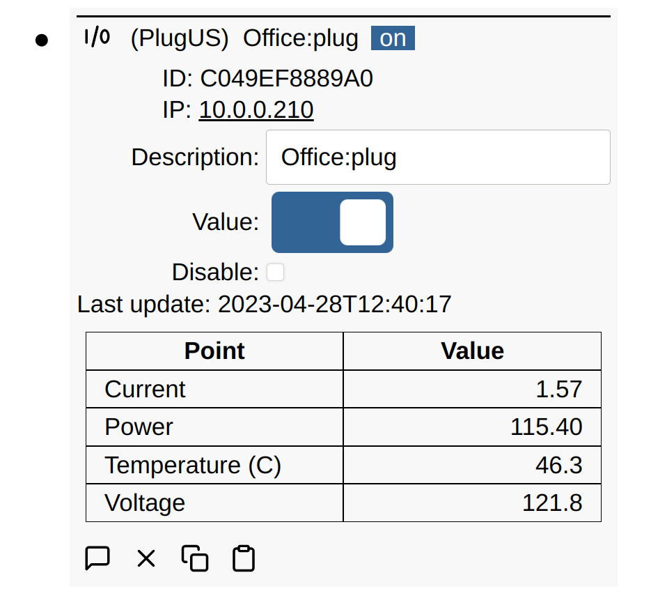

# Shelly IoT

Shelly sells a number of reasonably priced open IoT devices for home automation
and industrial control. Most support Wi-Fi network connections and some of the
Industrial line also supports Ethernet. The API is open and the devices support
a number of communication protocols including HTTP, MQTT, CoAP, etc. They also
support mDNS so they can be discovered on the network.

- [Main website](https://www.shelly.cloud/)
- [Device documentation](https://kb.shelly.cloud/knowledge-base/devices)
- [API](https://shelly-api-docs.shelly.cloud/)

Simple IoT provides the following support:

- Automatic discovery of all Shelly devices on the network using mDNS
- Support for the following devices:
  - `1pm` (not tested)
  - `Bulb Duo` (on/off only)
  - `Plus 1`
  - `Plus 1PM` (not tested)
  - `Plus 2PM`
  - `Plus Plug` (only US variant tested)
    - Measurements such as Current, Power, Temp, Voltage are collected.
  - `Plus i4`
- Currently status is polled via HTTP every 2 seconds

## Setup

- Configure the Shelly devices to connect to your Wi-Fi network. There are
  several options:
  1. Use the Shelly phone app
  1. A new device will start up in access point mode. Attach a computer or phone
     to this AP, open [http://192.168.33.1](http://192.168.33.1) (default
     address of a reset device), and then configure the Wi-Fi credentials using
     the built-in Web UI.
- Add the Shelly client in SIOT
- The Shelly client will then periodically scan for new devices and add them as
  child nodes.

## Example

## Plug Example

