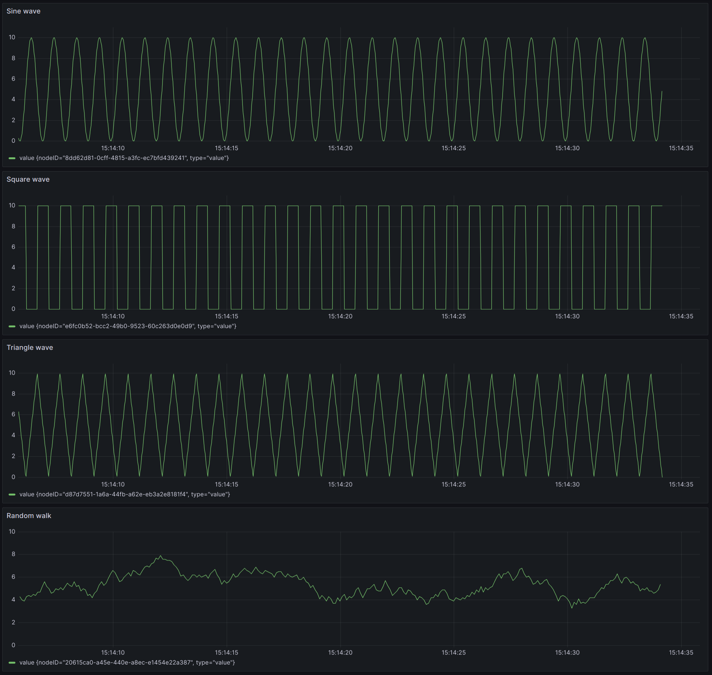

# Signal Generator Client

The signal generator can be used to generate various signals including:

- Sine wave
- Square wave
- Triangle wave
- Random walk

Below is a screen-shot of the generated data displayed in Grafana.

## Configuration

The signal generated can be configured with the following parameters:

Most of the parameters are self-explanatory. With a Random Walk, you typically
need to enter a negative number for the Min. Increment as shown above. This
causes the negative number generated to be negative roughly half the time.

The rounding can also be used to generate binary signals. Imagine a signal
generator with these settings:

- Max. value = 1
- Min. value = 0
- Initial value = 0
- Round to = 1
- Min. increment = -7
- Max. increment = 3
- Sample Rate = 20mins

Due to min/max/round to options, this is a binary value, either 0 or 1, biased
toward 0 (due to min/max increment options). This could be useful for simulating
binary switches or something like it. Effectively, this will hold the value for
at least 20m and picks a random number between -7 and 3. Due to rounding, if
value is currently 0, there's a 25% chance it becomes 1. If 1, there's a 65%
chance it becomes 0. This means that the value will be 0 roughly 91.25% (= 75% +
(1 - 75%) \* 65%) of the time.
