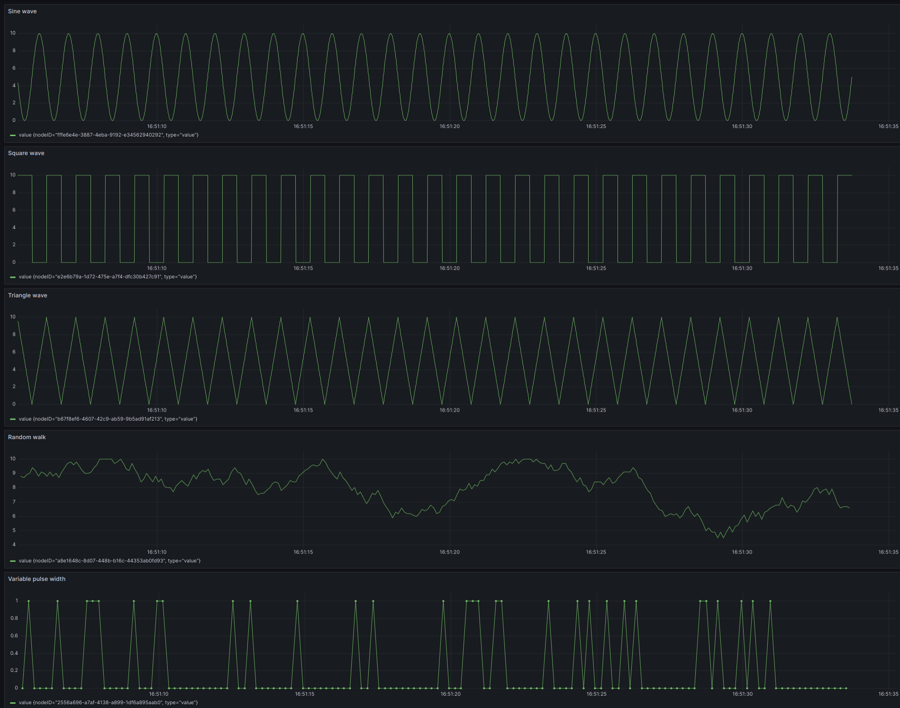
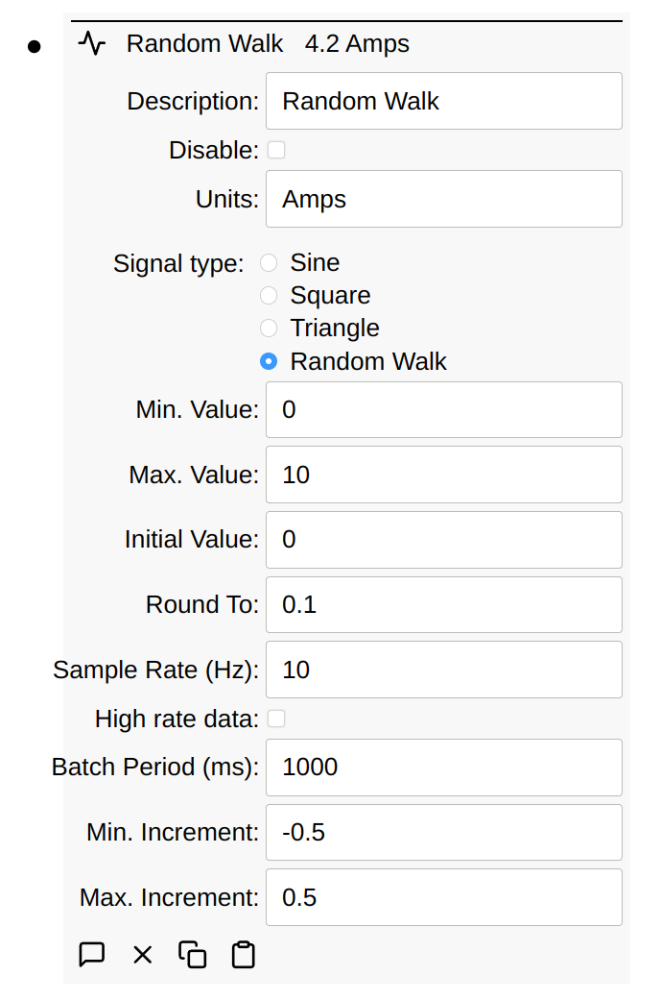

# Signal Generator Client

The signal generator can be used to generate various signals including:

- Sine wave
- Square wave
- Triangle wave
- Random walk

Below is a screen-shot of the generated data displayed in Grafana.



## Configuration

The signal generated can be configured with the following parameters:



Most of the parameters are self-explanatory. With a Random Walk, you typically
need to enter a negative number for the minimum. Increment as shown above. This
causes the negative number generated to be negative roughly half the time.

The rounding can also be used to generate binary signals. Imagine a signal
generator with these settings:

- `Max. value` = 1
- `Min. value` = 0
- `Initial value` = 0
- `Round to` = 1
- `Min. increment` = -7
- `Max. increment` = 3
- `Sample Rate` = 20 milliseconds

Due to `min/max/round` to options, this is a binary value, either 0 or 1, biased
toward 0 (due to `min/max` increment options). This could be useful for
simulating binary switches or something like it. Effectively, this will hold the
value for at least 20m and picks a random number between -7 and 3. Due to
rounding, if value is currently 0, there's a 25% chance it becomes 1. If 1,
there's a 65% chance it becomes 0. This means that the value will be 0 roughly
91.25% (= 75% + (1 - 75%) \* 65%) of the time.

## Schema

Below is an export of several types of signal generator nodes:

```yaml
children:
  - id: 2556a696-a7af-4138-a899-1df6a895aab0
    type: signalGenerator
    points:
      - type: batchPeriod
        value: 1000.0
      - type: description
        text: Variable pulse width
      - type: disabled
      - type: frequency
        value: 1.0
      - type: initialValue
        text: "0"
      - type: maxIncrement
        value: 3.0
      - type: maxValue
        value: 1.0
      - type: minIncrement
        value: -7.0
      - type: minValue
        text: "0"
      - type: roundTo
        value: 1.0
      - type: sampleRate
        value: 5.0
      - type: signalType
        text: random walk
      - type: units
        text: Amps
      - type: value
        value: 1.0
  - id: b67f8ef6-4607-42c9-ab59-9b5ad91af213
    type: signalGenerator
    points:
      - type: batchPeriod
        value: 1000.0
      - type: description
        text: Triangle
      - type: disabled
      - type: frequency
        value: 1.0
      - type: initialValue
        text: "0"
      - type: maxIncrement
        value: 0.5
      - type: maxValue
        value: 10.0
      - type: minIncrement
        value: 0.1
      - type: minValue
        text: "0"
      - type: sampleRate
        value: 100.0
      - type: signalType
        text: triangle
      - type: value
        value: 6.465714272450723e-12
  - id: e2e6b79a-1d72-475e-a7f4-dfc30b427c91
    type: signalGenerator
    points:
      - type: batchPeriod
        value: 1000.0
      - type: description
        text: Square
      - type: disabled
      - type: frequency
        value: 1.0
      - type: initialValue
        text: "0"
      - type: maxValue
        value: 10.0
      - type: minValue
        text: "0"
      - type: sampleRate
        value: 100.0
      - type: signalType
        text: square
      - type: value
        value: 10.0
  - id: fffe6e4e-3887-4eba-9192-e34562940292
    type: signalGenerator
    points:
      - type: batchPeriod
        value: 1000.0
      - type: description
        text: Sine
      - type: disabled
      - type: frequency
        value: 1.0
      - type: initialValue
        text: "0"
      - type: maxValue
        value: 10.0
      - type: minValue
        text: "0"
      - type: sampleRate
        value: 100.0
      - type: signalType
        text: sine
      - type: value
        value: 4.999999999989843
  - id: a8e1648c-8d07-448b-b16c-44353ab0fd93
    type: signalGenerator
    points:
      - type: batchPeriod
        value: 1000.0
      - type: description
        text: Random Walk
      - type: disabled
      - type: frequency
        value: 1.0
      - type: initialValue
        text: "0"
      - type: maxIncrement
        value: 0.5
      - type: maxValue
        value: 10.0
      - type: minIncrement
        value: -0.5
      - type: minValue
        text: "0"
      - type: roundTo
        value: 0.1
      - type: sampleRate
        value: 10.0
      - type: signalType
        text: random walk
      - type: units
        text: Amps
      - type: value
        value: 9.1
```
