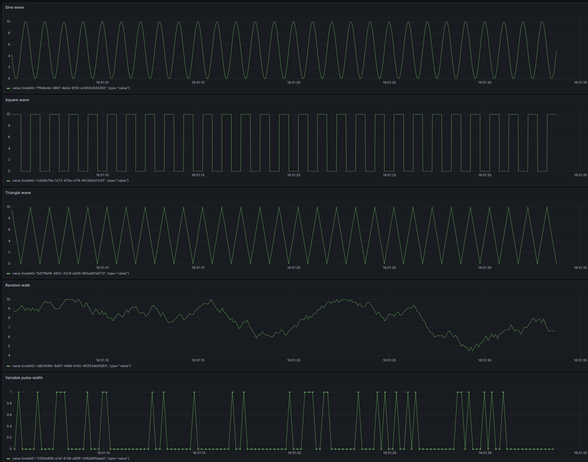
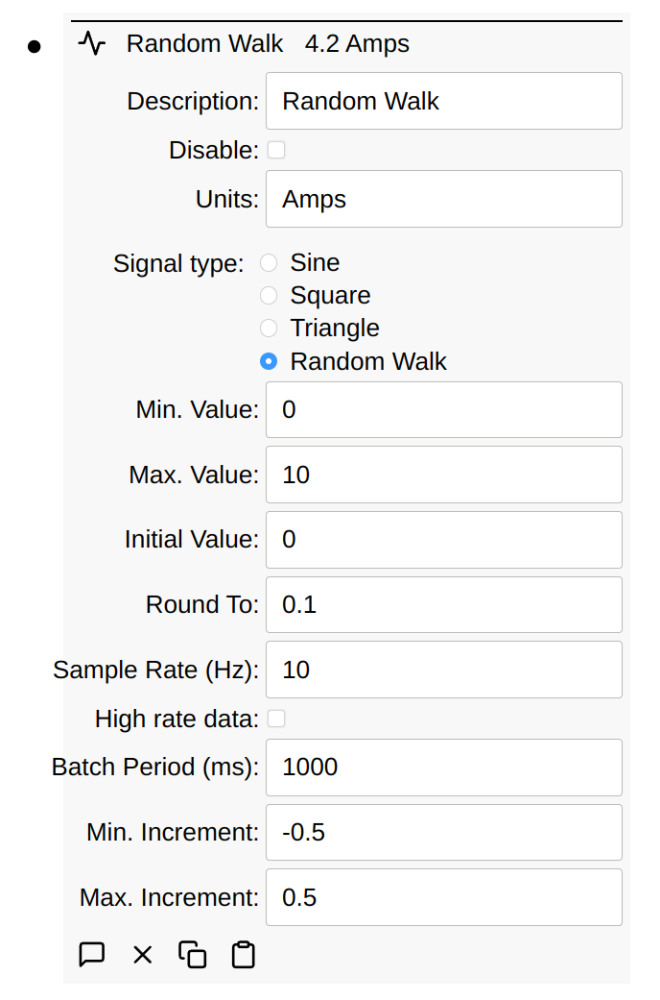

# Signal Generator Client

The signal generator can be used to generate various signals including:

- Sine wave
- Square wave
- Triangle wave
- Random walk

Below is a screen-shot of the generated data displayed in Grafana.



## Configuration

The signal generated can be configured with the following parameters:



Most of the parameters are self-explanatory. With a Random Walk, you typically
need to enter a negative number for the minimum. Increment as shown above. This
causes the negative number generated to be negative roughly half the time.

The rounding can also be used to generate binary signals. Imagine a signal
generator with these settings:

- `Max. value` = 1
- `Min. value` = 0
- `Initial value` = 0
- `Round to` = 1
- `Min. increment` = -7
- `Max. increment` = 3
- `Sample Rate` = 20 milliseconds

Due to `min/max/round` to options, this is a binary value, either 0 or 1, biased
toward 0 (due to `min/max` increment options). This could be useful for
simulating binary switches or something like it. Effectively, this will hold the
value for at least 20m and picks a random number between -7 and 3. Due to
rounding, if value is currently 0, there's a 25% chance it becomes 1. If 1,
there's a 65% chance it becomes 0. This means that the value will be 0 roughly
91.25% (= 75% + (1 - 75%) \* 65%) of the time.

## Schema

Below is an export of several types of signal generator nodes:

```yaml
nodes:
  - signalGenerator:
      batchPeriod: 1000
      description: Variable pulse width
      frequency: 1
      initialValue: "0"
      maxIncrement: 3
      maxValue: 1
      minIncrement: -7
      minValue: "0"
      roundTo: 1
      sampleRate: 5
      signalType: random walk
      units: Amps
      value: 1
  - signalGenerator:
      batchPeriod: 1000
      description: Triangle
      frequency: 1
      initialValue: "0"
      maxIncrement: 0.5
      maxValue: 10
      minIncrement: 0.1
      minValue: "0"
      sampleRate: 100
      signalType: triangle
      value: 6.465714272450723e-12
  - signalGenerator:
      batchPeriod: 1000
      description: Square
      frequency: 1
      initialValue: "0"
      maxValue: 10
      minValue: "0"
      sampleRate: 100
      signalType: square
      value: 10
  - signalGenerator:
      batchPeriod: 1000
      description: Sine
      frequency: 1
      initialValue: "0"
      maxValue: 10
      minValue: "0"
      sampleRate: 100
      signalType: sine
      value: 4.999999999989843
  - signalGenerator:
      batchPeriod: 1000
      description: Random Walk
      frequency: 1
      initialValue: "0"
      maxIncrement: 0.5
      maxValue: 10
      minIncrement: -0.5
      minValue: "0"
      roundTo: 0.1
      sampleRate: 10
      signalType: random walk
      units: Amps
      value: 9.1
```
