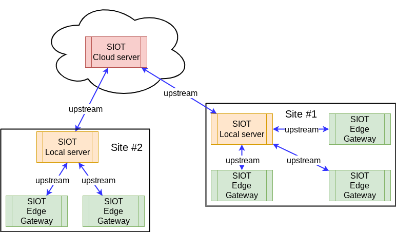
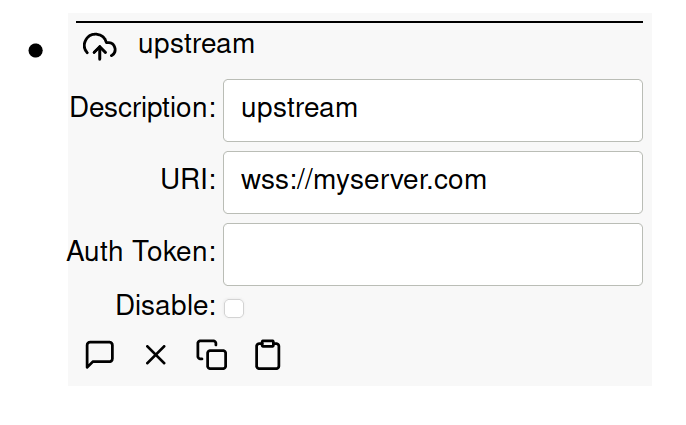

# Synchronization

Simple IoT provides for synchronized upstream connections via NATS or NATS over
WebSocket.



To create an upstream sync, add a sync node to the root node on the downstream
instance. If your upstream server has a name of `myserver.com`, then you can use
the following connections URIs:

- `nats://myserver.com:4222` (4222 is the default NATS port)
- `ws://myserver.com` (WebSocket unencrypted connection)
- `wss://myserver.com` (WebSocket encrypted connection)

IP addresses can also be used for the server name.

Auth token is optional and needs to be
[configured in an environment variable](configuration.md) for the upstream
server. If your upstream is on the public internet, you should use an auth
token. If both devices are on an internal network, then you may not need an auth
token.

Typically, `wss` are simplest for servers that are fronted by a web server like
Caddy that has TLS certs. For internal connections, `nats` or `ws` connections
are typically used.

Occasionally, you might also have edge devices on networks where NATS outgoing
connections on port 4222 are blocked. In this case, it's handy to be able to use
the `wss` connection, which just uses standard HTTP(S) ports.



## How synchronization behaves

Synchronization works by replicating the JetStream streams that store each
instance's data — see the [synchronization reference](../ref/sync.md) for how
this works. The behavior you will observe:

- **First connect:** the device announces itself and appears under the upstream
  root node; its full tree (structure, configuration, and history) then arrives
  through replication. Configuration written on the upstream for a device that
  has not connected yet is delivered on first connect.
- **Offline changes catch up.** Changes made on either side while the connection
  is down are delivered when it comes back — replication resumes exactly where
  it left off, and only missed data is sent. See
  [Queuing while offline](#queuing-while-offline) below.
- **Both sides can edit.** Configuration can be changed on either instance; the
  newest change wins everywhere.
- **Deleting a device on the upstream detaches it.** The device keeps running
  standalone and does not add itself back; undelete the device node on the
  upstream to resume synchronization.

## Queuing while offline

An edge instance does not need its upstream to keep working. It writes every
point to its own local store first, and the sync client replicates that store
upstream. When the connection drops, the instance keeps collecting data, running
rules, and accepting local configuration changes, all of which queue on disk.

On reconnect:

- The backlog is sent in order, with the original timestamps, so history
  upstream has no gap.
- Only the missed messages are sent. Replication resumes at the position it
  reached before the outage, which keeps the recovery cheap on a metered or low
  bandwidth link.
- Clients that act on current values (rules, protocol clients, the UI) see one
  update per changed value once the backlog drains rather than a replay of every
  intermediate reading, so a device coming back online does not re-trigger rules
  on stale data.
- History consumers still receive every point. A Db client feeding a time-series
  database reads the stream with its own durable consumer, so the backlog
  reaches the database as well.

Configuration written upstream while a device is offline, or before it has ever
connected, waits and is delivered on the next connect.

How long a device can be offline and still catch up in full depends on how much
history the store keeps. The default is 5000 points per value, which is
adjustable per instance. See [Store](../ref/store.md#retention-and-durability)
for the setting, and the [synchronization reference](../ref/sync.md) for how the
queuing works.

## Schema

The configuration of a sync node:

```yaml
nodes:
  - sync:
      authToken: your-auth-token
      description: Cloud
      disabled: 0
      uri: wss://myserver.com
```

`uri` is the upstream connection, written as one of the forms described above.
`authToken` matches `SIOT_AUTH_TOKEN` on the upstream server and is left out
when the upstream needs no token.

A sync node belongs on the root node of the downstream instance, so a file that
carries one leaves `parent` out and it attaches to the device node this instance
runs as.

An export carries `authToken` as it was entered, so treat a file that contains
sync nodes the way you would treat the token itself.

The count of synchronizations is a point the client maintains, so an export of a
running node carries it as well.

## Videos

There are also several videos that demonstrate upstream connections:

### [Simple IoT upstream synchronization support](https://youtu.be/6xB-gXUynQc)

<iframe width="791" height="445" src="https://www.youtube.com/embed/6xB-gXUynQc" title="Simple IoT upstream synchronization support" frameborder="0" allow="accelerometer; autoplay; clipboard-write; encrypted-media; gyroscope; picture-in-picture; web-share" allowfullscreen></iframe>

### [Simple IoT Integration with PLC Using Modbus](https://youtu.be/-1PuBoTAzPE)

<iframe width="791" height="445" src="https://www.youtube.com/embed/-1PuBoTAzPE" title="Simple IoT Integration with PLC Using Modbus" frameborder="0" allow="accelerometer; autoplay; clipboard-write; encrypted-media; gyroscope; picture-in-picture; web-share" allowfullscreen></iframe>
