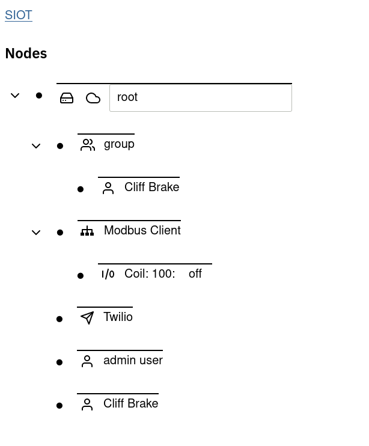
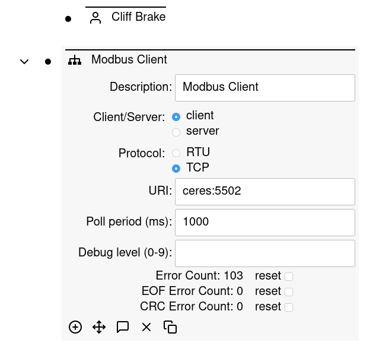

# User Interface

**Contents**

<!-- toc -->

## Basic Navigation

After Simple IoT is started, a web application is available on port `:8080`
(typically [http://localhost:8080](http://localhost:8080)). After logging in
(default user/pass is `admin@admin.com`/`admin`), you will be presented with a
tree of nodes. The `Node` is the based unit of configuration. Each node contains
`Points` which describe various attributes of a node. When you expand a node,
the information you see is a rendering of the point data in the node.

You can expand/collapse child nodes by clicking on the
 to the left of a node.

You can expand/edit node details by clicking on the  to
the left of a node.

## Adding nodes

Child nodes can be added to a node by clicking on the dot to expand the node,
then clicking on the plus icon. A list of available nodes to add will then be
displayed:

Some nodes are populated automatically if a new device is discovered, or a
downstream device starts sending data.

## Deleting, Moving, Mirroring, and Duplicating nodes

TODO: add screenshot.

Mirroring nodes is useful if you want a user to be a member of multiple groups
or devices. If you change a node, all of the mirrors of the node update as well.

Duplicating a node creates a new copy of the node that is not related to the
original node. This is useful for scenarios where you a device or site
configuration (perhaps a complex Modbus) setup that you want to duplicate at a
new site.
