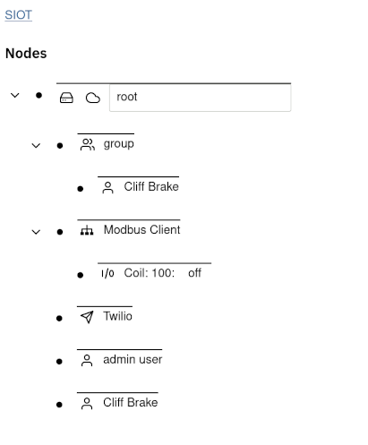
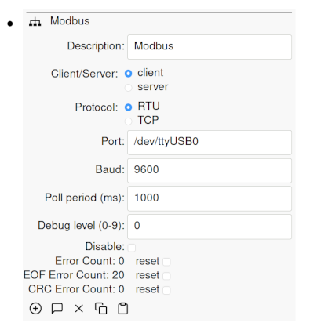
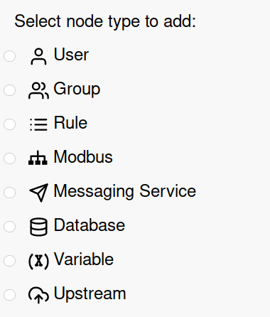
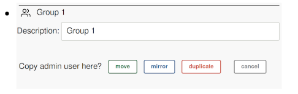
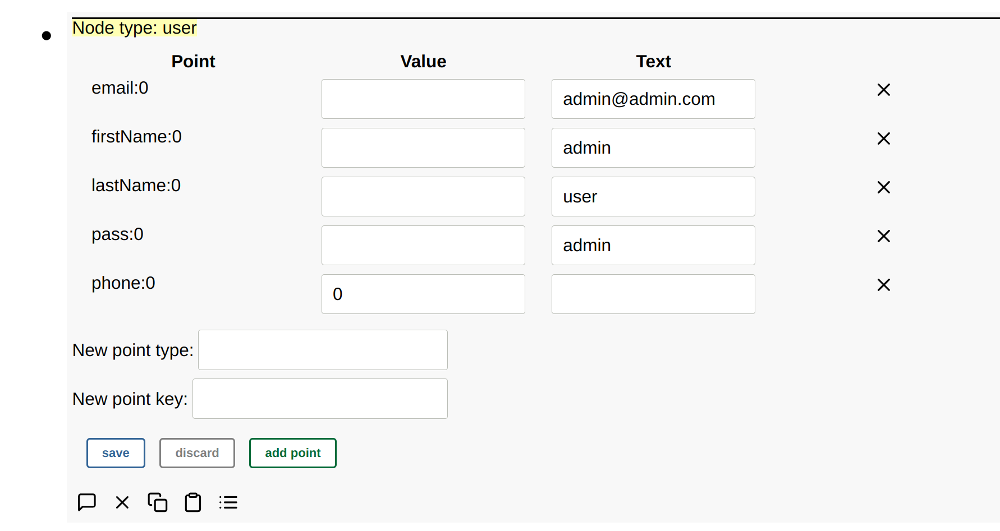
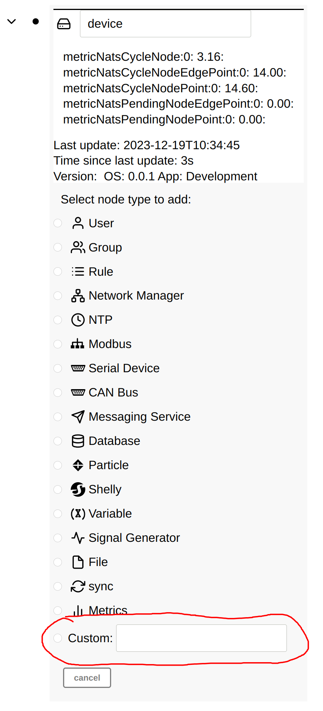

# User Interface

**Contents**

<!-- toc -->

## Basic Navigation

After Simple IoT is started, a web application is available on port `:8118`
(typically [http://localhost:8118](http://localhost:8118)). After logging in
(default user/pass is `admin`/`admin`), you will be presented with a tree of
nodes.

The `Node` is the base unit of configuration. Each node contains `Points` which
describe various attributes of a node. When you expand a node, the information
you see is a rendering of the point data in the node.

You can expand/collapse child nodes by clicking on the arrow
 to the left of a node.

You can expand/edit node details by clicking on the dot
 to the left of a node.

## Adding nodes

Child nodes can be added to a node by clicking on the dot to expand the node,
then clicking on the plus icon. A list of available nodes to add will then be
displayed:

Some nodes are populated automatically if a new device is discovered, or a
downstream device starts sending data.

## Deleting, Moving, Mirroring, and Duplicating nodes

Simple IoT provides the ability to re-arrange and organize your node structure.

To delete a node, expand it, and then press the delete
 icon.

To move or copy a node, expand it and press the copy
 icon. Then expand the destination node and
press the paste  icon. You will then be
presented with the following options:

- `move` - moves a node to new location
- `mirror` - is useful if you want a user or device to be a member of multiple
  groups. If you change a node, all the mirror copies of the node update as
  well.
- `duplicate` - recursively duplicates the copied node plus all its descendants.
  This is useful for scenarios where you have a device or site configuration
  (perhaps a complex Modbus setup) that you want to duplicate at a new site.

## Raw Node View

If a node is expanded, a raw node button is available that allows you to view
the raw type and points for any node in the tree. It is useful at times during
development and debugging to be able to view the raw points for a node.

After the raw button is pressed, the type and points are displayed:

Unknown nodes will also be displayed as raw nodes.

Points can also be edited, added, or removed in raw mode.

A custom node type can also be added by specifying the node type when adding a
node. This can be useful when developing new clients or external clients that
run outside of the SImple IoT application.

## Graphing and advanced dashboards

If you need graphs and more advanced dashboards, consider coupling Simple IoT
[with Grafana](graphing.md). Someday we hope to have dashboard capabilities
built in.

## Custom UIs

See the [frontend reference documentation](../ref/frontend.md).
