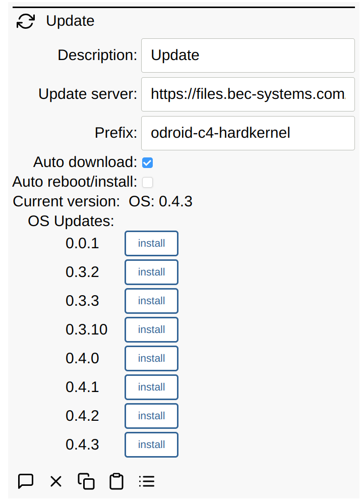

# Update

The Simple IoT update client facilitates updating software. Currently, it is
designed to download images for use by the
[Yoe Updater](https://github.com/YoeDistro/yoe-distro/blob/master/docs/updater.md). The process many be executed manually, or there are options to automatically download and install new updates.

There are several options:

- **Update server**: HTTP server that contains the following files:
  - files.txt: contains a list of update files on the server
  - update files named: `<prefix>_<version>.upd`
    - _version_ should follow [Semantic Versioning](https://semver.org/):
      `MAJOR.MINOR.PATCH`
    - _prefix_ must match what the updater on the target device is expecting --
      typically host/machine name.
- **Prefix**: described above -- typically host/machine name. This is
  autodetected on first startup, but can be changed if necessary.
- **Dest dir**: Destination directory for downloaded updates. Defaults to `/data`. _(TODO: is this a security issue? Perhaps this should be specified at command line or something.)_
- **Chk interval**: time interval at which the client checks for new updates.
- **Auto download**: option to periodically check the server for new updates and
  download the latest version.
- **Auto reboot/install**: option to auto install/reboot if a new version is
  detected and downloaded.
