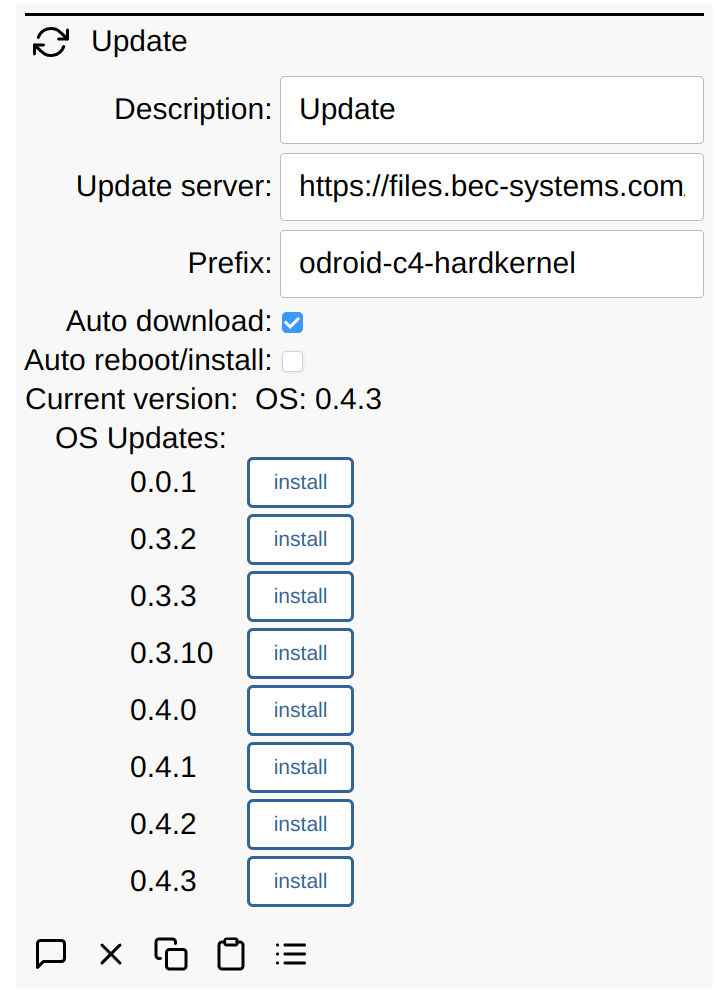

# Update

The Simple IoT update client facilitates updating software. Currently, it is
designed to download images for use by the
[Yoe Updater](https://github.com/YoeDistro/yoe-distro/blob/master/docs/updater.md).
The process can be executed manually, or there are options to automatically
download and install new updates.



There are several options:

- **Update server**: HTTP server that contains the following files:
  - files.txt: contains a list of update files on the server
  - update files named: `<prefix>_<version>.upd`
    - `version` should follow [Semantic Versioning](https://semver.org/):
      `MAJOR.MINOR.PATCH`
    - `prefix` must match what the updater on the target device is expecting
      typically host/machine name.
- `prefix`: described above - typically host/machine name. This is auto detected
  on first startup, but can be changed if necessary.
- `Dest dir`: Destination directory for downloaded updates. Defaults to `/data`.
- `Chk interval`: time interval at which the client checks for new updates.
- `Auto download`: option to periodically check the server for new updates and
  download the latest version.
- `Auto reboot/install`: option to auto install/reboot if a new version is
  detected and downloaded.

## Schema

The configuration of an update node:

```yaml
nodes:
  - update:
      autoDownload: 1
      autoReboot: 0
      description: Updates
      directory: /data
      pollPeriod: 60
      prefix: myboard
      uri: http://updates.example.com
```

`pollPeriod` is how often the server is checked, in minutes, and defaults to 30
when it is zero or missing. `directory` defaults to `/data`.

`prefix` is detected on first startup, so a file usually leaves it out and lets
each unit fill in its own; give it only when every unit the file applies to
expects the same one.

The versions found on the server, the version downloaded, and the current OS
version are points the client maintains, so an export of a running node carries
them as well.
