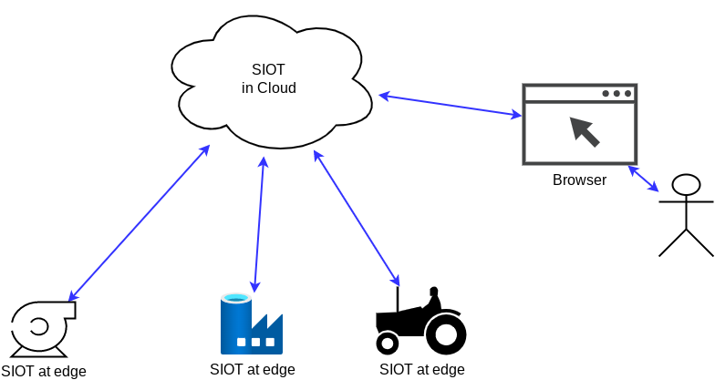
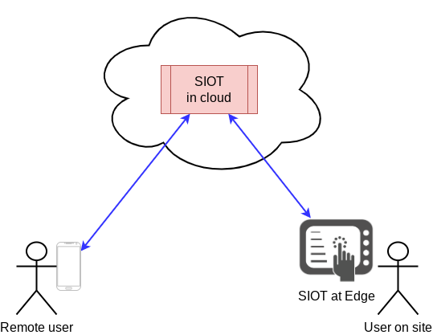

# Use Cases

Simple IoT is platform that can be used to build IoT systems where you want to
synchronize data between a number of distributed devices to a common central
point (typically in the cloud). A common use case is connected devices where
users want to remotely monitor and control these devices.

Some examples systems include:

- [Irrigation monitoring](https://youtu.be/REZ6DKvRVv0)
- Alarm/building control
- Industrial vehicle monitoring (commercial mowers, agricultural equipment,
  etc.)
- Factory automation

SIOT is optimized for systems where you run Embedded Linux at the edge and have
fairly complex config/state that needs synchronized between the edge and the
cloud.

## Changes can be made anywhere

Changes to config/state can be made locally or remotely in a SIOT system.

## Integration

There are many ways to integrate Simple IoT with other applications.

There are cases where some tasks like machine learning are easier to do in
languages like C++, then you can connect these applications to SIOT via NATS to
access config/state. See the
[Integration reference guide](../ref/integration.md) for more detailed
information.

## Multiple upstreams

Because we run the same SIOT application everywhere, we can add upstream
instances at multiple levels.

This flexibility allows us to run rules and other logic at any level (cloud,
local server, or edge gateway) - wherever it makes sense.
