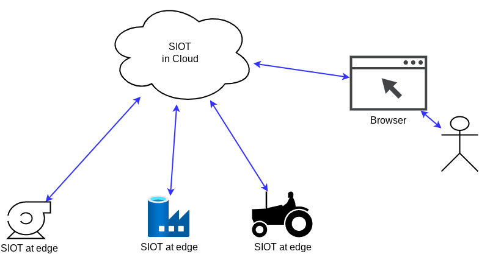
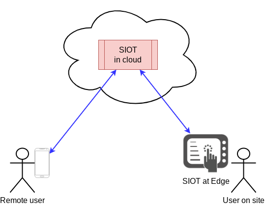
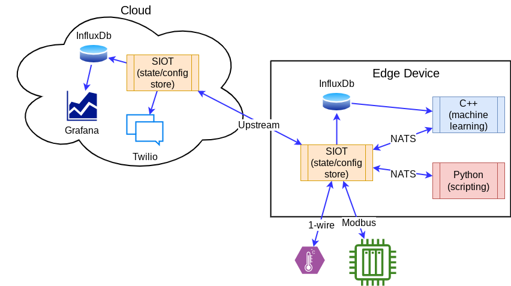

# Use Cases

Simple IoT is platform that can be used to build IoT systems where you want to
synchronize data between a number of distributed devices to a common central
point (typically in the cloud). A common use case is connected devices where
users want to remotely monitor and control these devices.

Some examples systems include:

- [Irrigation monitoring](https://youtu.be/REZ6DKvRVv0)
- Alarm/building control
- Industrial vehicle monitoring (commercial mowers, agricultural equipment,
  etc.)
- Factory automation

SIOT is optimized for systems where you run Embedded Linux at the edge and have
fairly complex config/state that needs synchronized between the edge and the
cloud.

## Changes can be made anywhere

Changes to config/state can be made locally or remotely in a SIOT system.

## Devices keep working when the connection drops

Edge devices are often on cellular or shared networks where outages are a normal
part of operation. A SIOT instance does not depend on its upstream to run: it
writes every point to its own local store first, then replicates that store
upstream. Sensor readings, rule activity, and configuration changes made while
the link is down are queued on disk and delivered in order when it returns.
Replication picks up at the point it stopped, so only the missed data is sent,
which matters on a metered or low bandwidth connection.

The same applies in the other direction. Configuration changed in the cloud for
a device that is offline, or one that has not been deployed yet, waits until the
device connects.

How long a device can be offline and still catch up in full depends on how much
history the store keeps. The store retains a bounded number of points per value
(20,000 by default), and the limit is adjustable, so a device that samples
slowly can be offline far longer than one writing every second. See
[Synchronization](sync.md) for setting up an upstream connection,
[Store](../ref/store.md) for the retention setting, and the
[synchronization reference](../ref/sync.md) for the mechanics of queuing and
catch-up.

## Integration

There are many ways to integrate Simple IoT with other applications.

There are cases where some tasks like machine learning are easier to do in
languages like C++, then you can connect these applications to SIOT via NATS to
access config/state. See the
[Integration reference guide](../ref/integration.md) for more detailed
information.

## Multiple upstreams

Because we run the same SIOT application everywhere, we can add upstream
instances at multiple levels.

This flexibility allows us to run rules and other logic at any level (cloud,
local server, or edge gateway) - wherever it makes sense.
