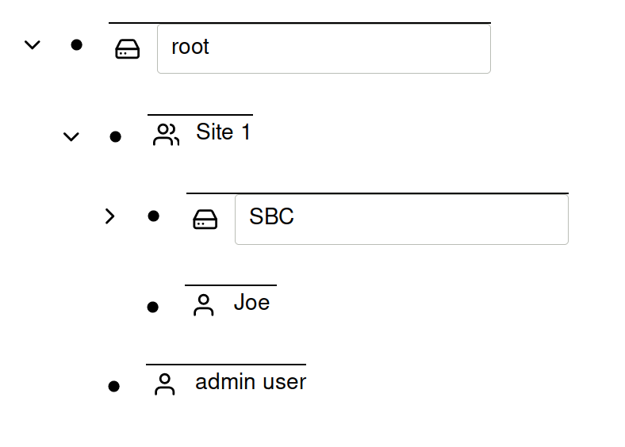
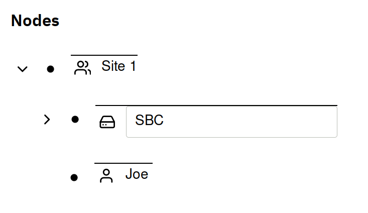

# Users/Groups

Users and Groups can be configured at any place in the node tree. The way
permissions work is users have access to the parent node and the parent nodes
children. In the below example, `Joe` has access to the `SBC` device because
both `Joe` and `SBC` are members of the `Site 1` group. `Joe` does have access
to the `root` node.

If `Joe` logs in, the following view will be presented:

