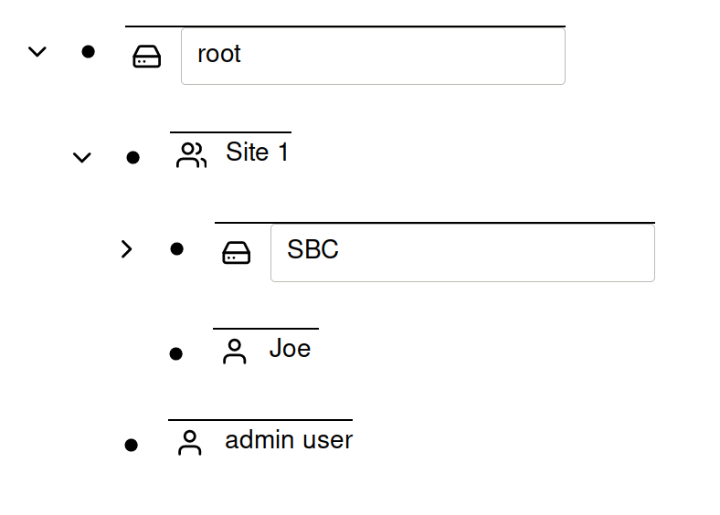
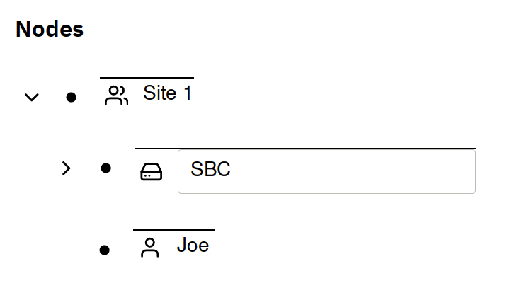

# Users/Groups

Users and Groups can be configured at any place in the node tree. The way
permissions work is users have access to the parent node and the parent nodes
children. In the below example, `Joe` has access to the `SBC` device because
both `Joe` and `SBC` are members of the `Site 1` group. `Joe` does have access
to the `root` node.



If `Joe` logs in, the following view will be presented:



## Schema

The configuration of a group and a user in it:

```yaml
nodes:
  - group:
      description: Site 1
  - user:
      parent: Site 1
      email: joe@example.com
      firstName: Joe
      lastName: Smith
      pass: his-password
      phone: "+12155551212"
      edgePoints:
        role: admin
```

A group carries a description and nothing else. Its place in the tree is what
gives it meaning, and the users and devices below it are what it groups.

A user is the one node type with no description, so a file finds it by `email`,
and by name when there is no email. `phone` is written as text so the leading
`+` is kept.

`role` is `admin` or `user` and lives under `edgePoints` rather than with the
points, because a role belongs to the connection between the user and the node
above rather than to the user. The same user mirrored into two places can hold a
different role in each.

## Passwords

A password is stored as a bcrypt hash, never as the plaintext value. A `pass`
value written through the UI, the API, an import, or a provisioning file is
hashed before it is stored, so the store, sync streams, and exports carry only
the hash. A password stored in plaintext by an earlier release keeps working
and is converted to a hash the next time that user signs in.

An export carries `pass` as the stored hash, which cannot be converted back to
the password. A plaintext `pass` in an import file is hashed when it is
applied, so a file that sets passwords should still be treated with care until
it is applied and deleted.

The password field in the UI shows blank rather than the stored hash; typing
in it sets a new password.
